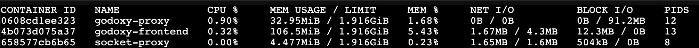

## TL;DR

- Benchmarked with `wrk` (HTTP/1.1) and `h2load` (HTTP/2)
- Benchmark server is written in Go returns 4096 random bytes body
- GoDoxy performs comparably to Traefik, with similar throughput
- Benchmarked on basic route `bench.6uo.me` -> `bench:80` without access logging and any other middleware
- Real world performance may vary depending on the use case and configuration

## Benchmark

Source code:

- [dev.compose.yml](https://github.com/yusing/godoxy/blob/main/dev.compose.yml)
- [scripts/benchmark.sh](https://github.com/yusing/godoxy/blob/main/scripts/benchmark.sh)
- [main.go](https://github.com/yusing/godoxy/blob/main/cmd/bench_server/main.go)

Run the benchmark with:

```shell
make benchmark
```

or

```shell
make TARGET={godoxy|traefik|nginx|caddy} benchmark
```

Results (Last updated: `2026-01-03 12:53 +0800`):

| Proxy   | HTTP/1.1 Req/sec | HTTP/2 Req/sec | HTTP/1.1 Latency (avg) | HTTP/2 Latency (avg) | Transfer/sec (HTTP/1.1) |
| ------- | ---------------- | -------------- | ---------------------- | -------------------- | ----------------------- |
| Nginx   | 103,906.54       | 91,673.00      | 1.17ms                 | 1.02ms               | 424.62MB                |
| Traefik | 68,597.99        | 56,198.30      | 1.74ms                 | 1.71ms               | 276.99MB                |
| GoDoxy  | 77,491.50        | 59,985.00      | 1.58ms                 | 1.60ms               | 312.90MB                |
| Caddy   | 10,541.64        | 1,431.10       | 82.72ms                | 68.17ms              | 42.73MB                 |

- **Nginx** leads with the highest throughput on both HTTP/1.1 (~104k req/s) and HTTP/2 (~92k req/s)
- **GoDoxy** performs comparably to Traefik, with higher throughput in both HTTP/1.1 (~77k req/s) and HTTP/2 (~60k req/s).
- **Traefik** maintains solid performance (~69k req/s HTTP/1.1, ~56k req/s HTTP/2)
- **Caddy** significantly underperforms, likely a bug (also had errors in HTTP/2 test: 1597 failed requests)

## Resource Usage

<Callout type="info">
For memory constrained environments, you can use the frontend with `latest-lite` tag.

See [Lite Image](getting-started/Basics#lite-image) for more details.

</Callout>



With Lite Image:


