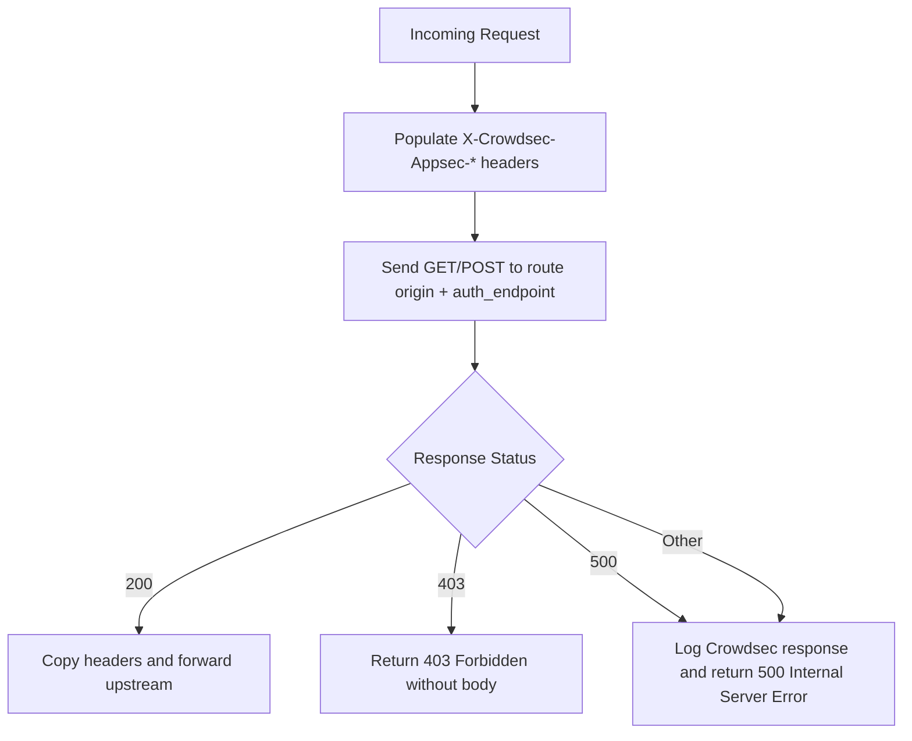

## Configuration

| Option        | Description                                | Default | Required |
| ------------- | ------------------------------------------ | ------- | -------- |
| `route`       | Crowdsec AppSec route or IP address        | -       | Yes      |
| `port`        | Crowdsec AppSec port (route is IP address) | `7422`  | No       |
| `api_key`     | Crowdsec AppSec API key                    | -       | Yes      |
| `endpoint`    | Crowdsec AppSec endpoint path              | `/`     | No       |
| `log_blocked` | Log blocked requests                       | `false` | No       |
| `timeout`     | Timeout for request to Crowdsec AppSec     | `5s`    | No       |

## Behavior



## Examples

### Entrypoint

```yaml
entrypoint:
  middlewares:
    - use: real_ip # add this or `cloudflare_real_ip` if you need to resolve client IP from proxy headers
      header: X-Real-IP
      from: [127.0.0.1, 192.168.0.0/16, 10.0.0.0/8]
    - use: crowdsec
      route: crowdsec
      api_key: 1234567890
      log_blocked: true
      bypass:
        - route crowdsec
```

### Docker Labels

```yaml
proxy.myapp.middlewares.crowdsec: |
  route: crowdsec
  api_key: 1234567890
  log_blocked: true
```

### Route Files

```yaml
myapp:
  middlewares:
    crowdsec:
      route: crowdsec
      api_key: 1234567890
      log_blocked: true
```
