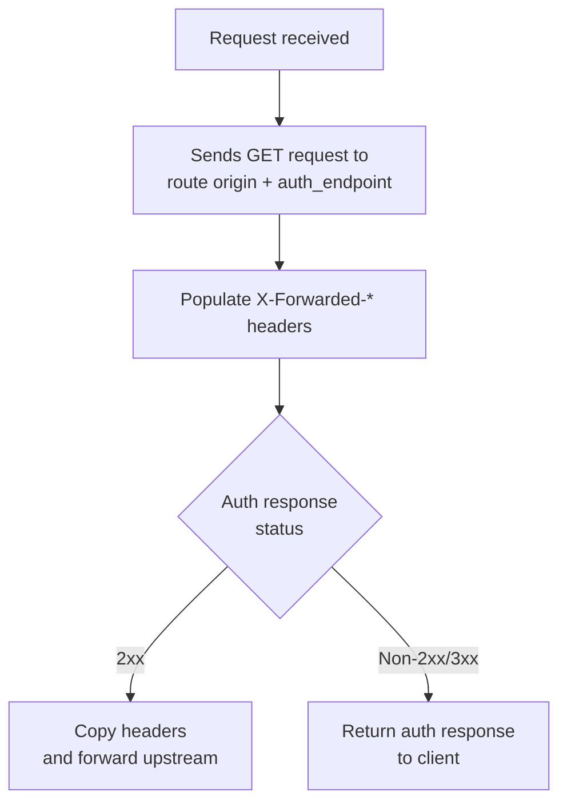

## Configuration

| Option          | Description        | Default                                                           |
| --------------- | ------------------ | ----------------------------------------------------------------- |
| `route`         | Auth server route  | `tinyauth`                                                        |
| `auth_endpoint` | Auth endpoint path | `/api/auth/traefik`                                               |
| `headers`       | Headers to forward | `["Remote-User", "Remote-Name", "Remote-Email", "Remote-Groups"]` |

## Behavior



## Examples

### Entrypoint

```yaml
entrypoint:
  middlewares:
    - use: forward_auth
      route: tinyauth
      auth_endpoint: /api/auth/traefik
      headers: Remote-User, Remote-Name, Remote-Email, Remote-Groups
      bypass:
        - route tinyauth
```

### Docker Labels

```yaml
proxy.myapp.middlewares.forward_auth: |
  route: tinyauth
  auth_endpoint: /api/auth/traefik
  headers: Remote-User, Remote-Name, Remote-Email, Remote-Groups
```

### Route Files

```yaml
myapp:
  middlewares:
    forward_auth:
      route: tinyauth
      auth_endpoint: /api/auth/traefik
      headers: Remote-User, Remote-Name, Remote-Email, Remote-Groups
```
