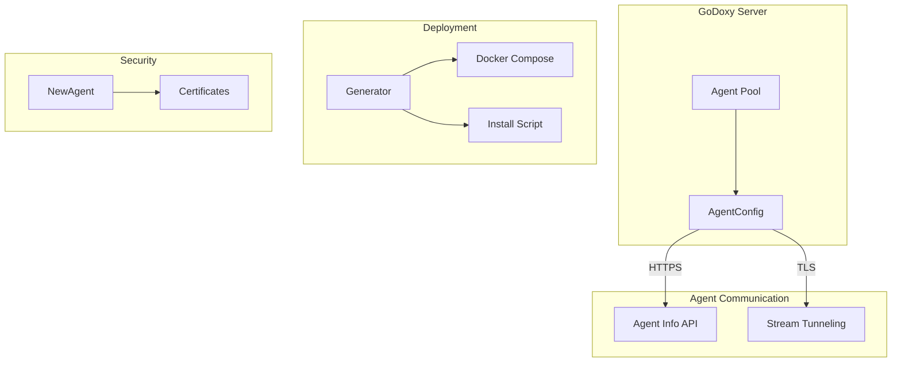

## Architecture Overview



## File Structure

| File                                     | Purpose                                                   |
| ---------------------------------------- | --------------------------------------------------------- |
| [`config.go`](https://github.com/yusing/godoxy/blob/main/agent/pkg/agent/config.go)                 | Core configuration, initialization, and API client logic. |
| [`new_agent.go`](https://github.com/yusing/godoxy/blob/main/agent/pkg/agent/new_agent.go)           | Agent creation and certificate generation logic.          |
| [`docker_compose.go`](https://github.com/yusing/godoxy/blob/main/agent/pkg/agent/docker_compose.go) | Generator for agent Docker Compose configurations.        |
| [`bare_metal.go`](https://github.com/yusing/godoxy/blob/main/agent/pkg/agent/bare_metal.go)         | Generator for bare metal installation scripts.            |
| [`env.go`](https://github.com/yusing/godoxy/blob/main/agent/pkg/agent/env.go)                       | Environment configuration types and constants.            |
| `common/`                                | Shared constants and utilities for agents.                |

## Core Types

### [`AgentConfig`](https://github.com/yusing/godoxy/blob/main/agent/pkg/agent/config.go#L29)

The primary struct used by the GoDoxy server to manage a connection to an agent. It stores the agent's address, metadata, and TLS configuration.

### [`AgentInfo`](https://github.com/yusing/godoxy/blob/main/agent/pkg/agent/config.go#L45)

Contains basic metadata about the agent, including its version, name, and container runtime (Docker or Podman).

### [`PEMPair`](https://github.com/yusing/godoxy/blob/main/agent/pkg/agent/new_agent.go#L53)

A utility struct for handling PEM-encoded certificate and key pairs, supporting encryption, decryption, and conversion to `tls.Certificate`.

## Agent Creation and Certificate Management

### Certificate Generation

The [`NewAgent`](https://github.com/yusing/godoxy/blob/main/agent/pkg/agent/new_agent.go#L147) function creates a complete certificate infrastructure for an agent:

- **CA Certificate**: Self-signed root certificate with 1000-year validity.
- **Server Certificate**: For the agent's HTTPS server, signed by the CA.
- **Client Certificate**: For the GoDoxy server to authenticate with the agent.

All certificates use ECDSA with P-256 curve and SHA-256 signatures.

### Certificate Security

- Certificates are encrypted using AES-GCM with a provided encryption key.
- The [`PEMPair`](https://github.com/yusing/godoxy/blob/main/agent/pkg/agent/new_agent.go#L53) struct provides methods for encryption, decryption, and conversion to `tls.Certificate`.
- Base64 encoding is used for certificate storage and transmission.

## Key Features

### 1. Secure Communication

All communication between the GoDoxy server and agents is secured using mutual TLS (mTLS). The [`AgentConfig`](https://github.com/yusing/godoxy/blob/main/agent/pkg/agent/config.go#L29) handles the loading of CA and client certificates to establish secure connections.

### 2. Agent Discovery and Initialization

The [`Init`](https://github.com/yusing/godoxy/blob/main/agent/pkg/agent/config.go#L231) and [`InitWithCerts`](https://github.com/yusing/godoxy/blob/main/agent/pkg/agent/config.go#L110) methods allow the server to:

- Fetch agent metadata (version, name, runtime).
- Verify compatibility between server and agent versions.
- Test support for TCP and UDP stream tunneling.

### 3. Deployment Generators

The package provides interfaces and implementations for generating deployment artifacts:

- **Docker Compose**: Generates a `docker-compose.yml` for running the agent as a container via [`AgentComposeConfig.Generate()`](https://github.com/yusing/godoxy/blob/main/agent/pkg/agent/docker_compose.go#L21).
- **Bare Metal**: Generates a shell script to install and run the agent as a systemd service via [`AgentEnvConfig.Generate()`](https://github.com/yusing/godoxy/blob/main/agent/pkg/agent/bare_metal.go#L27).

### 4. Fake Docker Host

The package supports a "fake" Docker host scheme (`agent://<addr>`) to identify containers managed by an agent, allowing the GoDoxy server to route requests appropriately. See [`IsDockerHostAgent`](https://github.com/yusing/godoxy/blob/main/agent/pkg/agent/config.go#L90) and [`GetAgentAddrFromDockerHost`](https://github.com/yusing/godoxy/blob/main/agent/pkg/agent/config.go#L94).

## Usage Example

```go
cfg := &agent.AgentConfig{}
cfg.Parse("192.168.1.100:8081")

ctx := context.Background()
if err := cfg.Init(ctx); err != nil {
    log.Fatal(err)
}

fmt.Printf("Connected to agent: %s (Version: %s)\n", cfg.Name, cfg.Version)
```
