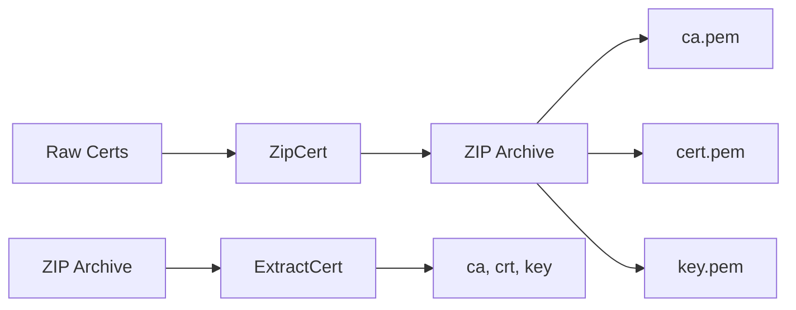

## Overview

This package provides utilities for packaging SSL certificates into ZIP archives and extracting them. It is used by the GoDoxy Agent to distribute certificates to clients in a convenient format.

## Architecture



## Public Functions

### ZipCert

```go
func ZipCert(ca, crt, key []byte) ([]byte, error)
```

Creates a ZIP archive containing three PEM files:

- `ca.pem` - CA certificate
- `cert.pem` - Server/client certificate
- `key.pem` - Private key

**Parameters:**

- `ca` - CA certificate in PEM format
- `crt` - Certificate in PEM format
- `key` - Private key in PEM format

**Returns:**

- ZIP archive bytes
- Error if packing fails

### ExtractCert

```go
func ExtractCert(data []byte) (ca, crt, key []byte, err error)
```

Extracts certificates from a ZIP archive created by `ZipCert`.

**Parameters:**

- `data` - ZIP archive bytes

**Returns:**

- `ca` - CA certificate bytes
- `crt` - Certificate bytes
- `key` - Private key bytes
- Error if extraction fails

### AgentCertsFilepath

```go
func AgentCertsFilepath(host string) (filepathOut string, ok bool)
```

Generates the file path for storing agent certificates.

**Parameters:**

- `host` - Agent hostname

**Returns:**

- Full file path within `certs/` directory
- `false` if host is invalid (contains path separators or special characters)

### isValidAgentHost

```go
func isValidAgentHost(host string) bool
```

Validates that a host string is safe for use in file paths.

## Constants

```go
const AgentCertsBasePath = "certs"
```

Base directory for storing certificate archives.

## File Format

The ZIP archive uses `zip.Store` compression (no compression) for fast creation and extraction. Each file is stored with its standard name (`ca.pem`, `cert.pem`, `key.pem`).
