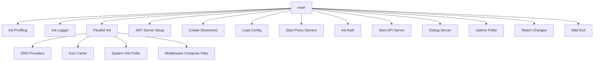

## Overview

This package contains the `main.go` entry point that initializes and starts the GoDoxy server. It coordinates the initialization of all core components including configuration loading, API server, authentication, and monitoring services.

## Architecture

## Main Function Flow

The `main()` function performs the following initialization steps:

1. **Profiling Setup**: Initializes pprof endpoints for performance monitoring
1. **Logger Initialization**: Configures zerolog with memory logging
1. **Parallel Initialization**: Starts DNS providers, icon cache, system info poller, and middleware
1. **JWT Secret**: Ensures API JWT secret is set (generates random if not provided)
1. **Directory Preparation**: Creates required directories for logs, certificates, etc.
1. **Configuration Loading**: Loads YAML configuration and reports any errors
1. **Proxy Servers**: Starts HTTP/HTTPS proxy servers based on configuration
1. **Authentication**: Initializes authentication system with access control
1. **API Server**: Starts the REST API server with all configured routes
1. **Debug Server**: Starts the debug page server (development mode)
1. **Monitoring**: Starts uptime and system info polling
1. **Change Watcher**: Starts watching for Docker container and configuration changes
1. **Graceful Shutdown**: Waits for exit signal with configured timeout

## Configuration

The main configuration is loaded from `config/config.yml`. Required directories include:

- `logs/` - Log files
- `config/` - Configuration directory
- `certs/` - SSL certificates
- `proxy/` - Proxy-related files

## Environment Variables

- `API_JWT_SECRET` - Secret key for JWT authentication (optional, auto-generated if not set)

## Dependencies

- `internal/api` - REST API handlers
- `internal/auth` - Authentication and ACL
- `internal/config` - Configuration management
- `internal/dnsproviders` - DNS provider integration
- `internal/homepage` - WebUI dashboard
- `internal/logging` - Logging infrastructure
- `internal/metrics` - System metrics collection
- `internal/route` - HTTP routing and middleware
- `github.com/yusing/goutils/task` - Task lifecycle management
