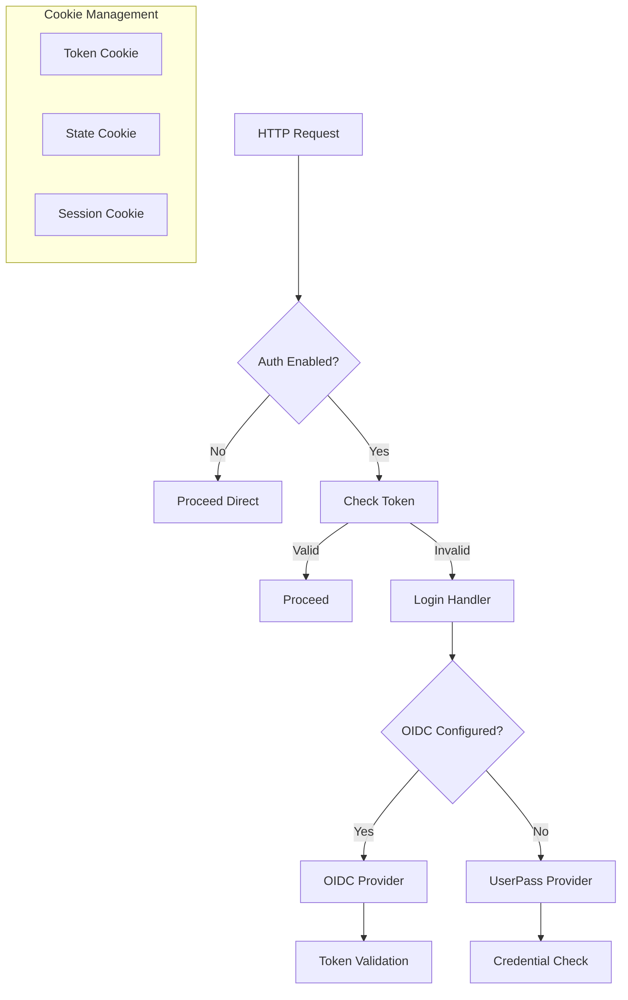
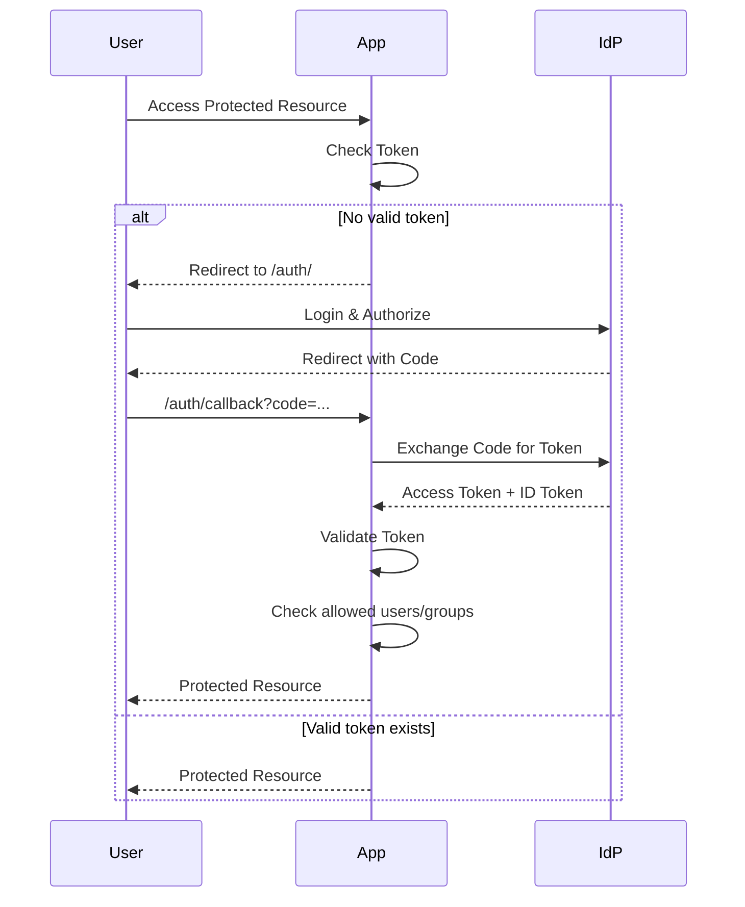
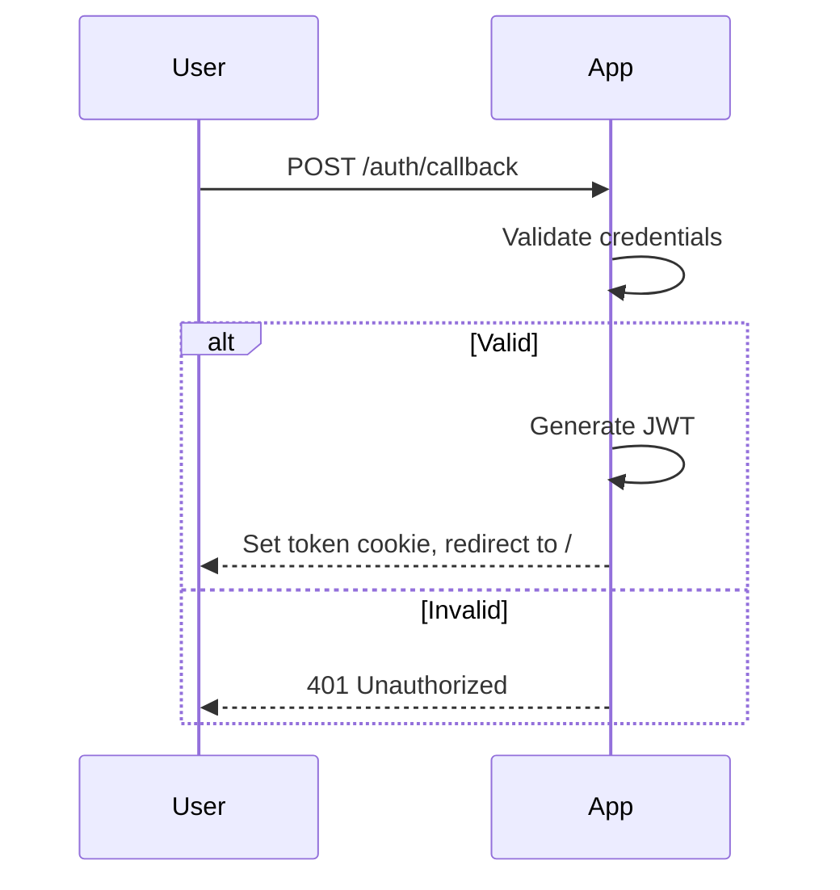

## Overview

The auth package implements authentication middleware and login handlers that integrate with GoDoxy's HTTP routing system. It provides flexible authentication that can be enabled/disabled based on configuration and supports multiple authentication providers.

### Primary consumers

- `internal/route/rules` - Authentication middleware for routes
- `internal/api/v1/auth` - Login and session management endpoints
- `internal/homepage` - WebUI login page

### Non-goals

- ACL or authorization (see `internal/acl`)
- User management database
- Multi-factor authentication
- Rate limiting (basic OIDC rate limiting only)

### Stability

Stable internal package. Public API consists of the `Provider` interface and initialization functions.

## Public API

### Exported types

```go
type Provider interface {
    CheckToken(r *http.Request) error
    LoginHandler(w http.ResponseWriter, r *http.Request)
    PostAuthCallbackHandler(w http.ResponseWriter, r *http.Request)
    LogoutHandler(w http.ResponseWriter, r *http.Request)
}
```

### OIDC Provider

```go
type OIDCProvider struct {
    oauthConfig   *oauth2.Config
    oidcProvider  *oidc.Provider
    oidcVerifier  *oidc.IDTokenVerifier
    endSessionURL *url.URL
    allowedUsers  []string
    allowedGroups []string
    rateLimit     *rate.Limiter
}
```

### Username/Password Provider

```go
type UserPassAuth struct {
    username string
    pwdHash  []byte
    secret   []byte
    tokenTTL time.Duration
}
```

### Exported functions

```go
func Initialize() error
```

Sets up authentication providers based on environment configuration. Returns error if OIDC issuer is configured but cannot be reached.

```go
func IsEnabled() bool
```

Returns whether authentication is enabled. Checks `DEBUG_DISABLE_AUTH`, `API_JWT_SECRET`, and `OIDC_ISSUER_URL`.

```go
func IsOIDCEnabled() bool
```

Returns whether OIDC authentication is configured.

```go
func GetDefaultAuth() Provider
```

Returns the configured authentication provider.

```go
func AuthCheckHandler(w http.ResponseWriter, r *http.Request)
```

HTTP handler that checks if the request has a valid token. Returns 200 if valid, invokes login handler otherwise.

```go
func AuthOrProceed(w http.ResponseWriter, r *http.Request) bool
```

Authenticates request or proceeds if valid. Returns `false` if login handler was invoked, `true` if authenticated.

```go
func ProceedNext(w http.ResponseWriter, r *http.Request)
```

Continues to the next handler after successful authentication.

```go
func NewUserPassAuth(username, password string, secret []byte, tokenTTL time.Duration) (*UserPassAuth, error)
```

Creates a new username/password auth provider with bcrypt password hashing.

```go
func NewUserPassAuthFromEnv() (*UserPassAuth, error)
```

Creates username/password auth from environment variables `API_USER`, `API_PASSWORD`, `API_JWT_SECRET`.

```go
func NewOIDCProvider(issuerURL, clientID, clientSecret string, allowedUsers, allowedGroups []string) (*OIDCProvider, error)
```

Creates a new OIDC provider. Returns error if issuer cannot be reached or no allowed users/groups are configured.

```go
func NewOIDCProviderFromEnv() (*OIDCProvider, error)
```

Creates OIDC provider from environment variables `OIDC_ISSUER_URL`, `OIDC_CLIENT_ID`, `OIDC_CLIENT_SECRET`, etc.

## Architecture

### Core components



### OIDC authentication flow



### Username/password flow



## Configuration Surface

### Environment variables

| Variable                 | Description                                                 |
| ------------------------ | ----------------------------------------------------------- |
| `DEBUG_DISABLE_AUTH`     | Set to "true" to disable auth for debugging                 |
| `API_JWT_SECRET`         | Secret key for JWT token validation (enables userpass auth) |
| `API_USER`               | Username for userpass authentication                        |
| `API_PASSWORD`           | Password for userpass authentication                        |
| `API_JWT_TOKEN_TTL`      | Token TTL duration (default: 24h)                           |
| `OIDC_ISSUER_URL`        | OIDC provider URL (enables OIDC)                            |
| `OIDC_CLIENT_ID`         | OIDC client ID                                              |
| `OIDC_CLIENT_SECRET`     | OIDC client secret                                          |
| `OIDC_REDIRECT_URL`      | OIDC redirect URL                                           |
| `OIDC_ALLOWED_USERS`     | Comma-separated list of allowed users                       |
| `OIDC_ALLOWED_GROUPS`    | Comma-separated list of allowed groups                      |
| `OIDC_SCOPES`            | Comma-separated OIDC scopes (default: openid,profile,email) |
| `OIDC_RATE_LIMIT`        | Rate limit requests (default: 10)                           |
| `OIDC_RATE_LIMIT_PERIOD` | Rate limit period (default: 1m)                             |

### Hot-reloading

Authentication configuration requires restart. No dynamic reconfiguration is supported.

## Dependency and Integration Map

### Internal dependencies

- `internal/common` - Environment variable access

### External dependencies

- `golang.org/x/crypto/bcrypt` - Password hashing
- `github.com/coreos/go-oidc/v3/oidc` - OIDC protocol
- `golang.org/x/oauth2` - OAuth2/OIDC implementation
- `github.com/golang-jwt/jwt/v5` - JWT token handling
- `golang.org/x/time/rate` - OIDC rate limiting

### Integration points

```go
// Route middleware uses AuthOrProceed
routeHandler := func(w http.ResponseWriter, r *http.Request) {
    if !auth.AuthOrProceed(w, r) {
        return // Auth failed, login handler was invoked
    }
    // Continue with authenticated request
}
```

## Observability

### Logs

- OIDC provider initialization errors
- Token validation failures
- Rate limit exceeded events

### Metrics

No metrics are currently exposed.

## Security Considerations

- JWT tokens use HS512 signing for userpass auth
- OIDC tokens are validated against the issuer
- Session tokens are scoped by client ID to prevent conflicts
- Passwords are hashed with bcrypt (cost 10)
- OIDC rate limiting prevents brute-force attacks
- State parameter prevents CSRF attacks
- Refresh tokens are stored and invalidated on logout

## Failure Modes and Recovery

| Failure                  | Behavior                       | Recovery                      |
| ------------------------ | ------------------------------ | ----------------------------- |
| OIDC issuer unreachable  | Initialize returns error       | Fix network/URL configuration |
| Invalid JWT secret       | Initialize uses API_JWT_SECRET | Provide correct secret        |
| Token expired            | CheckToken returns error       | User must re-authenticate     |
| User not in allowed list | Returns ErrUserNotAllowed      | Add user to allowed list      |
| Rate limit exceeded      | Returns 429 Too Many Requests  | Wait for rate limit reset     |

## Usage Examples

### Basic setup

```go
// Initialize authentication during startup
err := auth.Initialize()
if err != nil {
    log.Fatal(err)
}

// Check if auth is enabled
if auth.IsEnabled() {
    log.Println("Authentication is enabled")
}

// Check OIDC status
if auth.IsOIDCEnabled() {
    log.Println("OIDC authentication configured")
}
```

### Using AuthOrProceed middleware

```go
func protectedHandler(w http.ResponseWriter, r *http.Request) {
    if !auth.AuthOrProceed(w, r) {
        return // Auth failed, login handler was invoked
    }
    // Continue with authenticated request
}
```

### Using AuthCheckHandler

```go
http.HandleFunc("/api/", auth.AuthCheckHandler(apiHandler))
```

### Custom OIDC provider

```go
provider, err := auth.NewOIDCProvider(
    "https://your-idp.com",
    "your-client-id",
    "your-client-secret",
    []string{"user1", "user2"},
    []string{"group1"},
)
if err != nil {
    log.Fatal(err)
}
```

### Custom userpass provider

```go
provider, err := auth.NewUserPassAuth(
    "admin",
    "password123",
    []byte("jwt-secret-key"),
    24*time.Hour,
)
if err != nil {
    log.Fatal(err)
}
```
