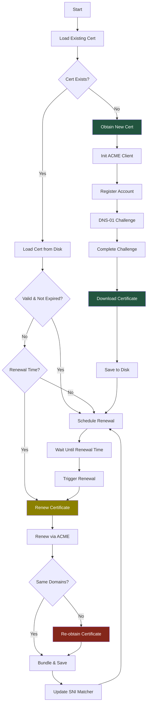
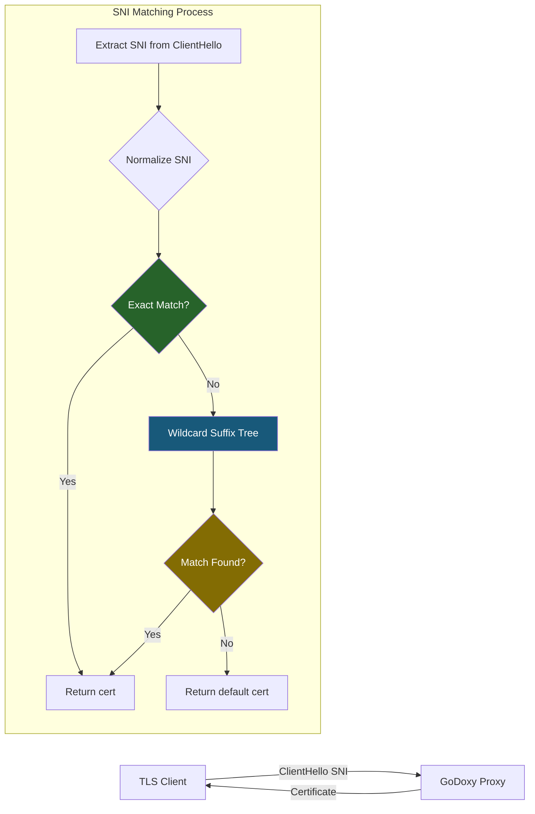

## Overview

### Purpose

This package provides complete SSL certificate lifecycle management:

- ACME account registration and management
- Certificate issuance via DNS-01 challenge
- Automatic renewal scheduling (1 month before expiry)
- SNI-based certificate selection for multi-domain setups

### Primary Consumers

- `goutils/server` - TLS handshake certificate provider
- `internal/api/v1/cert/` - REST API for certificate management
- Configuration loading via `internal/config/`

### Non-goals

- HTTP-01 challenge support
- Certificate transparency log monitoring
- OCSP stapling
- Private CA support (except via custom CADirURL)

### Stability

Internal package with stable public APIs. ACME protocol compliance depends on lego library.

## Public API

### Config (`config.go`)

```go
type Config struct {
    Email       string                       // ACME account email
    Domains     []string                     // Domains to certify
    CertPath    string                       // Output cert path
    KeyPath     string                       // Output key path
    Extra       []ConfigExtra                // Additional cert configs
    ACMEKeyPath string                       // ACME account private key
    Provider    string                       // DNS provider name
    Options     map[string]strutils.Redacted // Provider options
    Resolvers   []string                     // DNS resolvers (process-wide, see note below)
    CADirURL    string                       // Custom ACME CA directory
    CACerts     []string                     // Custom CA certificates
    EABKid      string                       // External Account Binding Key ID
    EABHmac     strutils.Redacted            // External Account Binding HMAC
    CertificateKeyType string                // ACME-issued cert key: EC256 (default), EC384, RSA2048, …
}

// Merge extra config with main provider
func MergeExtraConfig(mainCfg *Config, extraCfg *ConfigExtra) ConfigExtra
```

### Provider (`provider.go`)

```go
type Provider struct {
    logger       zerolog.Logger
    cfg          *Config
    user         *User
    legoCfg      *lego.Config
    client       *lego.Client
    lastFailure  time.Time
    legoCert     *certificate.Resource
    tlsCert      *tls.Certificate
    certExpiries CertExpiries
    extraProviders []*Provider
    sniMatcher   sniMatcher
}

// Create new provider (initializes extras atomically)
func NewProvider(cfg *Config, user *User, legoCfg *lego.Config) (*Provider, error)

// TLS certificate getter for SNI
func (p *Provider) GetCert(hello *tls.ClientHelloInfo) (*tls.Certificate, error)

// Certificate info for API
func (p *Provider) GetCertInfos() ([]CertInfo, error)

// Provider name ("main" or "extra[N]")
func (p *Provider) GetName() string

// Obtain certificate if not exists
func (p *Provider) ObtainCertIfNotExistsAll(ctx context.Context) error

// Force immediate renewal
func (p *Provider) ForceExpiryAll() bool

// Schedule automatic renewal
func (p *Provider) ScheduleRenewalAll(parent task.Parent)

// Print expiry dates
func (p *Provider) PrintCertExpiriesAll()
```

### User (`user.go`)

```go
type User struct {
    Email        string                 // Account email
    Registration *acme.ExtendedAccount  // ACME registration
    Key          crypto.Signer          // Account key
}
```

## Architecture

### Certificate Lifecycle



Existing certificate/key pairs are loaded before any ACME network request. An
unreachable CA therefore does not prevent HTTPS startup with cached certificates.
ACME clients are created only for issuance or renewal; failed scheduled renewals
retry after one hour while the loaded certificate remains available. If a
certificate is missing, initial issuance must still succeed before autocert starts.
TLS certificate selection reads memory only and returns an error when no certificate
is loaded; it never waits for ACME.

### Concurrency Model

- Certificate obtain / renew work is serialized per provider.
- Extra providers may still renew in parallel with each other.
- Each provider uses its own ACME HTTP client instance so parallel renewals do not mutate shared transport state.
- TLS certificate replacement and SNI matcher rebuilds are synchronized before new state becomes visible to handshakes.

### SNI Matching Flow



### Suffix Tree Structure

```
Certificate: *.example.com, example.com, *.api.example.com

exact:
  "example.com" -> Provider_A

root:
  └── "com"
      └── "example"
          ├── "*" -> Provider_A  [wildcard at *.example.com]
          └── "api"
              └── "*" -> Provider_B  [wildcard at *.api.example.com]
```

## Configuration Surface

### Provider Types

| Type           | Description                  | Use Case                  |
| -------------- | ---------------------------- | ------------------------- |
| `local`        | No ACME, use existing cert   | Pre-existing certificates |
| `pseudo`       | Internal mock provider      | Tests; not user-selectable |
| `custom`       | Custom ACME CA directory    | Internal ACME CAs          |
| DNS providers  | DNS-01 via bundled lego providers | Production           |

### Selectable Certificate Providers

[autocert-providers-start]: #

Generated from the bundled provider registry with `shadowtree gen-autocert-providers`.

| Provider ID | Configuration reference |
| --- | --- |
| `acmedns` | [lego acmedns](https://go-acme.github.io/lego/dns/acmedns/) |
| `azuredns` | [lego azuredns](https://go-acme.github.io/lego/dns/azuredns/) |
| `clouddns` | [lego clouddns](https://go-acme.github.io/lego/dns/clouddns/) |
| `cloudflare` | [lego cloudflare](https://go-acme.github.io/lego/dns/cloudflare/) |
| `cloudns` | [lego cloudns](https://go-acme.github.io/lego/dns/cloudns/) |
| `custom` | Custom ACME CA (`ca_dir_url`) |
| `desec` | [lego desec](https://go-acme.github.io/lego/dns/desec/) |
| `digitalocean` | [lego digitalocean](https://go-acme.github.io/lego/dns/digitalocean/) |
| `dnsupdate` | [lego dnsupdate](https://go-acme.github.io/lego/dns/dnsupdate/) |
| `duckdns` | [lego duckdns](https://go-acme.github.io/lego/dns/duckdns/) |
| `edgedns` | [lego edgedns](https://go-acme.github.io/lego/dns/edgedns/) |
| `gcloud` | [lego gcloud](https://go-acme.github.io/lego/dns/gcloud/) |
| `godaddy` | [lego godaddy](https://go-acme.github.io/lego/dns/godaddy/) |
| `hetzner` | [lego hetzner](https://go-acme.github.io/lego/dns/hetzner/) |
| `hostinger` | [lego hostinger](https://go-acme.github.io/lego/dns/hostinger/) |
| `httpreq` | [lego httpreq](https://go-acme.github.io/lego/dns/httpreq/) |
| `infomaniak` | [lego infomaniak](https://go-acme.github.io/lego/dns/infomaniak/) |
| `inwx` | [lego inwx](https://go-acme.github.io/lego/dns/inwx/) |
| `ionos` | [lego ionos](https://go-acme.github.io/lego/dns/ionos/) |
| `linode` | [lego linode](https://go-acme.github.io/lego/dns/linode/) |
| `local` | Existing certificate files (`cert_path` and `key_path`); no ACME |
| `namecheap` | [lego namecheap](https://go-acme.github.io/lego/dns/namecheap/) |
| `netcup` | [lego netcup](https://go-acme.github.io/lego/dns/netcup/) |
| `netlify` | [lego netlify](https://go-acme.github.io/lego/dns/netlify/) |
| `oraclecloud` | [lego oraclecloud](https://go-acme.github.io/lego/dns/oraclecloud/) |
| `ovh` | [lego ovh](https://go-acme.github.io/lego/dns/ovh/) |
| `porkbun` | [lego porkbun](https://go-acme.github.io/lego/dns/porkbun/) |
| `rfc2136` | Alias for `dnsupdate` |
| `scaleway` | [lego scaleway](https://go-acme.github.io/lego/dns/scaleway/) |
| `spaceship` | [lego spaceship](https://go-acme.github.io/lego/dns/spaceship/) |
| `timewebcloud` | [lego timewebcloud](https://go-acme.github.io/lego/dns/timewebcloud/) |
| `vercel` | [lego vercel](https://go-acme.github.io/lego/dns/vercel/) |
| `vultr` | [lego vultr](https://go-acme.github.io/lego/dns/vultr/) |

`pseudo` is internal and is not offered in the picker. Only the bundled DNS providers above are supported; lego's full catalogue includes providers that GoDoxy does not bundle.

[autocert-providers-end]: #

The WebUI uses the generated provider list for both the main certificate and
extra certificates. Providers without a dedicated credential form use the base
certificate fields and an editable `options` map.

### Example Configuration

```yaml
autocert:
  provider: cloudflare
  email: admin@example.com
  domains:
    - example.com
    - "*.example.com"
  # Optional: RSA leaf certs for clients without ECDSA support (e.g. some embedded MQTT stacks)
  # certificate_key_type: RSA2048
  options:
    auth_token: ${CF_API_TOKEN}
  resolvers:
    - 1.1.1.1:53
```

`options` keys match fields in the selected lego provider's `Config` struct,
written in snake_case (for example, `APIKey` becomes `api_key`). They are not
lego environment variable names. Only bundled providers are available.

`resolvers` sets the recursive nameservers used for the dns-01 propagation check.
lego applies it to a process-wide DNS client, so when extra providers each set
their own list, the last provider constructed wins. Set one
list on the main provider unless you know all providers agree.

### Extra Providers

```yaml
autocert:
  provider: cloudflare
  email: admin@example.com
  domains:
    - example.com
    - "*.example.com"
  cert_path: certs/example.com.crt
  key_path: certs/example.com.key
  options:
    auth_token: ${CF_API_TOKEN}
  extra:
    - domains:
        - api.example.com
        - "*.api.example.com"
      cert_path: certs/api.example.com.crt
      key_path: certs/api.example.com.key
```

## Dependency and Integration Map

### External Dependencies

- `github.com/go-acme/lego/v5` - ACME protocol implementation
- `github.com/rs/zerolog` - Structured logging

### Internal Dependencies

- `internal/task/task.go` - Lifetime management
- `internal/notif/` - Renewal notifications
- `internal/config/` - Configuration loading
- `internal/dnsproviders/` - DNS provider implementations

## Observability

### Logs

| Level   | When                          |
| ------- | ----------------------------- |
| `Info`  | Certificate obtained/renewed  |
| `Info`  | Registration reused           |
| `Warn`  | Renewal failure               |
| `Error` | Certificate retrieval failure |

### Notifications

- Certificate renewal success/failure
- Service startup with expiry dates

## Security Considerations

- Account private key stored at `certs/acme.key` (mode 0600)
- Certificate private keys stored at configured paths (mode 0600)
- Certificate files world-readable (mode 0644)
- ACME account email used for Let's Encrypt ToS
- EAB credentials for zero-touch enrollment

## Failure Modes and Recovery

| Failure Mode                   | Impact                     | Recovery                      |
| ------------------------------ | -------------------------- | ----------------------------- |
| DNS-01 challenge timeout       | Certificate issuance fails | Check DNS provider API        |
| Rate limiting (too many certs) | 1-hour cooldown            | Wait or use different account |
| DNS provider API error         | Renewal fails              | 1-hour cooldown, retry        |
| Certificate domains mismatch   | Must re-obtain             | Force renewal via API         |
| Account key corrupted          | Must register new account  | New key, may lose certs       |

### Failure Tracking

Last failure persisted per-certificate to prevent rate limiting:

```
File: <cert_dir>/.last_failure-<hash>
Where hash = SHA256(certPath|keyPath)[:6]
```

## Usage Examples

### Initial Setup

```go
autocertCfg := state.AutoCert
user, legoCfg, err := autocertCfg.GetLegoConfig()
if err != nil {
    return err
}

provider, err := autocert.NewProvider(autocertCfg, user, legoCfg)
if err != nil {
    return fmt.Errorf("autocert error: %w", err)
}

if err := provider.ObtainCertIfNotExistsAll(state.Task().Context()); err != nil {
    return fmt.Errorf("failed to obtain certificates: %w", err)
}

provider.ScheduleRenewalAll(state.Task())
provider.PrintCertExpiriesAll()
```

### Force Renewal via API

```go
// WebSocket endpoint: GET /api/v1/cert/renew
if provider.ForceExpiryAll() {
    // Wait for renewal to complete
    provider.WaitRenewalDone(ctx)
}
```

## Maintaining the Provider Contract

`internal/dnsproviders/providers.go` is the source of the bundled DNS provider
list. Run `shadowtree gen-autocert-providers` after changing it to regenerate the
WebUI provider union, the marked documentation tables, and the config/autocert
schemas. Run `shadowtree check-autocert-providers` to detect drift; CI runs this
contract check too. Preserve generated blocks when editing surrounding prose.

## Testing Notes

- `config_test.go` - Configuration validation
- `provider_test/` - Provider functionality tests
- `sni_test.go` - SNI matching tests
- `multi_cert_test.go` - Extra provider tests
- Integration tests require mock DNS provider
