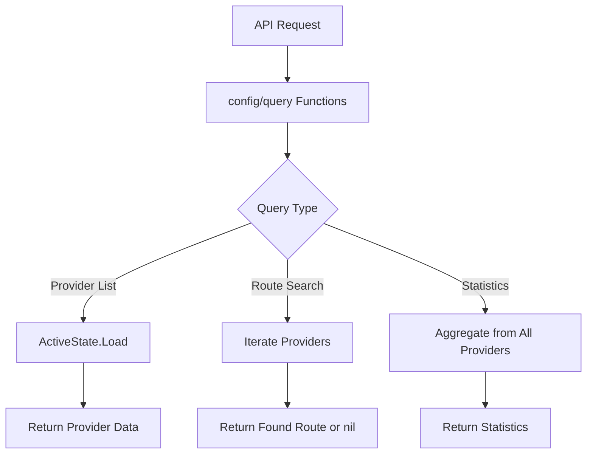

## Overview

The `internal/config/query` package offers read-only access to the active configuration state. It provides functions to dump route providers, list providers, search for routes, and retrieve system statistics. This package is primarily used by the API layer to expose configuration information.

### Primary consumers

- `internal/api/v1` - REST API endpoints for configuration queries
- `internal/homepage` - Dashboard statistics display
- Operators - CLI tools and debugging interfaces

### Non-goals

- Configuration modification (see `internal/config`)
- Provider lifecycle management
- Dynamic state updates

### Stability

Stable internal package. Functions are simple read-only accessors.

## Public API

### Exported types

```go
type RouteProviderListResponse struct {
    ShortName string `json:"short_name"`
    FullName  string `json:"full_name"`
}
```

```go
type Statistics struct {
    Total          uint16                         `json:"total"`
    ReverseProxies types.RouteStats               `json:"reverse_proxies"`
    Streams        types.RouteStats               `json:"streams"`
    Providers      map[string]types.ProviderStats `json:"providers"`
}
```

### Exported functions

```go
func DumpRouteProviders() map[string]types.RouteProvider
```

Returns all route providers as a map keyed by their short name. Thread-safe access via `config.ActiveState.Load()`.

```go
func RouteProviderList() []RouteProviderListResponse
```

Searches for a route by alias across all providers. Returns `nil` if not found.

```go
func GetStatistics() Statistics
```

Aggregates statistics from all route providers, including total routes, reverse proxies, streams, and per-provider stats.

## Architecture

### Core components

```
config/query/
├── query.go    # Provider and route queries
└── stats.go    # Statistics aggregation
```

### Data flow



### Thread safety model

All functions use `config.ActiveState.Load()` for thread-safe read access:

```go
func DumpRouteProviders() map[string]types.RouteProvider {
    state := config.ActiveState.Load()
    entries := make(map[string]types.RouteProvider, state.NumProviders())
    for _, p := range state.IterProviders() {
        entries[p.ShortName()] = p
    }
    return entries
}
```

## Configuration Surface

No configuration. This package only reads from the active state.

## Dependency and Integration Map

### Internal dependencies

- `internal/config/types` - `ActiveState` atomic pointer and `State` interface
- `internal/types` - Route provider and route types

### Integration points

```go
// API endpoint uses query functions
func ListProviders(w http.ResponseWriter, r *http.Request) {
    providers := statequery.RouteProviderList()
    json.NewEncoder(w).Encode(providers)
}
```

## Observability

### Logs

No logging in the query package itself.

### Metrics

No metrics are currently exposed.

## Security Considerations

- Read-only access prevents state corruption
- No sensitive data is exposed beyond what the configuration already contains
- Caller should handle nil state gracefully

## Failure Modes and Recovery

| Failure              | Behavior                   | Recovery                       |
| -------------------- | -------------------------- | ------------------------------ |
| No active state      | Functions return empty/nil | Initialize config first        |
| Provider returns nil | Skipped in iteration       | Provider should not return nil |
| Route not found      | Returns nil                | Expected behavior              |

## Performance Characteristics

- O(n) where n is number of providers for provider queries
- O(n \* m) where m is routes per provider for route search
- O(n) for statistics aggregation
- No locking required (uses atomic load)

## Usage Examples

### Listing all providers

```go
providers := statequery.RouteProviderList()
for _, p := range providers {
    fmt.Printf("Short: %s, Full: %s\n", p.ShortName, p.FullName)
}
```

### Getting all providers as a map

```go
providers := statequery.DumpRouteProviders()
for shortName, provider := range providers {
    fmt.Printf("%s: %s\n", shortName, provider.String())
}
```

### Getting system statistics

```go
stats := statequery.GetStatistics()
fmt.Printf("Total routes: %d\n", stats.Total)
fmt.Printf("Reverse proxies: %d\n", stats.ReverseProxies.Total)
for name, providerStats := range stats.Providers {
    fmt.Printf("Provider %s: %d routes\n", name, providerStats.RPs.Total)
}
```

### Integration with API

```go
func handleGetProviders(w http.ResponseWriter, r *http.Request) {
    providers := statequery.RouteProviderList()
    w.Header().Set("Content-Type", "application/json")
    json.NewEncoder(w).Encode(providers)
}

func handleGetStats(w http.ResponseWriter, r *http.Request) {
    stats := statequery.GetStatistics()
    w.Header().Set("Content-Type", "application/json")
    json.NewEncoder(w).Encode(stats)
}
```
