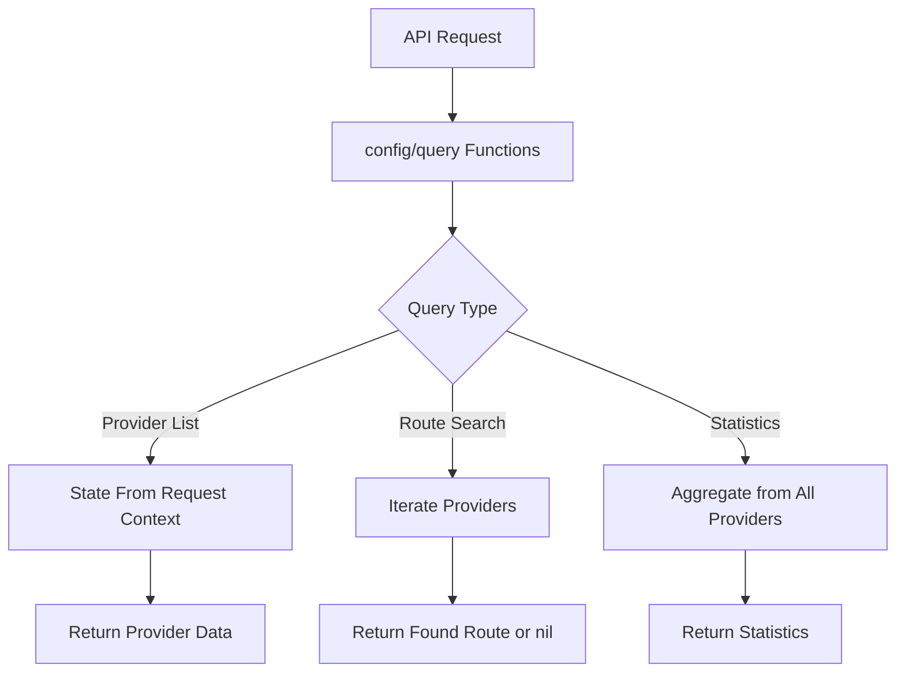

## Overview

The `internal/config/query` package offers read-only projections of the runtime
state carried by a request context. It lists route providers and retrieves
system statistics for the exact runtime that accepted the request.

### Primary consumers

- `internal/api/v1` - REST API endpoints for configuration queries
- `internal/homepage` - Dashboard statistics display
- Operators - CLI tools and debugging interfaces

### Non-goals

- Configuration modification (see `internal/config`)
- Provider lifecycle management
- Dynamic state updates

### Stability

Stable internal package. Functions are simple read-only accessors.

## Public API

### Exported types

```go
type RouteProviderListResponse struct {
    ShortName string `json:"short_name"`
    FullName  string `json:"full_name"`
}
```

```go
type Statistics struct {
    Total          uint16                           `json:"total"`
    ReverseProxies routing.RouteStats               `json:"reverse_proxies"`
    Streams        routing.RouteStats               `json:"streams"`
    Providers      map[string]routing.ProviderStats `json:"providers"`
}
```

### Exported functions

```go
func RouteProviderList(ctx context.Context) []RouteProviderListResponse
```

Returns route provider short and full names for API responses.

```go
func GetStatistics(ctx context.Context) Statistics
```

Aggregates statistics from all route providers, including total routes, reverse proxies, streams, and per-provider stats.

## Architecture

### Core components

```
config/query/
├── query.go    # Provider and route queries
└── stats.go    # Statistics aggregation
```

### Data flow


```mermaid
graph TD
    A[API Request] --> B[config/query Functions]
    B --> C{Query Type}
    C -->|Provider List| D[State From Request Context]
    C -->|Route Search| E[Iterate Providers]
    C -->|Statistics| F[Aggregate from All Providers]
    D --> G[Return Provider Data]
    E --> H[Return Found Route or nil]
    F --> I[Return Statistics]
```

### State ownership

All functions resolve the state already attached to the request context:

```go
func RouteProviderList(ctx context.Context) []RouteProviderListResponse {
    state := config.FromCtx(ctx)
    if state == nil {
        return nil
    }
    list := make([]RouteProviderListResponse, 0, state.NumProviders())
    for _, p := range state.IterProviders() {
        list = append(list, RouteProviderListResponse{
            ShortName: p.ShortName(),
            FullName:  p.String(),
        })
    }
    return list
}
```

## Configuration Surface

No configuration. This package only reads from the active state.

## Dependency and Integration Map

### Internal dependencies

- `internal/config/types` - request-context helpers and the `State` interface
- `internal/types` - Route provider and route types

### Integration points

```go
// API endpoint uses query functions
func ListProviders(w http.ResponseWriter, r *http.Request) {
    providers := statequery.RouteProviderList(r.Context())
    json.NewEncoder(w).Encode(providers)
}
```

## Observability

### Logs

No logging in the query package itself.

### Metrics

No metrics are currently exposed.

## Security Considerations

- Read-only access prevents state corruption
- No sensitive data is exposed beyond what the configuration already contains
- Missing context state returns an empty projection

## Failure Modes and Recovery

| Failure              | Behavior                   | Recovery                       |
| -------------------- | -------------------------- | ------------------------------ |
| No context state     | Functions return empty/nil | Install runtime request context |
| Provider returns nil | Skipped in iteration       | Provider should not return nil |
| Route not found      | Returns nil                | Expected behavior              |

## Performance Characteristics

- O(n) where n is number of providers for provider queries
- O(n \* m) where m is routes per provider for route search
- O(n) for statistics aggregation
- No package-global runtime lookup

## Usage Examples

### Listing all providers

```go
providers := statequery.RouteProviderList(ctx)
for _, p := range providers {
    fmt.Printf("Short: %s, Full: %s\n", p.ShortName, p.FullName)
}
```

### Getting system statistics

```go
stats := statequery.GetStatistics(ctx)
fmt.Printf("Total routes: %d\n", stats.Total)
fmt.Printf("Reverse proxies: %d\n", stats.ReverseProxies.Total)
for name, providerStats := range stats.Providers {
    fmt.Printf("Provider %s: %d routes\n", name, providerStats.RPs.Total)
}
```

### Integration with API

```go
func handleGetProviders(w http.ResponseWriter, r *http.Request) {
    providers := statequery.RouteProviderList(r.Context())
    w.Header().Set("Content-Type", "application/json")
    json.NewEncoder(w).Encode(providers)
}

func handleGetStats(w http.ResponseWriter, r *http.Request) {
    stats := statequery.GetStatistics(r.Context())
    w.Header().Set("Content-Type", "application/json")
    json.NewEncoder(w).Encode(stats)
}
```
