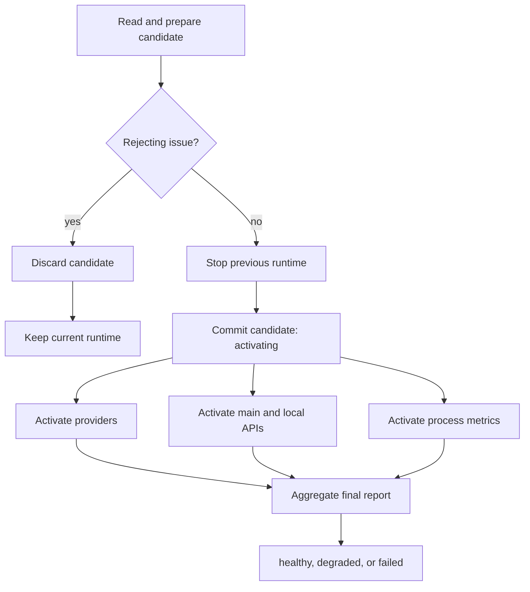

## Lifecycle contract

A candidate configuration has separate persistence, commitment, and activation
outcomes. Once preparation finishes without a rejecting issue, the candidate is
authoritative. The previous runtime is stopped, `RuntimeManager.commitState`
publishes the candidate with status `activating`, and every independent subsystem is
activated. Provider or route failures after that boundary never restore the old
configuration.



`Load` and `Reload` share this transition through `RuntimeManager`. Expected
rejections and degraded or failed activations are returned as `ReloadResult`;
they are not transported through panics.

```go
type ReloadResult struct {
    Committed bool
    Health    ActivationHealth
    Issues    []ActivationIssue
    ActivationReport
}

func Load(ctx context.Context) ReloadResult
func Reload(ctx context.Context) ReloadResult
```

The final report contains provider ready/degraded/failed counts, route
active/failed counts, separate main/local API results, metrics readiness, and
classified component issues. `RuntimeSnapshot` exposes the current runtime
status through `/api/v1/stats`.

## Error ownership and classification

`RejectingError` is reserved for preparation failures that make the candidate
unsafe to accept: unreadable root configuration, invalid YAML or root semantics,
and inability to build required entrypoint state. Optional provider,
notification, MaxMind, Proxmox, certificate, and route-source failures are
recorded as non-rejecting preparation issues.

Issues retain their original `error` values. Classification uses the wrapped
error chain, and JSON, logging, and notification formatting occurs only at the
final presentation boundary. This preserves nested GoDoxy plain, Markdown, and
JSON error formats and keeps `errors.Is`/`errors.As` usable. Unknown preparation
classifications fail closed; unknown activation severities produce failed
health.

Exactly one final lifecycle result is written to the pretty log, runtime event
history, and the notifier chosen by commitment:

- rejected candidate: the current runtime notifier;
- committed candidate: the new runtime notifier.

## State ownership

Every state owns a root `task.Task` and its runtime-specific dependencies:

- route providers and entrypoint;
- agent pool;
- Proxmox node pool;
- MaxMind instance and lookup cache;
- notification dispatcher;
- event history reference;
- autocert provider;
- buffered preparation diagnostics.

These dependencies are installed on the state task and inherited by provider,
route, server, and request contexts. Candidate preparation therefore cannot
mutate registries belonging to the active runtime. There is no global working
state. The committed-state synchronization cell belongs to the owning
`RuntimeManager`, rather than to the package.
Request handlers use `types.FromCtx`; process-lifetime services that must follow
runtime replacement use an explicit `RuntimeStateSource` installed on their
task by `RuntimeManager`.

```go
type State interface {
    Task() *task.Task
    Context() context.Context
    Value() *Config

    ActivateProviders(context.Context) routing.ProviderActivationReport
    ActivateAPIServers(context.Context) APIActivationReport
    RuntimeSnapshot() RuntimeSnapshot
    Stop(reason any)
}
```

## Preparation

`state.Init` validates the root YAML, creates context-owned dependencies, builds
the entrypoint, and loads all route providers with the candidate context.
Provider files and agents are attempted independently; one failed source does
not prevent other sources from being represented in the candidate.

Preparation diagnostics remain buffered until the lifecycle decision. Rejected
candidates discard the buffer. Accepted candidates flush it once; persistent
flush failure degrades the runtime and enables direct logging for subsequent
diagnostics.

## Activation

`state.ActivateProviders` activates providers concurrently and aggregates their
structured reports. `state.ActivateAPIServers` reports the mandatory main API
and optional local API separately and cleans a failed server task before
returning. The runtime manager owns metrics as a process-lifetime service, so
reload does not start duplicate mutable pollers.

Authentication and static API handler registration happen in `cmd/main.go`
before the shared initial-load lifecycle can activate API listeners.

## Hot reload and cancellation

The config watcher filters rename, delete, and managed-write suppression events,
then calls `Reload` directly. It never panics for an expected lifecycle result.

- Cancellation before acceptance stops and discards the candidate and retains
  the current runtime.
- Cancellation after acceptance leaves the candidate authoritative, stops its
  incomplete work, and reports failed activation without resurrecting the old
  runtime.

## Observability

The final human log is a compact multiline summary:

```text
config committed: degraded
providers: 4 ready, 1 degraded, 1 failed
routes: 37 active, 3 failed
api: main ready, local failed
metrics: ready
```

The event and API boundaries retain the full machine-readable result. The stats
endpoint includes runtime status and the latest activation report.

## Security

- Configuration files contain credentials and require restricted permissions.
- Startup diagnostics are allowlisted and never recursively serialize config.
- Runtime contexts prevent a candidate from inheriting or overwriting the old
  state's agents, MaxMind reader, notifier, Proxmox nodes, or event sink.
- Local unauthenticated API binds remain loopback-only unless explicitly
  allowed by `LOCAL_API_ALLOW_NON_LOOPBACK`.
