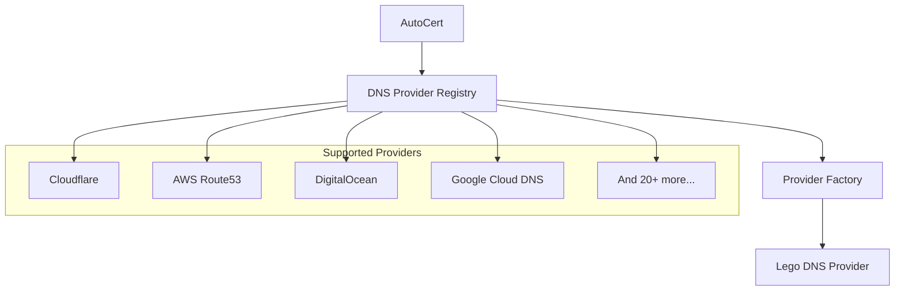
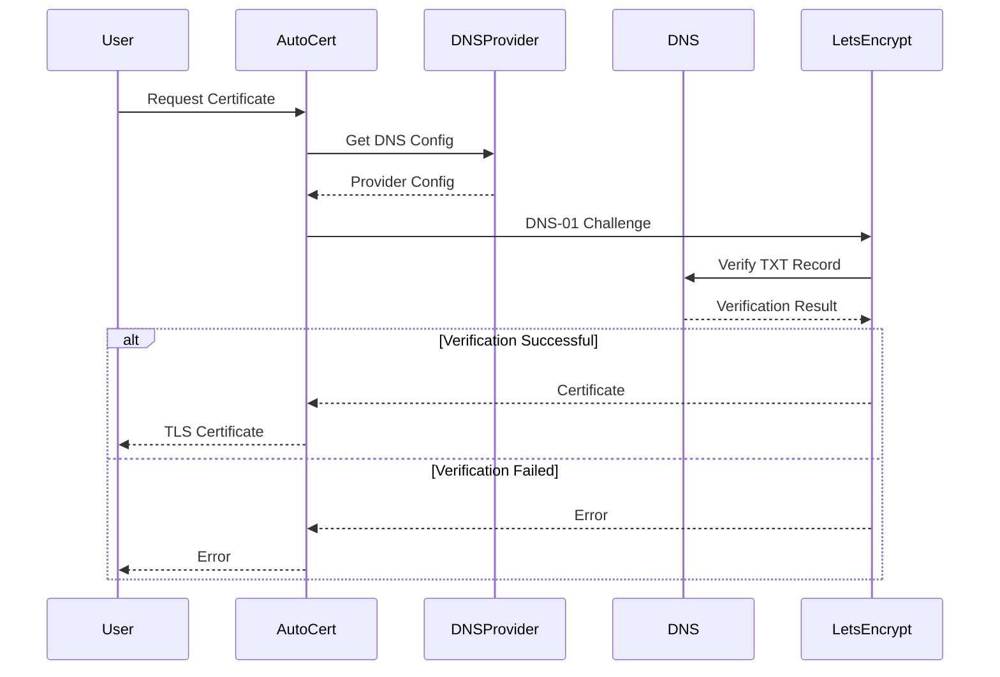

## Overview

The dnsproviders package registers and initializes DNS providers supported by the ACME protocol implementation (lego). It provides a unified interface for configuring DNS-01 challenge providers for SSL certificate issuance.

### Primary consumers

- `internal/autocert` - Uses registered providers for certificate issuance
- Operators - Configure DNS providers via YAML

### Non-goals

- DNS zone management
- Record creation/deletion outside ACME challenges
- Provider-specific features beyond DNS-01

### Stability

Stable internal package. Provider registry is extensible.

## Public API

### Exported constants

```go
const (
    Local  = "local"   // Dummy local provider for static certificates
    Pseudo = "pseudo"  // Pseudo provider for testing
)
```

### Exported functions

```go
func InitProviders()
```

Registers all available DNS providers with the autocert package. Called during initialization.

```go
func NewDummyDefaultConfig() *Config
```

Creates a dummy default config for testing providers.

```go
func NewDummyDNSProviderConfig() map[string]any
```

Creates a dummy provider configuration for testing.

## Architecture

### Core components



### Supported providers

| Provider       | Key             | Description           |
| -------------- | --------------- | --------------------- |
| ACME DNS       | `acmedns`       | ACME DNS server       |
| Azure DNS      | `azuredns`      | Microsoft Azure DNS   |
| Cloudflare     | `cloudflare`    | Cloudflare DNS        |
| CloudNS        | `cloudns`       | ClouDNS               |
| CloudDNS       | `clouddns`      | Google Cloud DNS      |
| DigitalOcean   | `digitalocean`  | DigitalOcean DNS      |
| DuckDNS        | `duckdns`       | DuckDNS               |
| EdgeDNS        | `edgedns`       | Akamai EdgeDNS        |
| GoDaddy        | `godaddy`       | GoDaddy DNS           |
| Google Domains | `googledomains` | Google Domains DNS    |
| Hetzner        | `hetzner`       | Hetzner DNS           |
| Hostinger      | `hostinger`     | Hostinger DNS         |
| HTTP Request   | `httpreq`       | Generic HTTP provider |
| INWX           | `inwx`          | INWX DNS              |
| IONOS          | `ionos`         | IONOS DNS             |
| Linode         | `linode`        | Linode DNS            |
| Namecheap      | `namecheap`     | Namecheap DNS         |
| Netcup         | `netcup`        | netcup DNS            |
| Netlify        | `netlify`       | Netlify DNS           |
| OVH            | `ovh`           | OVHcloud DNS          |
| Oracle Cloud   | `oraclecloud`   | Oracle Cloud DNS      |
| Porkbun        | `porkbun`       | Porkbun DNS           |
| RFC 2136       | `rfc2136`       | BIND/named (RFC 2136) |
| Scaleway       | `scaleway`      | Scaleway DNS          |
| SpaceShip      | `spaceship`     | SpaceShip DNS         |
| Timeweb Cloud  | `timewebcloud`  | Timeweb Cloud DNS     |
| Vercel         | `vercel`        | Vercel DNS            |
| Vultr          | `vultr`         | Vultr DNS             |
| Google Cloud   | `gcloud`        | Google Cloud DNS      |

## Configuration Surface

### Config sources

Configuration is loaded from `config/config.yml` under the `autocert` key.

### Schema

```yaml
autocert:
  provider: cloudflare
  email: admin@example.com
  domains:
    - example.com
    - "*.example.com"
  options: # provider-specific options
    auth_token: your-api-token
```

### Hot-reloading

Supports hot-reloading via editing `config/config.yml`.

## Dependency and Integration Map

### Internal dependencies

- `internal/autocert` - Provider registry and certificate issuance

### External dependencies

- `github.com/go-acme/lego/v4/providers/dns/*` - All lego DNS providers

### Integration points

```go
// In autocert package
var Providers = map[string]DNSProvider{
    "local":  dnsproviders.NewDummyDefaultConfig,
    "pseudo": dnsproviders.NewDummyDefaultConfig,
    // ... registered providers
}

type DNSProvider func(*any, ...any) (provider.Config, error)
```

## Observability

### Logs

- Provider initialization messages from lego
- DNS challenge validation attempts
- Certificate issuance progress

### Metrics

No metrics are currently exposed.

## Security Considerations

- API credentials are passed to provider configuration
- Credentials are stored in configuration files (should be protected)
- DNS-01 challenge requires TXT record creation capability
- Provider should have minimal DNS permissions (only TXT records)

## Failure Modes and Recovery

| Failure               | Behavior                    | Recovery                               |
| --------------------- | --------------------------- | -------------------------------------- |
| Invalid credentials   | Provider returns error      | Verify credentials                     |
| DNS propagation delay | Challenge fails temporarily | Retry with longer propagation time     |
| Provider unavailable  | Certificate issuance fails  | Use alternative provider               |
| Unsupported provider  | Key not found in registry   | Register provider or use supported one |

## Performance Characteristics

- Provider initialization is O(1) per provider
- DNS-01 challenge depends on DNS propagation time
- Certificate issuance may take several seconds

## Usage Examples

### Initialization

```go
import "github.com/yusing/godoxy/internal/dnsproviders"

func init() {
    dnsproviders.InitProviders()
}
```

### Using with AutoCert

```go
import "github.com/yusing/godoxy/internal/autocert"

// Providers are automatically registered
providers := autocert.Providers

provider, ok := providers["cloudflare"]
if !ok {
    log.Fatal("Cloudflare provider not available")
}

config := provider.DefaultConfig()
```

### Getting provider configuration

```go
// Access registered providers
for name, factory := range autocert.Providers {
    cfg := factory.DefaultConfig()
    log.Printf("Provider %s: %+v", name, cfg)
}
```

### Certificate issuance flow


