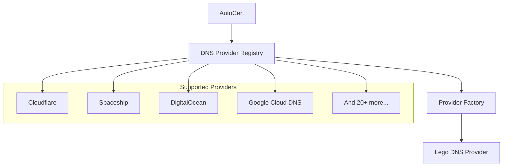
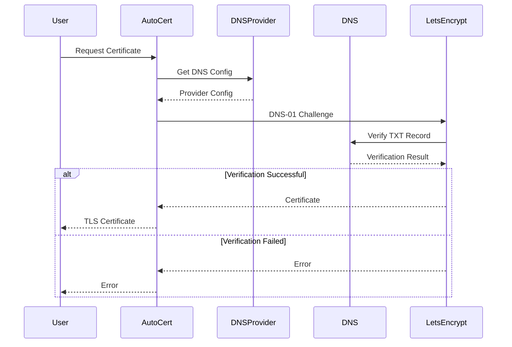

## Overview

The dnsproviders package registers and initializes the bundled subset of lego DNS providers. It provides a unified interface for configuring DNS-01 challenge providers for SSL certificate issuance.

### Primary consumers

- `internal/autocert` - Uses registered providers for certificate issuance
- Operators - Configure DNS providers via YAML

### Non-goals

- DNS zone management
- Record creation/deletion outside ACME challenges
- Provider-specific features beyond DNS-01

### Stability

Stable internal package. Provider registry is extensible.

## Public API

### Exported constants

```go
const (
    Local  = "local"   // Dummy local provider for static certificates
    Pseudo = "pseudo"  // Pseudo provider for testing
)
```

### Exported functions

```go
func InitProviders()
```

Registers the bundled DNS providers and the `rfc2136` alias with the autocert package. Called during initialization.

```go
func NewDummyDefaultConfig() *DummyConfig
```

Creates a dummy default config for testing providers.

```go
func NewDummyDNSProviderConfig(*DummyConfig) (*DummyProvider, error)
```

Creates a no-op DNS challenge provider for local certificates and tests.

## Architecture

### Core components


```mermaid
graph TD
    A[AutoCert] --> B[DNS Provider Registry]
    B --> C[Provider Factory]
    C --> D[Lego DNS Provider]

    subgraph Supported Providers
        E[Cloudflare]
        F[Spaceship]
        G[DigitalOcean]
        H[Google Cloud DNS]
        I[And 20+ more...]
    end

    B --> E
    B --> F
    B --> G
    B --> H
    B --> I
```

### Selectable certificate providers

[autocert-providers-start]: #

Generated from the bundled provider registry with `shadowtree gen-autocert-providers`.

| Provider ID | Configuration reference |
| --- | --- |
| `acmedns` | [lego acmedns](https://go-acme.github.io/lego/dns/acmedns/) |
| `azuredns` | [lego azuredns](https://go-acme.github.io/lego/dns/azuredns/) |
| `clouddns` | [lego clouddns](https://go-acme.github.io/lego/dns/clouddns/) |
| `cloudflare` | [lego cloudflare](https://go-acme.github.io/lego/dns/cloudflare/) |
| `cloudns` | [lego cloudns](https://go-acme.github.io/lego/dns/cloudns/) |
| `custom` | Custom ACME CA (`ca_dir_url`) |
| `desec` | [lego desec](https://go-acme.github.io/lego/dns/desec/) |
| `digitalocean` | [lego digitalocean](https://go-acme.github.io/lego/dns/digitalocean/) |
| `dnsupdate` | [lego dnsupdate](https://go-acme.github.io/lego/dns/dnsupdate/) |
| `duckdns` | [lego duckdns](https://go-acme.github.io/lego/dns/duckdns/) |
| `edgedns` | [lego edgedns](https://go-acme.github.io/lego/dns/edgedns/) |
| `gcloud` | [lego gcloud](https://go-acme.github.io/lego/dns/gcloud/) |
| `godaddy` | [lego godaddy](https://go-acme.github.io/lego/dns/godaddy/) |
| `hetzner` | [lego hetzner](https://go-acme.github.io/lego/dns/hetzner/) |
| `hostinger` | [lego hostinger](https://go-acme.github.io/lego/dns/hostinger/) |
| `httpreq` | [lego httpreq](https://go-acme.github.io/lego/dns/httpreq/) |
| `infomaniak` | [lego infomaniak](https://go-acme.github.io/lego/dns/infomaniak/) |
| `inwx` | [lego inwx](https://go-acme.github.io/lego/dns/inwx/) |
| `ionos` | [lego ionos](https://go-acme.github.io/lego/dns/ionos/) |
| `linode` | [lego linode](https://go-acme.github.io/lego/dns/linode/) |
| `local` | Existing certificate files (`cert_path` and `key_path`); no ACME |
| `namecheap` | [lego namecheap](https://go-acme.github.io/lego/dns/namecheap/) |
| `netcup` | [lego netcup](https://go-acme.github.io/lego/dns/netcup/) |
| `netlify` | [lego netlify](https://go-acme.github.io/lego/dns/netlify/) |
| `oraclecloud` | [lego oraclecloud](https://go-acme.github.io/lego/dns/oraclecloud/) |
| `ovh` | [lego ovh](https://go-acme.github.io/lego/dns/ovh/) |
| `porkbun` | [lego porkbun](https://go-acme.github.io/lego/dns/porkbun/) |
| `rfc2136` | Alias for `dnsupdate` |
| `scaleway` | [lego scaleway](https://go-acme.github.io/lego/dns/scaleway/) |
| `spaceship` | [lego spaceship](https://go-acme.github.io/lego/dns/spaceship/) |
| `timewebcloud` | [lego timewebcloud](https://go-acme.github.io/lego/dns/timewebcloud/) |
| `vercel` | [lego vercel](https://go-acme.github.io/lego/dns/vercel/) |
| `vultr` | [lego vultr](https://go-acme.github.io/lego/dns/vultr/) |

`pseudo` is internal and is not offered in the picker. Only the bundled DNS providers above are supported; lego's full catalogue includes providers that GoDoxy does not bundle.

[autocert-providers-end]: #

`rfc2136` is accepted as an alias for `dnsupdate`, which lego renamed in v5.

Provider options match fields in the selected lego provider `Config` struct,
written in snake_case (for example, `APIKey` becomes `api_key`), not lego
environment variable names. Lego v5 changed some of them:

| Provider    | Change                                     |
| ----------- | ------------------------------------------ |
| `scaleway`  | `token` renamed to `secret_key`            |
| `netcup`    | `ttl` removed                              |
| `namecheap` | `debug` removed                            |
| `vultr`     | `http_timeout` removed                     |

`googledomains` is gone: lego v5 dropped it after Google shut the service down.

## Configuration Surface

### Config sources

Configuration is loaded from `config/config.yml` under the `autocert` key.

### Schema

```yaml
autocert:
  provider: cloudflare
  email: admin@example.com
  domains:
    - example.com
    - "*.example.com"
  options: # provider-specific options
    auth_token: your-api-token
```

The WebUI offers the same generated list for main and extra certificates. For
providers without dedicated credential forms, it shows base certificate fields
and an editable `options` map.

### Maintaining the provider contract

The registry in `internal/dnsproviders/providers.go` defines the bundled providers.
Run `shadowtree gen-autocert-providers` after changing it to regenerate the
WebUI provider union, marked documentation tables, and config/autocert schemas.
`shadowtree check-autocert-providers` detects drift, and CI runs this contract
check. Preserve the marked blocks when editing surrounding prose.

### Hot-reloading

Supports hot-reloading via editing `config/config.yml`.

## Dependency and Integration Map

### Internal dependencies

- `internal/autocert` - Provider registry and certificate issuance

### External dependencies

- `github.com/go-acme/lego/v5/providers/dns/*` - Bundled lego DNS providers

### Integration points

```go
// In autocert package
type Generator func(map[string]strutils.Redacted) (challenge.Provider, error)

var Providers = make(map[string]Generator)

func DNSProvider[CT any, PT challenge.Provider](
    defaultCfg func() *CT,
    newProvider func(*CT) (PT, error),
) Generator
```

## Observability

### Logs

- Provider initialization messages from lego
- DNS challenge validation attempts
- Certificate issuance progress

### Metrics

No metrics are currently exposed.

## Security Considerations

- API credentials are passed to provider configuration
- Credentials are stored in configuration files (should be protected)
- DNS-01 challenge requires TXT record creation capability
- Provider should have minimal DNS permissions (only TXT records)

## Failure Modes and Recovery

| Failure               | Behavior                    | Recovery                               |
| --------------------- | --------------------------- | -------------------------------------- |
| Invalid credentials   | Provider returns error      | Verify credentials                     |
| DNS propagation delay | Challenge fails temporarily | Retry with longer propagation time     |
| Provider unavailable  | Certificate issuance fails  | Use alternative provider               |
| Unsupported provider  | Key not found in registry   | Register provider or use supported one |

## Performance Characteristics

- Provider initialization is O(1) per provider
- DNS-01 challenge depends on DNS propagation time
- Certificate issuance may take several seconds

## Usage Examples

### Initialization

```go
import "github.com/yusing/godoxy/internal/dnsproviders"

func init() {
    dnsproviders.InitProviders()
}
```

### Using with AutoCert

```go
import (
    "github.com/yusing/godoxy/internal/autocert"
    strutils "github.com/yusing/goutils/strings"
)

// Providers are automatically registered
providers := autocert.Providers

provider, ok := providers["cloudflare"]
if !ok {
    log.Fatal("Cloudflare provider not available")
}

dnsProvider, err := provider(map[string]strutils.Redacted{
    "auth_token": strutils.Redacted("your-api-token"),
})
// Handle err before using dnsProvider.
```

The generator starts from the lego provider's default config, applies `options`,
then constructs the DNS challenge provider.

### Certificate issuance flow


```mermaid
sequenceDiagram
    participant User
    participant AutoCert
    participant DNSProvider
    participant DNS
    participant LetsEncrypt

    User->>AutoCert: Request Certificate
    AutoCert->>DNSProvider: Get DNS Config
    DNSProvider-->>AutoCert: Provider Config

    AutoCert->>LetsEncrypt: DNS-01 Challenge
    LetsEncrypt->>DNS: Verify TXT Record
    DNS-->>LetsEncrypt: Verification Result

    alt Verification Successful
        LetsEncrypt-->>AutoCert: Certificate
        AutoCert-->>User: TLS Certificate
    else Verification Failed
        LetsEncrypt-->>AutoCert: Error
        AutoCert-->>User: Error
    end
```
