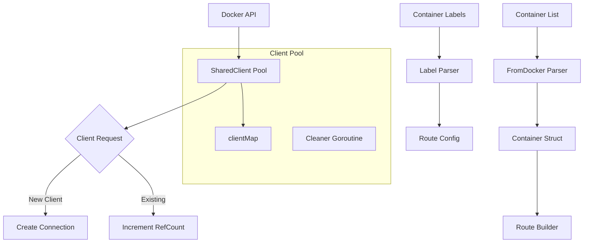
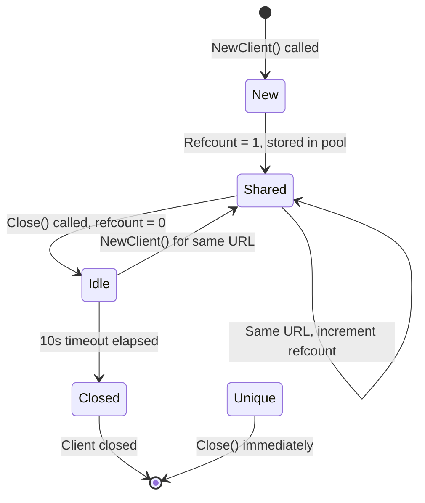
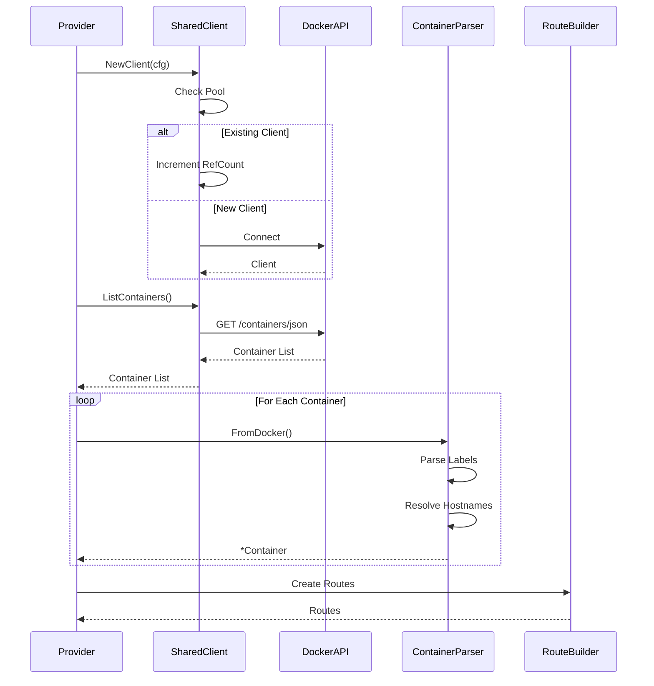

## Overview

The docker package implements Docker container integration, providing shared client connections, container parsing from Docker API responses, label processing for route configuration, and container filtering capabilities.

### Primary consumers

- `internal/route/provider` - Creates Docker-based route providers
- `internal/idlewatcher` - Container idle detection
- Operators - Configure routes via Docker labels

### Non-goals

- Docker image building or management
- Container lifecycle operations (start/stop)
- Volume management
- Docker Swarm orchestration

### Stability

Stable internal package. Public API consists of client management and container parsing functions.

## Public API

### Exported types

```go
type SharedClient struct {
    *client.Client
    cfg       types.DockerProviderConfig
    refCount  atomic.Int32
    closedOn  atomic.Int64
    key       string
    addr      string
    dial      func(ctx context.Context) (net.Conn, error)
    unique    bool
}
```

```go
type Container struct {
    DockerCfg           types.DockerProviderConfig
    Image               Image
    ContainerName       string
    ContainerID         string
    Labels              map[string]string
    ActualLabels        map[string]string
    Mounts              []Mount
    Network             string
    PublicPortMapping   map[int]PortSummary
    PrivatePortMapping  map[int]PortSummary
    Aliases             []string
    IsExcluded          bool
    IsExplicit          bool
    IsHostNetworkMode   bool
    Running             bool
    State               string
    PublicHostname      string
    PrivateHostname     string
    Agent               *agentpool.Agent
    IdlewatcherConfig   *IdlewatcherConfig
}
```

### Exported functions

```go
func NewClient(cfg types.DockerProviderConfig, unique ...bool) (*SharedClient, error)
```

Creates or returns a Docker client. Reuses existing clients for the same URL. Thread-safe.

```go
func Clients() map[string]*SharedClient
```

Returns all currently connected clients. Callers must close returned clients.

```go
func FromDocker(c *container.Summary, dockerCfg types.DockerProviderConfig) *types.Container
```

Converts Docker API container summary to internal container type. Parses labels for route configuration.

```go
func UpdatePorts(ctx context.Context, c *Container) error
```

Refreshes port mappings from container inspect.

```go
func DockerComposeProject(c *Container) string
```

Returns the Docker Compose project name.

```go
func DockerComposeService(c *Container) string
```

Returns the Docker Compose service name.

```go
func Dependencies(c *Container) []string
```

Returns container dependencies from labels.

```go
func IsBlacklisted(c *Container) bool
```

Checks if container should be excluded from routing.

## Architecture

### Core components



### Client lifecycle



### Container parsing flow



### Client pool management

The docker package maintains a pool of shared clients:

```go
var (
    clientMap   = make(map[string]*SharedClient, 10)
    clientMapMu sync.RWMutex
)

func initClientCleaner() {
    cleaner := task.RootTask("docker_clients_cleaner", true)
    go func() {
        ticker := time.NewTicker(cleanInterval)
        for {
            select {
            case <-ticker.C:
                closeTimedOutClients()
            case <-cleaner.Context().Done():
                // Cleanup all clients
            }
        }
    }()
}
```

## Configuration Surface

### Docker provider configuration

```yaml
providers:
  docker:
    local: ${DOCKER_HOST}
    remote1:
      scheme: tcp
      host: docker1.local
      port: 2375
    remote2:
      scheme: tls
      host: docker2.local
      port: 2375
      tls:
        ca_file: /path/to/ca.pem
        cert_file: /path/to/cert.pem
        key_file: /path/to/key.pem
```

### Route configuration labels

Route labels use the format `proxy.<alias>.<field>` where `<alias>` is the route alias (or `*` for wildcard). The base labels apply to all routes.

| Label                  | Description                     | Example                         |
| ---------------------- | ------------------------------- | ------------------------------- |
| `proxy.aliases`        | Route aliases (comma-separated) | `proxy.aliases: www,app`        |
| `proxy.exclude`        | Exclude from routing            | `proxy.exclude: true`           |
| `proxy.network`        | Docker network                  | `proxy.network: frontend`       |
| `proxy.<alias>.host`   | Override hostname               | `proxy.app.host: 192.168.1.100` |
| `proxy.<alias>.port`   | Target port                     | `proxy.app.port: 8080`          |
| `proxy.<alias>.scheme` | HTTP scheme                     | `proxy.app.scheme: https`       |
| `proxy.<alias>.*`      | Any route-specific setting      | `proxy.app.no_tls_verify: true` |

#### Wildcard alias

Use `proxy.*.<field>` to apply settings to all routes:

```yaml
labels:
  proxy.aliases: app1,app2
  proxy.*.scheme: https
  proxy.app1.port: 3000 # overrides wildcard
```

### Idle watcher labels

| Label                   | Description                     | Example                            |
| ----------------------- | ------------------------------- | ---------------------------------- |
| `proxy.idle_timeout`    | Idle timeout duration           | `proxy.idle_timeout: 30m`          |
| `proxy.wake_timeout`    | Max time to wait for wake       | `proxy.wake_timeout: 10s`          |
| `proxy.stop_method`     | Stop method (pause, stop, kill) | `proxy.stop_method: stop`          |
| `proxy.stop_signal`     | Signal to send (e.g., SIGTERM)  | `proxy.stop_signal: SIGTERM`       |
| `proxy.stop_timeout`    | Stop timeout in seconds         | `proxy.stop_timeout: 30`           |
| `proxy.depends_on`      | Container dependencies          | `proxy.depends_on: database`       |
| `proxy.start_endpoint`  | Optional path restriction       | `proxy.start_endpoint: /api/ready` |
| `proxy.no_loading_page` | Skip loading page               | `proxy.no_loading_page: true`      |

### Docker Compose labels

Those are created by Docker Compose.

| Label                           | Description          |
| ------------------------------- | -------------------- |
| `com.docker.compose.project`    | Compose project name |
| `com.docker.compose.service`    | Service name         |
| `com.docker.compose.depends_on` | Dependencies         |

## Dependency and Integration Map

### Internal dependencies

- `internal/agentpool` - Agent-based Docker host connections
- `internal/maxmind` - Container geolocation
- `internal/types` - Container and provider types
- `internal/task/task.go` - Lifetime management

### External dependencies

- `github.com/docker/cli/cli/connhelper` - Connection helpers
- `github.com/moby/moby/client` - Docker API client
- `github.com/docker/go-connections/nat` - Port parsing

### Integration points

```go
// Route provider uses docker for container discovery
client, err := docker.NewClient(cfg)
containers, err := client.ContainerList(ctx, container.ListOptions{})

for _, c := range containers {
    container := docker.FromDocker(c, cfg)
    // Create routes from container
}
```

## Observability

### Logs

- Client initialization and cleanup
- Connection errors
- Container parsing errors

### Metrics

No metrics are currently exposed.

## Security Considerations

- Docker socket access requires proper permissions
- TLS certificates for remote connections
- Agent-based connections are authenticated via TLS
- Database containers are automatically blacklisted

### Blacklist detection

Containers are automatically blacklisted if they:

- Mount database directories:
  - `/var/lib/postgresql/data`
  - `/var/lib/mysql`
  - `/var/lib/mongodb`
  - `/var/lib/mariadb`
  - `/var/lib/memcached`
  - `/var/lib/rabbitmq`
- Expose database ports:
  - 5432 (PostgreSQL)
  - 3306 (MySQL/MariaDB)
  - 6379 (Redis)
  - 11211 (Memcached)
  - 27017 (MongoDB)

## Failure Modes and Recovery

| Failure                    | Behavior                     | Recovery                 |
| -------------------------- | ---------------------------- | ------------------------ |
| Docker socket inaccessible | NewClient returns error      | Fix socket permissions   |
| Remote connection failed   | NewClient returns error      | Check network/tls config |
| Container inspect failed   | UpdatePorts returns error    | Container may be stopped |
| Invalid labels             | Container created with error | Fix label syntax         |
| Agent not found            | Panic during client creation | Add agent to pool        |

## Performance Characteristics

- Client pooling reduces connection overhead
- Reference counting prevents premature cleanup
- Background cleaner removes idle clients after 10s
- O(n) container parsing where n is container count

## Usage Examples

### Creating a Docker client

```go
dockerCfg := types.DockerProviderConfig{
    URL: "unix:///var/run/docker.sock",
}

client, err := docker.NewClient(dockerCfg)
if err != nil {
    log.Fatal(err)
}
defer client.Close()
```

### Using unique client

```go
// Create a unique client that won't be shared
client, err := docker.NewClient(cfg, true)
if err != nil {
    log.Fatal(err)
}
// Remember to close when done
client.Close()
```

### Getting all clients

```go
clients := docker.Clients()
for host, client := range clients {
    log.Printf("Connected to: %s", host)
}
// Use clients...
// Close all clients when done
for _, client := range clients {
    client.Close()
}
```

### Parsing containers

```go
containers, err := dockerClient.ContainerList(ctx, container.ListOptions{})
for _, c := range containers {
    container := docker.FromDocker(c, dockerCfg)
    if container.Errors != nil {
        log.Printf("Container %s has errors: %v", container.ContainerName, container.Errors)
        continue
    }
    log.Printf("Container: %s, Aliases: %v", container.ContainerName, container.Aliases)
}
```

### Checking if container is blacklisted

```go
container := docker.FromDocker(c, dockerCfg)
if docker.IsBlacklisted(container) {
    log.Printf("Container %s is blacklisted, skipping", container.ContainerName)
    continue
}
```
