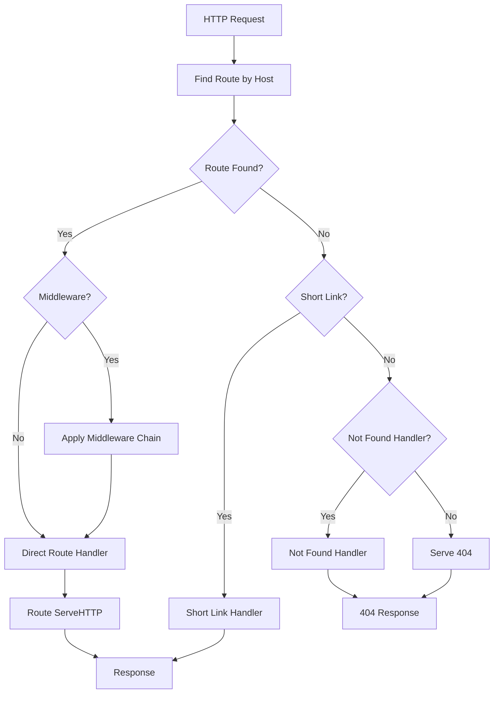
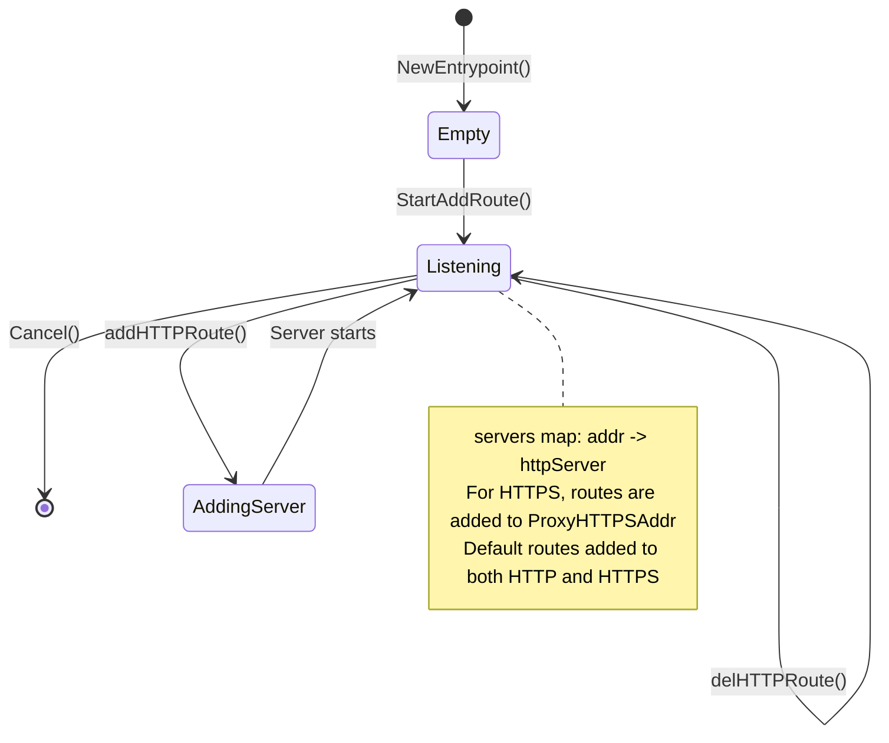
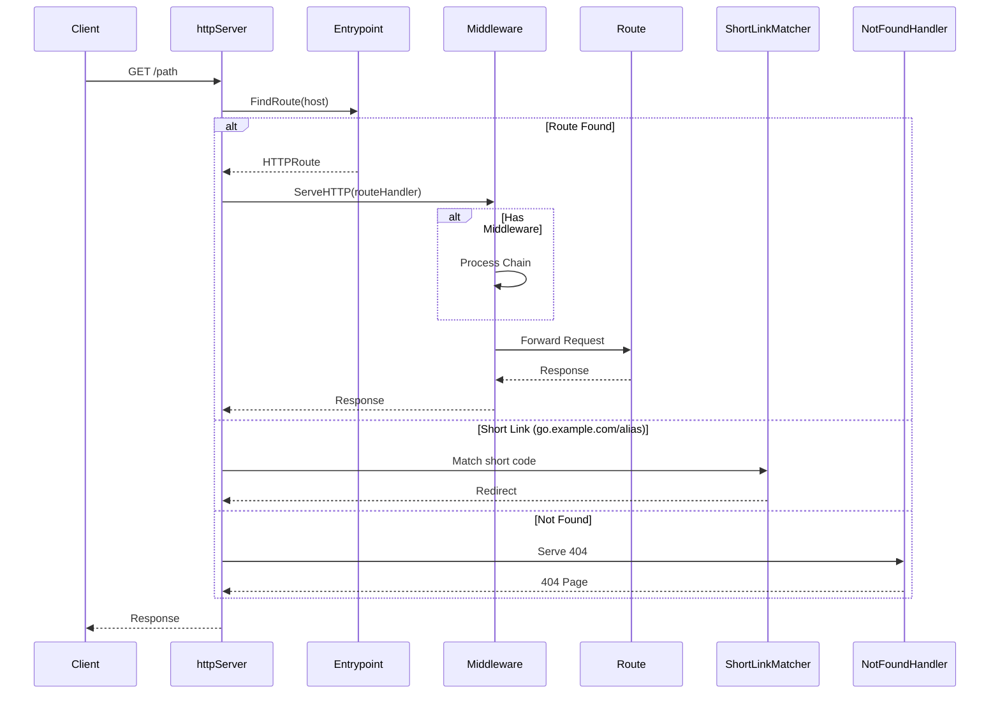

## Overview

The entrypoint package implements the primary HTTP handler that receives all incoming requests, manages the lifecycle of HTTP servers, determines the target route based on hostname, applies middleware, and forwards requests to the appropriate route handler.

### Key Features

- Domain-based route lookup with subdomain support
- Short link (`go/<alias>` domain) handling
- Middleware chain application
- Access logging for all requests
- Configurable not-found handling
- Per-domain route resolution
- HTTP server management (HTTP/HTTPS)
- Route pool abstractions via [`PoolLike`](/impl/internal-entrypoint) and [`RWPoolLike`](/impl/internal-entrypoint) interfaces

### Primary Consumers

- **HTTP servers**: Per-listen-addr servers dispatch requests to routes
- **Route providers**: Register routes via [`StartAddRoute`](/impl/internal-entrypoint)
- **Configuration layer**: Validates and applies middleware/access-logging config

### Non-goals

- Does not implement route discovery (delegates to providers)
- Does not handle TLS certificate management (delegates to autocert)
- Does not implement health checks (delegates to `internal/health/monitor`)
- Does not manage TCP/UDP listeners directly (only HTTP/HTTPS via `goutils/server`)

### Stability

Internal package with stable core interfaces. The [`Entrypoint`](/impl/internal-entrypoint) interface is the public contract.

## Public API

### Entrypoint Interface

```go
type Entrypoint interface {
    // Server capabilities
    SupportProxyProtocol() bool
    DisablePoolsLog(v bool)

    // Route registry access
    GetRoute(alias string) (types.Route, bool)
    StartAddRoute(r types.Route) error
    IterRoutes(yield func(r types.Route) bool)
    NumRoutes() int
    RoutesByProvider() map[string][]types.Route

    // Route pool accessors
    HTTPRoutes() PoolLike[types.HTTPRoute]
    StreamRoutes() PoolLike[types.StreamRoute]
    ExcludedRoutes() RWPoolLike[types.Route]

    // Health info queries
    GetHealthInfo() map[string]types.HealthInfo
    GetHealthInfoWithoutDetail() map[string]types.HealthInfoWithoutDetail
    GetHealthInfoSimple() map[string]types.HealthStatus

    // Configuration
    SetFindRouteDomains(domains []string)
    SetMiddlewares(mws []map[string]any) error
    SetNotFoundRules(rules rules.Rules)
    SetAccessLogger(parent task.Parent, cfg *accesslog.RequestLoggerConfig) error

    // Context integration
    ShortLinkMatcher() *ShortLinkMatcher
}
```

### Pool Interfaces

```go
type PoolLike[Route types.Route] interface {
    Get(alias string) (Route, bool)
    Iter(yield func(alias string, r Route) bool)
    Size() int
}

type RWPoolLike[Route types.Route] interface {
    PoolLike[Route]
    Add(r Route)
    Del(r Route)
}
```

### Configuration

```go
type Config struct {
    SupportProxyProtocol bool                     `json:"support_proxy_protocol"`
    Rules                struct {
        NotFound rules.Rules                     `json:"not_found"`
    }                                               `json:"rules"`
    Middlewares          []map[string]any          `json:"middlewares"`
    AccessLog            *accesslog.RequestLoggerConfig `json:"access_log" validate:"omitempty"`
}
```

### Context Functions

```go
func SetCtx(ctx interface{ SetValue(any, any) }, ep Entrypoint)
func FromCtx(ctx context.Context) Entrypoint
```

## Architecture

### Core Components

```mermaid
classDiagram
    class Entrypoint {
        +task *task.new_task
        +cfg *Config
        +middleware *middleware.Middleware
        +notFoundHandler http.Handler
        +accessLogger AccessLogger
        +findRouteFunc findRouteFunc
        +shortLinkMatcher *ShortLinkMatcher
        +streamRoutes *pool.Pool[types.StreamRoute]
        +excludedRoutes *pool.Pool[types.Route]
        +servers *xsync.Map[string, *httpServer]
        +SupportProxyProtocol() bool
        +StartAddRoute(r) error
        +IterRoutes(yield)
        +HTTPRoutes() PoolLike
    }

    class httpServer {
        +routes *pool.Pool[types.HTTPRoute]
        +ServeHTTP(w, r)
        +AddRoute(route)
        +DelRoute(route)
        +FindRoute(s) types.HTTPRoute
    }

    class PoolLike {
        <<interface>>
        +Get(alias) (Route, bool)
        +Iter(yield) bool
        +Size() int
    }

    class RWPoolLike {
        <<interface>>
        +PoolLike
        +Add(r Route)
        +Del(r Route)
    }

    class ShortLinkMatcher {
        +fqdnRoutes *xsync.Map[string, string]
        +subdomainRoutes *xsync.Map[string, struct{}]
        +ServeHTTP(w, r)
        +AddRoute(alias)
        +DelRoute(alias)
        +SetDefaultDomainSuffix(suffix)
    }

    Entrypoint --> httpServer : manages
    Entrypoint --> ShortLinkMatcher : owns
    Entrypoint --> PoolLike : HTTPRoutes()
    Entrypoint --> RWPoolLike : ExcludedRoutes()
    httpServer --> PoolLike : routes pool
```

### Request Processing Pipeline



### Server Lifecycle



## Data Flow



## Route Registry

Routes are managed per-entrypoint:

```go
// Adding a route (main entry point for providers)
if err := ep.StartAddRoute(route); err != nil {
    return err
}

// Iterating all routes including excluded
ep.IterRoutes(func(r types.Route) bool {
    log.Info().Str("alias", r.Name()).Msg("route")
    return true // continue iteration
})

// Querying by alias
route, ok := ep.GetRoute("myapp")

// Grouping by provider
byProvider := ep.RoutesByProvider()
```

## Configuration Surface

### Config Source

Environment variables and YAML config file:

```yaml
entrypoint:
  support_proxy_protocol: true
  middlewares:
    - rate_limit:
        requests_per_second: 100
  rules:
    not_found:
      # not-found rules configuration
  access_log:
    path: /var/log/godoxy/access.log
```

### Environment Variables

| Variable                       | Description                   |
| ------------------------------ | ----------------------------- |
| `PROXY_SUPPORT_PROXY_PROTOCOL` | Enable PROXY protocol support |

## Dependency and Integration Map

| Dependency                         | Purpose                     |
| ---------------------------------- | --------------------------- |
| `internal/route`                   | Route types and handlers    |
| `internal/route/rules`             | Not-found rules processing  |
| `internal/logging/accesslog`       | Request logging             |
| `internal/net/gphttp/middleware`   | Middleware chain            |
| `internal/types`                   | Route and health types      |
| `github.com/puzpuzpuz/xsync/v4`    | Concurrent server map       |
| `github.com/yusing/goutils/pool`   | Route pool implementations  |
| `github.com/yusing/goutils/task`   | Lifecycle management        |
| `github.com/yusing/goutils/server` | HTTP/HTTPS server lifecycle |

## Observability

### Logs

| Level   | Context               | Description             |
| ------- | --------------------- | ----------------------- |
| `DEBUG` | `route`, `listen_url` | Route addition/removal  |
| `DEBUG` | `addr`, `proto`       | Server lifecycle        |
| `ERROR` | `route`, `listen_url` | Server startup failures |

### Metrics

Route metrics exposed via [`GetHealthInfo`](/impl/internal-entrypoint) methods:

```go
// Health info for all routes
healthMap := ep.GetHealthInfo()
// {
//   "myapp": {Status: "healthy", Uptime: 3600, Latency: 5ms},
//   "excluded-route": {Status: "unknown", Detail: "n/a"},
// }
```

## Security Considerations

- Route lookup is read-only from route pools
- Middleware chain is applied per-request
- Proxy protocol support must be explicitly enabled
- Access logger captures request metadata before processing
- Short link matching is limited to configured domains

## Failure Modes and Recovery

| Failure               | Behavior                        | Recovery                     |
| --------------------- | ------------------------------- | ---------------------------- |
| Server bind fails     | Error returned, route not added | Fix port/address conflict    |
| Route start fails     | Route excluded, error logged    | Fix route configuration      |
| Middleware load fails | SetMiddlewares returns error    | Fix middleware configuration |
| Context cancelled     | All servers stopped gracefully  | Restart entrypoint           |

## Usage Examples

### Basic Setup

```go
ep := entrypoint.NewEntrypoint(parent, &entrypoint.Config{
    SupportProxyProtocol: false,
})

// Configure domain matching
ep.SetFindRouteDomains([]string{".example.com", "example.com"})

// Configure middleware
err := ep.SetMiddlewares([]map[string]any{
    {"rate_limit": map[string]any{"requests_per_second": 100}},
})
if err != nil {
    return err
}

// Configure access logging
err = ep.SetAccessLogger(parent, &accesslog.RequestLoggerConfig{
    Path: "/var/log/godoxy/access.log",
})
if err != nil {
    return err
}
```

### Route Querying

```go
// Iterate all routes including excluded
ep.IterRoutes(func(r types.Route) bool {
    log.Info().
        Str("alias", r.Name()).
        Str("provider", r.ProviderName()).
        Bool("excluded", r.ShouldExclude()).
        Msg("route")
    return true // continue iteration
})

// Get health info for all routes
healthMap := ep.GetHealthInfoSimple()
for alias, status := range healthMap {
    log.Info().Str("alias", alias).Str("status", string(status)).Msg("health")
}
```

### Route Addition

Routes are typically added by providers via `StartAddRoute`:

```go
// StartAddRoute handles route registration and server creation
if err := ep.StartAddRoute(route); err != nil {
    return err
}
```

### Context Integration

Routes can access the entrypoint from request context:

```go
// Set entrypoint in context (typically during initialization)
entrypoint.SetCtx(task, ep)

// Get entrypoint from context
if ep := entrypoint.FromCtx(r.Context()); ep != nil {
    route, ok := ep.GetRoute("alias")
}
```

## Testing Notes

- Benchmark tests in [`entrypoint_benchmark_test.go`](/impl/internal-entrypoint)
- Integration tests in [`entrypoint_test.go`](/impl/internal-entrypoint)
- Mock route pools for unit testing
- Short link tests in [`shortlink_test.go`](/impl/internal-entrypoint)
