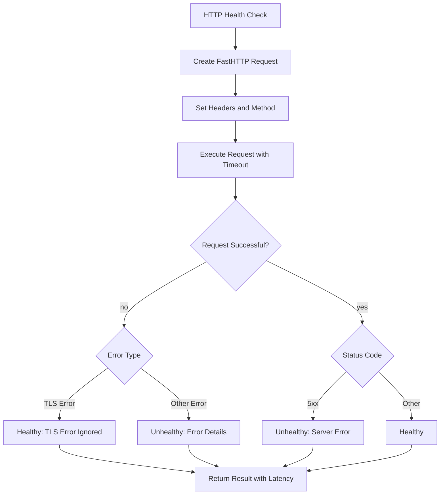
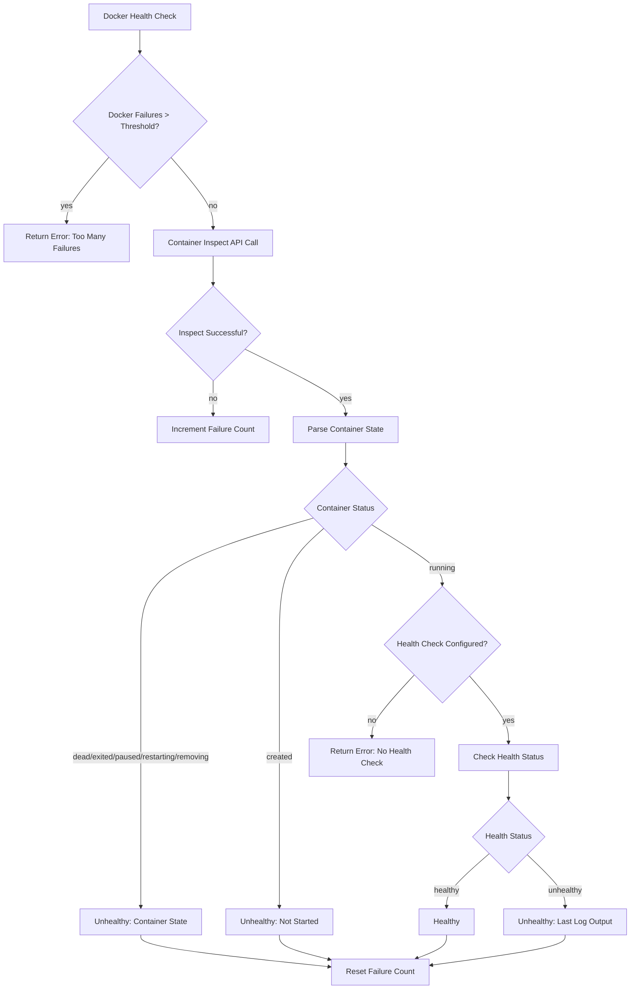
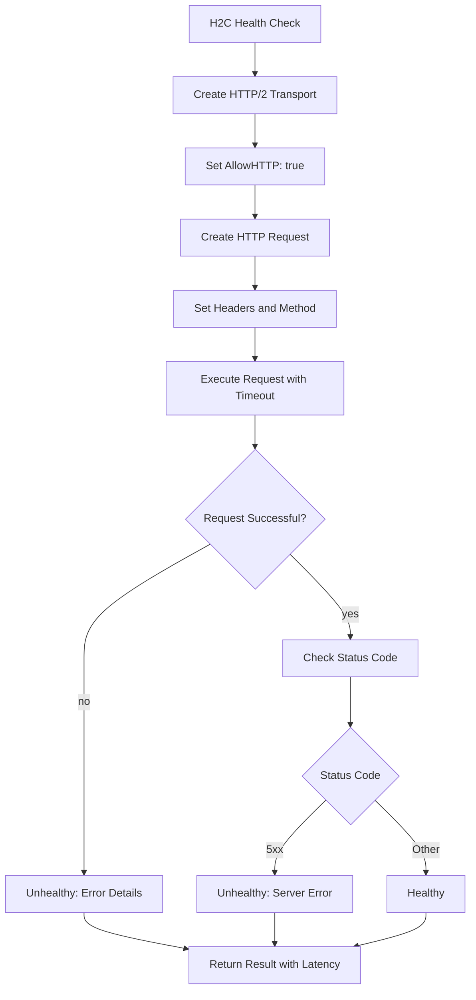
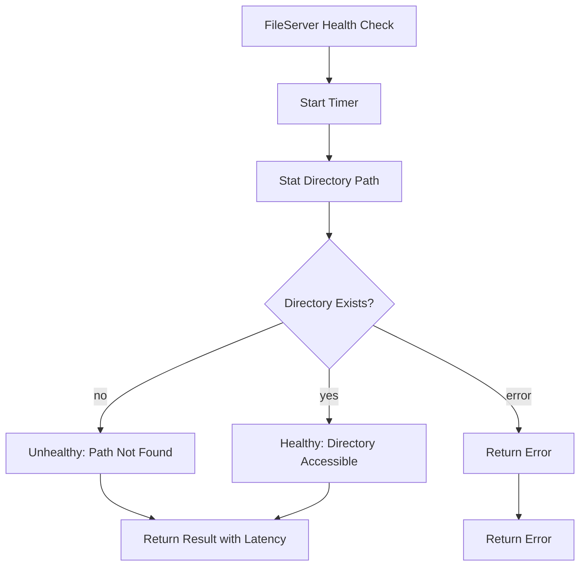
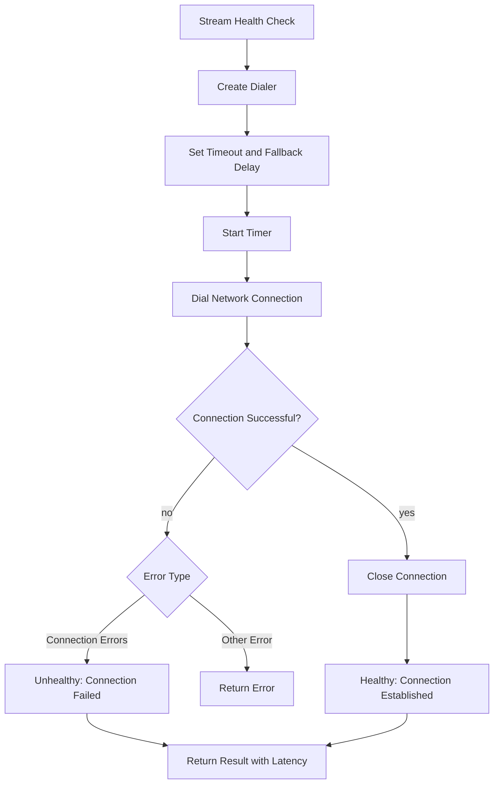

## Overview

### Purpose

This package provides health check implementations for various protocols:

- **HTTP/HTTPS** - Standard HTTP health checks with fasthttp
- **H2C** - HTTP/2 cleartext health checks
- **Docker** - Container health status via Docker API
- **FileServer** - Directory accessibility checks
- **Stream** - Generic network connection checks

### Primary Consumers

- `internal/health/monitor/` - Route health monitoring
- `internal/metrics/uptime/` - Uptime poller integration

### Non-goals

- Complex health check logic (response body validation, etc.)
- Authentication/authorization in health checks
- Multi-step health checks (login then check)

### Stability

Internal package. Public functions are stable but may be extended with new parameters.

## Public API

### HTTP Health Check (`http.go`)

```go
func HTTP(
    url *url.URL,
    method string,
    path string,
    timeout time.Duration,
) (types.HealthCheckResult, error)
```

### H2C Health Check (`http.go`)

```go
func H2C(
    ctx context.Context,
    url *url.URL,
    method string,
    path string,
    timeout time.Duration,
) (types.HealthCheckResult, error)
```

### Docker Health Check (`docker.go`)

```go
func Docker(
    ctx context.Context,
    containerID string,
) (types.HealthCheckResult, error)
```

### FileServer Health Check (`fileserver.go`)

```go
func FileServer(
    url *url.URL,
) (types.HealthCheckResult, error)
```

### Stream Health Check (`stream.go`)

```go
func Stream(
    url *url.URL,
) (types.HealthCheckResult, error)
```

### Common Types (`internal/types/`)

```go
type HealthCheckResult struct {
    Healthy  bool
    Latency  time.Duration
    Detail   string
}

type HealthStatus int

const (
    StatusHealthy   HealthStatus = 0
    StatusUnhealthy HealthStatus = 1
    StatusError     HealthStatus = 2
)
```

## Architecture

### HTTP Health Check Flow



### Docker Health Check Flow



### H2C Health Check Flow



### FileServer Health Check Flow



### Stream Health Check Flow



## Configuration Surface

No explicit configuration per health check. Parameters are passed directly:

| Check Type | Parameters                          |
| ---------- | ----------------------------------- |
| HTTP       | URL, Method, Path, Timeout          |
| H2C        | Context, URL, Method, Path, Timeout |
| Docker     | Context, ContainerID                |
| FileServer | URL (path component used)           |
| Stream     | URL (scheme, host, port used)       |

### HTTP Headers

All HTTP/H2C checks set:

- `User-Agent: GoDoxy/<version>`
- `Accept: text/plain,text/html,*/*;q=0.8`
- `Accept-Encoding: identity`
- `Cache-Control: no-cache`
- `Pragma: no-cache`

## Dependency and Integration Map

### External Dependencies

- `github.com/valyala/fasthttp` - High-performance HTTP client
- `golang.org/x/net/http2` - HTTP/2 transport
- Docker socket (for Docker health check)

### Internal Dependencies

- `internal/types/` - Health check result types
- `goutils/version/` - User-Agent version

## Observability

### Logs

No direct logging in health check implementations. Errors are returned as part of `HealthCheckResult.Detail`.

### Metrics

- Check latency (returned in result)
- Success/failure rates (tracked by caller)

## Security Considerations

- TLS certificate verification skipped (`InsecureSkipVerify: true`)
- Docker socket access required for Docker health check
- No authentication in health check requests
- User-Agent identifies GoDoxy for server-side filtering

## Failure Modes and Recovery

### HTTP/H2C

| Failure Mode          | Result    | Notes                           |
| --------------------- | --------- | ------------------------------- |
| Connection timeout    | Unhealthy | Detail: timeout message         |
| TLS certificate error | Healthy   | Handled gracefully              |
| 5xx response          | Unhealthy | Detail: status text             |
| 4xx response          | Healthy   | Client error considered healthy |

### Docker

| Failure Mode               | Result    | Notes                          |
| -------------------------- | --------- | ------------------------------ |
| API call failure           | Error     | Throws error to caller         |
| Container not running      | Unhealthy | State: "Not Started"           |
| Container dead/exited      | Unhealthy | State logged                   |
| No health check configured | Error     | Requires health check in image |

### FileServer

| Failure Mode      | Result    | Notes                    |
| ----------------- | --------- | ------------------------ |
| Path not found    | Unhealthy | Detail: "path not found" |
| Permission denied | Error     | Returned to caller       |
| Other OS error    | Error     | Returned to caller       |

### Stream

| Failure Mode           | Result    | Notes                 |
| ---------------------- | --------- | --------------------- |
| Connection refused     | Unhealthy | Detail: error message |
| Network unreachable    | Unhealthy | Detail: error message |
| DNS resolution failure | Unhealthy | Detail: error message |
| Context deadline       | Unhealthy | Detail: timeout       |

## Usage Examples

### HTTP Health Check

```go
url, _ := url.Parse("http://localhost:8080/health")
result, err := healthcheck.HTTP(url, "GET", "/health", 10*time.Second)
if err != nil {
    fmt.Printf("Error: %v\n", err)
}
fmt.Printf("Healthy: %v, Latency: %v, Detail: %s\n",
    result.Healthy, result.Latency, result.Detail)
```

### H2C Health Check

```go
ctx, cancel := context.WithTimeout(context.Background(), 10*time.Second)
defer cancel()

url, _ := url.Parse("h2c://localhost:8080")
result, err := healthcheck.H2C(ctx, url, "GET", "/health", 10*time.Second)
```

### Docker Health Check

```go
ctx := context.Background()
result, err := healthcheck.Docker(ctx, "abc123def456")
```

### FileServer Health Check

```go
url, _ := url.Parse("file:///var/www/html")
result, err := healthcheck.FileServer(url)
```

### Stream Health Check

```go
url, _ := url.Parse("tcp://localhost:5432")
result, err := healthcheck.Stream(url)
```

## Testing Notes

- Unit tests for each health check type
- Mock Docker server for Docker health check tests
- Integration tests require running services
- Timeout handling tests
