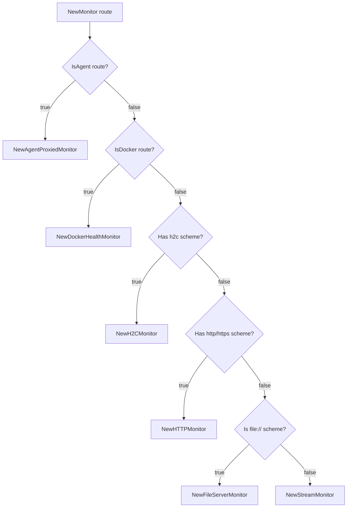
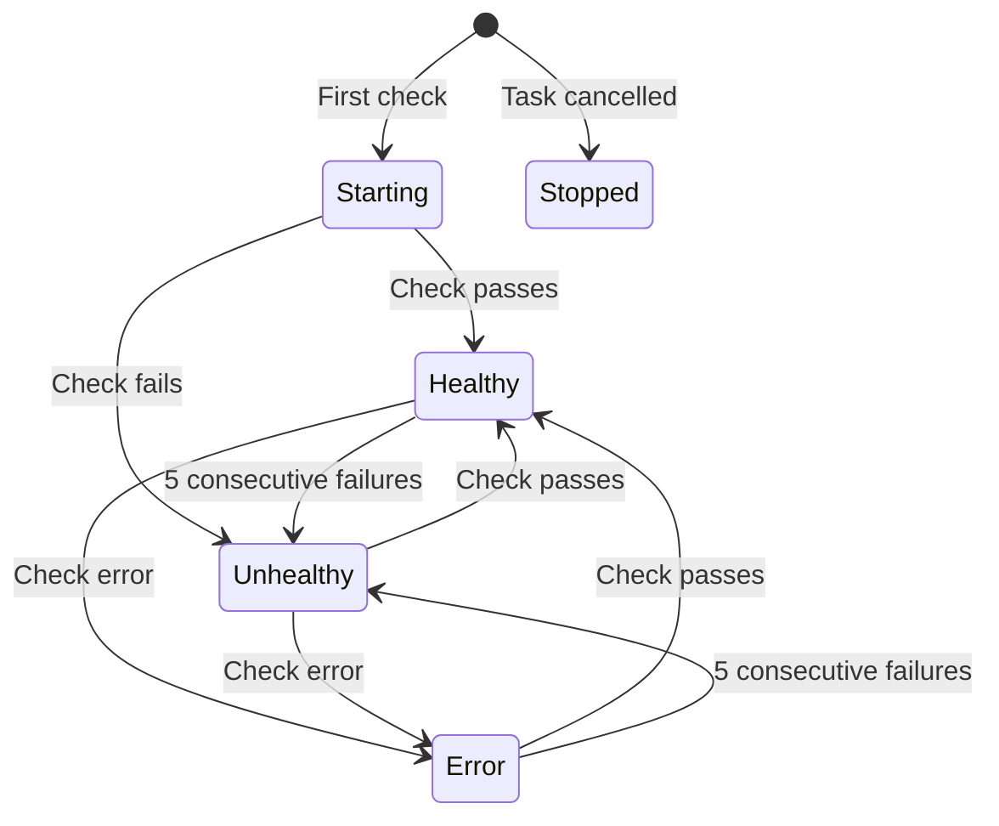
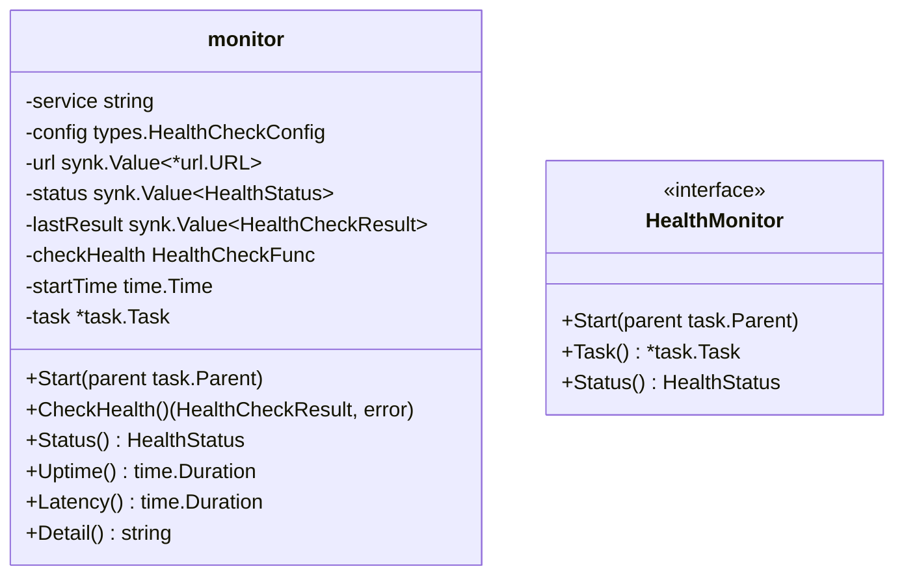

## Overview

### Purpose

This package provides health monitoring for different route types in GoDoxy:

- Monitors service health via configurable check functions
- Tracks consecutive failures with configurable thresholds
- Sends notifications on status changes
- Provides last-seen tracking for idle detection

### Primary Consumers

- `internal/route/` - Route health monitoring
- `internal/api/v1/metrics/` - Uptime poller integration
- WebUI - Health status display

### Non-goals

- Health check execution itself (delegated to `internal/health/check/`)
- Alert routing (handled by `internal/notif/`)
- Automatic remediation

### Stability

Internal package with stable public interfaces. `HealthMonitor` interface is stable.

## Public API

### Types

```go
type HealthCheckFunc func(url *url.URL) (result types.HealthCheckResult, err error)
```

### HealthMonitor Interface

```go
type HealthMonitor interface {
    Start(parent task.Parent) error
    Task() *task.Task
    Finish(reason any)
    UpdateURL(url *url.URL)
    URL() *url.URL
    Config() *types.HealthCheckConfig
    Status() types.HealthStatus
    Uptime() time.Duration
    Latency() time.Duration
    Detail() string
    Name() string
    String() string
    CheckHealth() (types.HealthCheckResult, error)
}
```

### Monitor Creation (`new.go`)

```go
// Create monitor for agent-proxied routes
func NewAgentProxiedMonitor(
    ctx context.Context,
    cfg types.HealthCheckConfig,
    url *url.URL,
) (HealthMonitor, error)

// Create monitor for Docker containers
func NewDockerHealthMonitor(
    ctx context.Context,
    cfg types.HealthCheckConfig,
    url *url.URL,
    containerID string,
) (HealthMonitor, error)

// Create monitor for HTTP routes
func NewHTTPMonitor(
    ctx context.Context,
    cfg types.HealthCheckConfig,
    url *url.URL,
) HealthMonitor

// Create monitor for H2C (HTTP/2 cleartext) routes
func NewH2CMonitor(
    ctx context.Context,
    cfg types.HealthCheckConfig,
    url *url.URL,
) HealthMonitor

// Create monitor for file server routes
func NewFileServerMonitor(
    cfg types.HealthCheckConfig,
    url *url.URL,
) HealthMonitor

// Create monitor for stream routes
func NewStreamMonitor(
    cfg types.HealthCheckConfig,
    url *url.URL,
) HealthMonitor

// Unified monitor factory (routes to appropriate type)
func NewMonitor(
    ctx context.Context,
    cfg types.HealthCheckConfig,
    url *url.URL,
) (HealthMonitor, error)
```

## Architecture

### Monitor Selection Flow



### Monitor State Machine



### Component Structure



## Configuration Surface

### HealthCheckConfig

```go
type HealthCheckConfig struct {
    Interval    time.Duration // Check interval (default: 30s)
    Timeout     time.Duration // Check timeout (default: 10s)
    Path        string        // Health check path
    Method      string        // HTTP method (GET/HEAD)
    Retries     int           // Consecutive failures before notification (-1 for immediate)
    BaseContext func() context.Context
}
```

### Defaults

| Field    | Default |
| -------- | ------- |
| Interval | 30s     |
| Timeout  | 10s     |
| Method   | GET     |
| Path     | "/"     |
| Retries  | 3       |

### Applying Defaults

```go
cfg.ApplyDefaults(state.Value().Defaults.HealthCheck)
```

## Dependency and Integration Map

### Internal Dependencies

- `internal/task/task.go` - Lifetime management
- `internal/notif/` - Status change notifications
- `internal/health/check/` - Health check implementations
- `internal/types/` - Health status types
- `internal/config/types/` - Working state

### External Dependencies

- `github.com/puzpuzpuz/xsync/v4` - Atomic values

## Observability

### Logs

| Level   | When                           |
| ------- | ------------------------------ |
| `Info`  | Service comes up               |
| `Warn`  | Service goes down              |
| `Error` | Health check error             |
| `Error` | Monitor stopped after 5 trials |

### Notifications

- Service up notification (with latency)
- Service down notification (with last seen time)
- Immediate notification when `Retries < 0`

### Metrics

- Consecutive failure count
- Last check latency
- Monitor uptime

## Failure Modes and Recovery

| Failure Mode                | Impact                                 | Recovery                |
| --------------------------- | -------------------------------------- | ----------------------- |
| 5 consecutive check errors  | Monitor enters Error state, task stops | Manual restart required |
| Health check function panic | Monitor crashes                        | Automatic cleanup       |
| Context cancellation        | Monitor stops gracefully               | Stopped state           |
| URL update to invalid       | Check will fail                        | Manual URL fix          |

### Status Transitions

| From      | To        | Condition                      |
| --------- | --------- | ------------------------------ |
| Starting  | Healthy   | Check passes                   |
| Starting  | Unhealthy | Check fails                    |
| Healthy   | Unhealthy | `Retries` consecutive failures |
| Healthy   | Error     | Check returns error            |
| Unhealthy | Healthy   | Check passes                   |
| Error     | Healthy   | Check passes                   |

## Usage Examples

### Creating an HTTP Monitor

```go
cfg := types.HealthCheckConfig{
    Interval: 15 * time.Second,
    Timeout: 5 * time.Second,
    Path:    "/health",
    Retries: 3,
}
url, _ := url.Parse("http://localhost:8080")

monitor := monitor.NewHTTPMonitor(context.Background(), cfg, url)
if err := monitor.Start(parent); err != nil {
    return err
}

// Check status
fmt.Printf("Status: %s\n", monitor.Status())
fmt.Printf("Latency: %v\n", monitor.Latency())
```

### Creating a Docker Monitor

```go
monitor, err := monitor.NewDockerHealthMonitor(
    context.Background(),
    cfg,
    url,
    containerID,
)
if err != nil {
    return err
}
monitor.Start(parent)
```

### Unified Factory

```go
monitor, err := monitor.NewMonitor(ctx, cfg, url)
if err != nil {
    return err
}
monitor.Start(parent)
```

## Testing Notes

- `monitor_test.go` - Monitor lifecycle tests
- Mock health check functions for deterministic testing
- Status transition coverage tests
- Notification trigger tests
