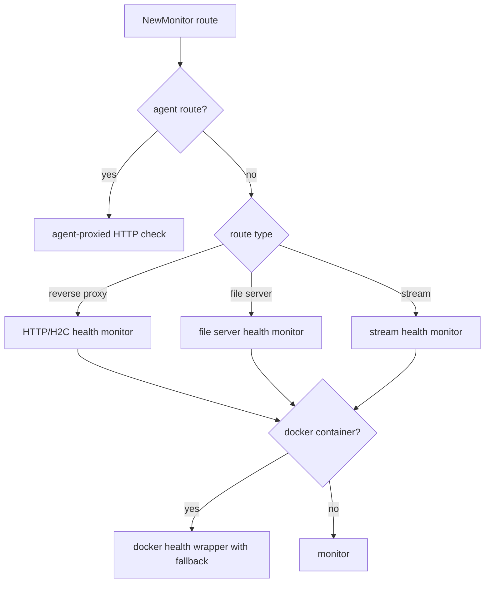

## Overview

`internal/health/monitor` wraps low-level checks from `internal/health/check`
with task-managed polling, retry tracking, status transitions, JSON output, and
up/down notifications. Shared health config, status values, and interfaces live
in `internal/health`.

## Responsibilities

- Build monitor implementations for routes.
- Poll health checks on the configured interval.
- Apply timeout, retry, and failure threshold behavior.
- Track last successful health check time.
- Emit notifications/events on service up/down transitions.
- Wrap Docker health checks with route fallback health checks.

## Non-Goals

- No route validation or route implementation construction.
- No protocol-specific check logic beyond selecting functions from `health/check`.
- No entrypoint route lookup.
- No load-balancer server selection.

## Public API

```go
func NewMonitor(r routing.Route) Monitor
```

`NewMonitor` selects an implementation from the concrete route interface:

- agent routes use `NewAgentProxiedMonitor`
- reverse proxy routes use `NewHTTPHealthMonitor`
- file server routes use `NewFileServerHealthMonitor`
- stream routes use `NewStreamHealthMonitor`
- Docker routes can wrap the route monitor with `NewDockerHealthMonitor`

Direct constructors:

```go
func NewHTTPHealthMonitor(config health.HealthCheckConfig, u *url.URL) Monitor
func NewFileServerHealthMonitor(config health.HealthCheckConfig, path string) Monitor
func NewStreamHealthMonitor(config health.HealthCheckConfig, targetURL *url.URL) Monitor
func NewDockerHealthMonitor(config health.HealthCheckConfig, client *docker.SharedClient, containerID string, fallback Monitor) Monitor
func NewAgentProxiedMonitor(config health.HealthCheckConfig, agent *agentpool.Agent, targetURL *url.URL) Monitor
```

## Monitor Flow


```mermaid
flowchart TD
    A[NewMonitor route] --> B{agent route?}
    B -->|yes| C[agent-proxied HTTP check]
    B -->|no| D{route type}
    D -->|reverse proxy| E[HTTP/H2C health monitor]
    D -->|file server| F[file server health monitor]
    D -->|stream| G[stream health monitor]
    E --> H{docker container?}
    F --> H
    G --> H
    H -->|yes| I[docker health wrapper with fallback]
    H -->|no| J[monitor]
```

## Runtime Behavior

On start, a monitor creates a `health_monitor` subtask, applies config defaults,
sets initial status to healthy, and begins polling after jitter. Each poll stores
the latest result and updates status:

- healthy result: `health.StatusHealthy`, last-seen timestamp updated
- unhealthy result: `health.StatusUnhealthy`
- check error: `health.StatusError`

Service-up and service-down notifications are emitted only on status transitions
and after retry thresholds are met.

## Dependency Map

| Dependency | Purpose |
| --- | --- |
| `internal/health` | Shared config, status, and monitor interfaces |
| `internal/health/check` | Protocol-specific health checks |
| `internal/docker` | Docker health wrapper client |
| `internal/notif` | Status change notifications |
| `goutils/task` | Monitor task lifetime |
| `goutils/events` | Global service up/down events |
