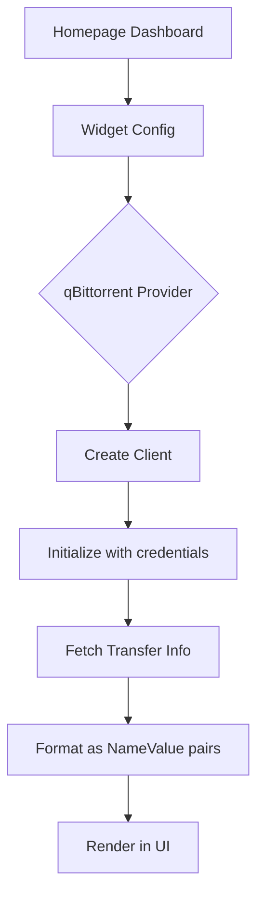

<Callout type="warn">
  This package is a work in progress and is not stable.
</Callout>

## Overview

The `internal/homepage/integrations/qbittorrent` package implements the `widgets.Widget` interface for qBittorrent. It provides functionality to connect to a qBittorrent instance and fetch transfer information.

## Architecture

### Core Components

```
integrations/qbittorrent/
├── client.go       # Client and API methods
├── transfer_info.go # Transfer info widget data
└── version.go      # Version checking
└── logs.go         # Log fetching
```

### Main Types

```go
type Client struct {
    URL      string
    Username string
    Password string
}
```

## API Reference

### Client Methods

#### Initialize

Connects to the qBittorrent API and verifies authentication.

```go
func (c *Client) Initialize(ctx context.Context, url string, cfg map[string]any) error
```

**Parameters:**

- `ctx` - Context for the HTTP request
- `url` - Base URL of the qBittorrent instance
- `cfg` - Configuration map containing `username` and `password`

**Returns:**

- `error` - Connection or authentication error

**Example:**

```go
client := &qbittorrent.Client{}
err := client.Initialize(ctx, "http://localhost:8080", map[string]any{
    "username": "admin",
    "password": "your-password",
})
if err != nil {
    log.Fatalf("Failed to connect: %v", err)
}
```

#### Data

Returns current transfer statistics as name-value pairs.

```go
func (c *Client) Data(ctx context.Context) ([]widgets.NameValue, error)
```

**Returns:**

- `[]widgets.NameValue` - Transfer statistics
- `error` - API request error

**Example:**

```go
data, err := client.Data(ctx)
if err != nil {
    log.Fatal(err)
}
for _, nv := range data {
    fmt.Printf("%s: %s\n", nv.Name, nv.Value)
}
// Output:
// Status: connected
// Download: 1.5 GB
// Upload: 256 MB
// Download Speed: 5.2 MB/s
// Upload Speed: 1.1 MB/s
```

### Internal Methods

#### doRequest

Performs an HTTP request to the qBittorrent API.

```go
func (c *Client) doRequest(ctx context.Context, method, endpoint string, query url.Values, body io.Reader) (*http.Response, error)
```

#### jsonRequest

Performs a JSON API request and unmarshals the response.

```go
func jsonRequest[T any](ctx context.Context, client *Client, endpoint string, query url.Values) (result T, err error)
```

## Data Types

### TransferInfo

Represents transfer statistics from qBittorrent.

```go
type TransferInfo struct {
    ConnectionStatus string `json:"connection_status"`
    SessionDownloads uint64 `json:"dl_info_data"`
    SessionUploads   uint64 `json:"up_info_data"`
    DownloadSpeed    uint64 `json:"dl_info_speed"`
    UploadSpeed      uint64 `json:"up_info_speed"`
}
```

## API Endpoints

| Endpoint                | Method | Description             |
| ----------------------- | ------ | ----------------------- |
| `/api/v2/transfer/info` | GET    | Get transfer statistics |
| `/api/v2/app/version`   | GET    | Get qBittorrent version |

## Usage Example

### Complete Widget Usage

```go
package main

import (
    "context"
    "fmt"
    "github.com/yusing/godoxy/internal/homepage/integrations/qbittorrent"
    "github.com/yusing/godoxy/internal/homepage/widgets"
)

func main() {
    ctx := context.Background()

    // Create and initialize client
    client := &qbittorrent.Client{}
    err := client.Initialize(ctx, "http://localhost:8080", map[string]any{
        "username": "admin",
        "password": "password123",
    })
    if err != nil {
        fmt.Printf("Connection failed: %v\n", err)
        return
    }

    // Get transfer data
    data, err := client.Data(ctx)
    if err != nil {
        fmt.Printf("Failed to get data: %v\n", err)
        return
    }

    // Display in dashboard format
    fmt.Println("qBittorrent Status:")
    fmt.Println(strings.Repeat("-", 30))
    for _, nv := range data {
        fmt.Printf("  %-15s %s\n", nv.Name+":", nv.Value)
    }
}
```

## Integration with Homepage Widgets



### Widget Configuration

```yaml
widgets:
  - provider: qbittorrent
    config:
      url: http://localhost:8080
      username: admin
      password: password123
```

## Error Handling

```go
// Handle HTTP errors
resp, err := client.doRequest(ctx, http.MethodGet, endpoint, query, body)
if err != nil {
    return nil, err
}
if resp.StatusCode != http.StatusOK {
    return nil, widgets.ErrHTTPStatus.Subject(resp.Status)
}
```

## Related Packages

- `internal/homepage/widgets` - Widget framework and interface
- `github.com/bytedance/sonic` - JSON serialization
- `github.com/yusing/goutils/strings` - String utilities for formatting
