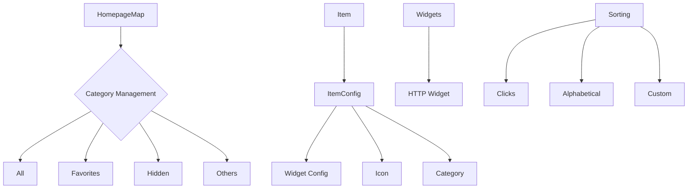
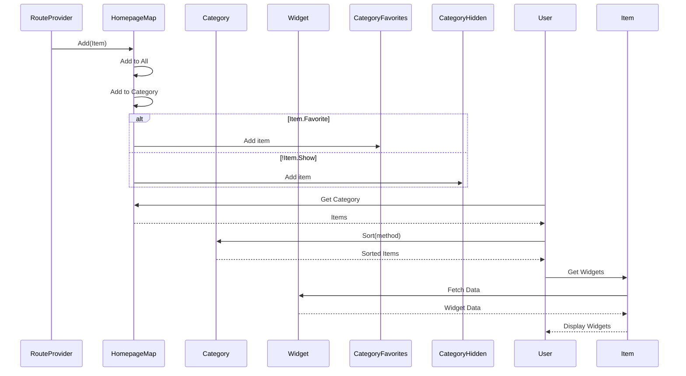

## Overview

The homepage package implements the WebUI dashboard, managing homepage items, categories, sorting methods, and widget integration for monitoring container status and providing interactive features.

### Key Features

- Dynamic homepage item management
- Category-based organization (All, Favorites, Hidden, Others)
- Multiple sort methods (clicks, alphabetical, custom)
- Widget support for live data display
- Icon URL handling with favicon integration
- Item override configuration
- Click tracking and statistics

## Architecture



## Core Types

### Homepage Structure

```go
type HomepageMap struct {
    ordered.Map[string, *Category]
}

type Homepage []*Category

type Category struct {
    Items []*Item
    Name  string
}

type Item struct {
    ItemConfig
    SortOrder    int
    FavSortOrder int
    AllSortOrder int
    Clicks       int
    Widgets      []Widget
    Alias        string
    Provider     string
    OriginURL    string
    ContainerID  string
}

type ItemConfig struct {
    Show           bool
    Name           string
    Icon           *IconURL
    Category       string
    Description    string
    URL            string
    Favorite       bool
    WidgetConfig   *widgets.Config
}
```

### Sort Methods

```go
const (
    SortMethodClicks       = "clicks"
    SortMethodAlphabetical = "alphabetical"
    SortMethodCustom       = "custom"
)
```

### Categories

```go
const (
    CategoryAll       = "All"
    CategoryFavorites = "Favorites"
    CategoryHidden    = "Hidden"
    CategoryOthers    = "Others"
)
```

## Public API

### Creation

```go
// NewHomepageMap creates a new homepage map with default categories.
func NewHomepageMap(total int) *HomepageMap
```

### Item Management

```go
// Add adds an item to appropriate categories.
func (c *HomepageMap) Add(item *Item)

// GetOverride returns the override configuration for an item.
func (cfg Item) GetOverride() Item
```

### Sorting

```go
// Sort sorts a category by the specified method.
func (c *Category) Sort(method SortMethod)
```

## Usage

### Creating a Homepage Map

```go
homepageMap := homepage.NewHomepageMap(100) // Reserve space for 100 items
```

### Adding Items

```go
item := &homepage.Item{
    Alias:       "my-app",
    Provider:    "docker",
    OriginURL:   "http://myapp.local",
    ItemConfig: homepage.ItemConfig{
        Name:        "My Application",
        Show:        true,
        Favorite:    true,
        Category:    "Docker",
        Description: "My Docker application",
    },
}

homepageMap.Add(item)
```

### Sorting Categories

```go
allCategory := homepageMap.Get(homepage.CategoryAll)
if allCategory != nil {
    allCategory.Sort(homepage.SortMethodClicks)
}
```

### Filtering by Category

```go
favorites := homepageMap.Get(homepage.CategoryFavorites)
for _, item := range favorites.Items {
    fmt.Printf("Favorite: %s\n", item.Name)
}
```

## Widgets

The homepage supports widgets for each item:

```go
type Widget struct {
    Label string
    Value string
}

type Config struct {
    // Widget configuration
}
```

### Widget Types

Widgets can display various types of information:

- **Status**: Container health status
- **Stats**: Usage statistics
- **Links**: Quick access links
- **Custom**: Provider-specific data

## Categories

### Default Categories

| Category  | Description              |
| --------- | ------------------------ |
| All       | Contains all items       |
| Favorites | User-favorited items     |
| Hidden    | Items with `Show: false` |
| Others    | Uncategorized items      |

### Custom Categories

Custom categories are created dynamically:

```go
// Adding to custom category
item := &homepage.Item{
    ItemConfig: homepage.ItemConfig{
        Name:     "App",
        Category: "Development",
    },
}
homepageMap.Add(item)
// "Development" category is auto-created
```

## Override Configuration

Items can have override configurations for customization:

```go
// GetOverride returns the effective configuration
func (cfg Item) GetOverride() Item {
    return overrideConfigInstance.GetOverride(cfg)
}
```

## Sorting Methods

### Clicks Sort

Sorts by click count (most clicked first):

```go
func (c *Category) sortByClicks() {
    slices.SortStableFunc(c.Items, func(a, b *Item) int {
        if a.Clicks > b.Clicks {
            return -1
        }
        if a.Clicks < b.Clicks {
            return 1
        }
        return strings.Compare(title(a.Name), title(b.Name))
    })
}
```

### Alphabetical Sort

Sorts alphabetically by name:

```go
func (c *Category) sortByAlphabetical() {
    slices.SortStableFunc(c.Items, func(a, b *Item) int {
        return strings.Compare(title(a.Name), title(b.Name))
    })
}
```

### Custom Sort

Sorts by predefined sort order:

```go
func (c *Category) sortByCustom() {
    // Uses SortOrder, FavSortOrder, AllSortOrder fields
}
```

## Data Flow



## Integration Points

The homepage package integrates with:

- **Route Provider**: Item discovery from routes
- **Container**: Container status and metadata
- **Widgets**: Live data display
- **API**: Frontend data API
- **Configuration**: Default and override configs

## Configuration

### Active Configuration

```go
var ActiveConfig atomic.Pointer[Config]
```

### Configuration Structure

```go
type Config struct {
    UseDefaultCategories bool
    // ... other options
}
```

## Serialization

The package registers default value factories for serialization:

```go
func init() {
    serialization.RegisterDefaultValueFactory(func() *ItemConfig {
        return &ItemConfig{
            Show: true,
        }
    })
}
```
