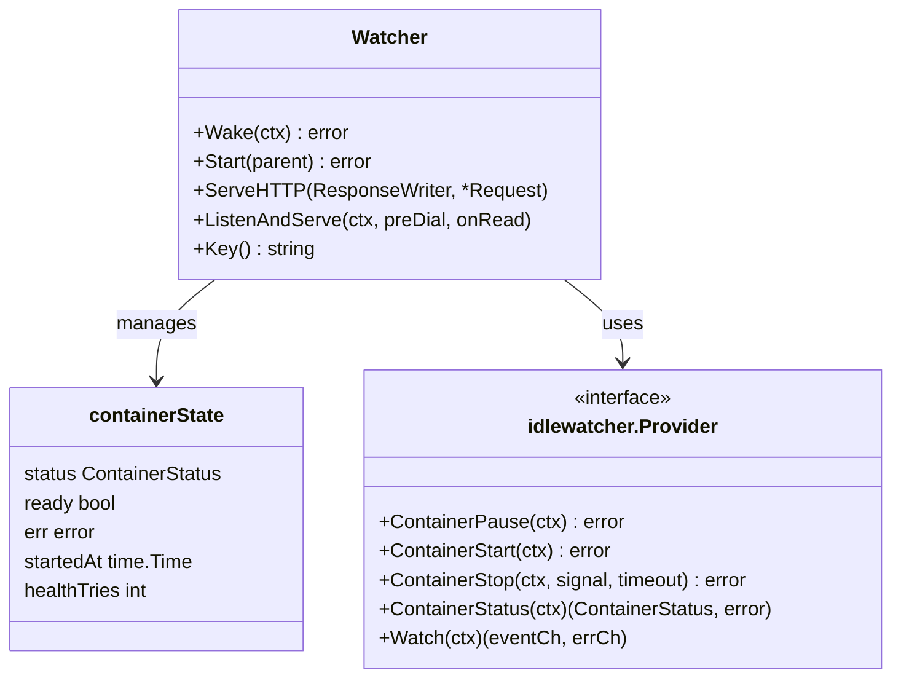
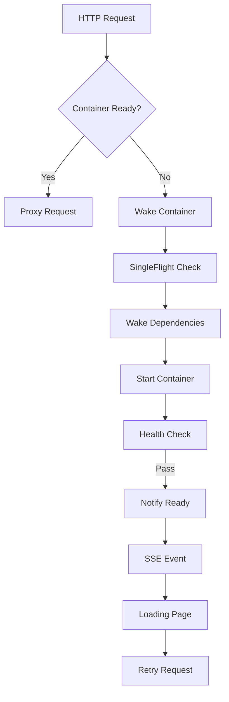
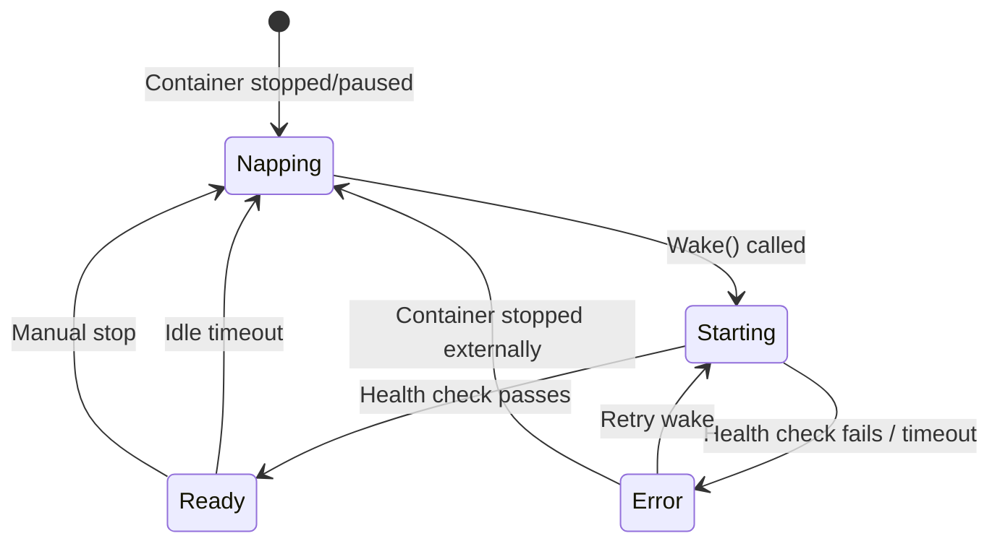

## Overview

The `internal/idlewatcher` package implements idle-based container lifecycle management for GoDoxy. When a container is idle for a configured duration, it can be automatically stopped, paused, or killed. When a request arrives, the container is woken up automatically.

### Primary Consumers

- **Route layer**: Routes with idlewatcher config integrate with this package to manage container lifecycle
- **HTTP handlers**: Serve loading pages and SSE events during wake-up
- **Stream handlers**: Handle stream connections with idle detection

### Non-goals

- Does not implement container runtime operations directly (delegates to providers)
- Does not manage container dependencies beyond wake ordering
- Does not provide health checking (delegates to `internal/health/monitor`)

### Stability

Internal package with stable public API. Changes to exported types require backward compatibility.

## Public API

### Exported Types

```go
// Watcher manages lifecycle of a single container
type Watcher struct {
    // Embedded route helper for proxy/stream/health
    routeHelper

    cfg *types.IdlewatcherConfig

    // Thread-safe state containers
    provider    synk.Value[idlewatcher.Provider]
    state       synk.Value[*containerState]
    lastReset   synk.Value[time.Time]

    // Timers and channels
    idleTicker   *time.Ticker
    healthTicker *time.Ticker
    readyNotifyCh chan struct{}

    // SSE event broadcasting (HTTP routes only)
    eventChs       *xsync.Map[chan *WakeEvent, struct{}]
    eventHistory   []WakeEvent
}
```

```go
// WakeEvent is broadcast via SSE during wake-up
type WakeEvent struct {
    Type      WakeEventType
    Message   string
    Timestamp time.Time
    Error     string
}
```

### Exported Functions/Methods

```go
// NewWatcher creates or reuses a watcher for the given route and config
func NewWatcher(parent task.Parent, r types.Route, cfg *types.IdlewatcherConfig) (*Watcher, error)

// Wake wakes the container, blocking until ready
func (w *Watcher) Wake(ctx context.Context) error

// Start begins the idle watcher loop
func (w *Watcher) Start(parent task.Parent) error

// ServeHTTP serves the loading page and SSE events
func (w *Watcher) ServeHTTP(rw http.ResponseWriter, r *http.Request)

// ListenAndServe handles stream connections with idle detection
func (w *Watcher) ListenAndServe(ctx context.Context, preDial, onRead nettypes.HookFunc)

// Key returns the unique key for this watcher
func (w *Watcher) Key() string
```

### Package-level Variables

```go
var (
    // watcherMap is a global registry keyed by config.Key()
    watcherMap map[string]*Watcher
    watcherMapMu sync.RWMutex

    // singleFlight prevents duplicate wake calls for the same container
    singleFlight singleflight.Group
)
```

## Architecture

### Core Components



### Component Interactions



### State Machine



## Configuration Surface

Configuration is defined in `types.IdlewatcherConfig`:

```go
type IdlewatcherConfig struct {
    IdlewatcherConfigBase
    Docker  *types.DockerProviderConfig  // Exactly one required
    Proxmox *types.ProxmoxProviderConfig // Exactly one required
}

type IdlewatcherConfigBase struct {
    IdleTimeout  time.Duration          // Duration before container is stopped
    StopMethod   types.ContainerMethod  // pause, stop, or kill
    StopSignal   types.ContainerSignal  // Signal to send
    StopTimeout  int                    // Timeout in seconds
    WakeTimeout  time.Duration          // Max time to wait for wake
    DependsOn    []string               // Container dependencies
    StartEndpoint string                // Optional path restriction
    NoLoadingPage bool                  // Skip loading page
}
```

### Docker Labels

```yaml
labels:
  proxy.idle_timeout: 5m
  proxy.idle_stop_method: stop
  proxy.idle_depends_on: database:redis
```

### Path Constants

```go
const (
    LoadingPagePath = "/$godoxy/loading"
    WakeEventsPath  = "/$godoxy/wake-events"
)
```

## Dependency and Integration Map

| Dependency                       | Purpose                     |
| -------------------------------- | --------------------------- |
| `internal/health/monitor`        | Health checking during wake |
| `internal/route/routes`          | Route registry lookup       |
| `internal/docker`                | Docker client connection    |
| `internal/proxmox`               | Proxmox LXC management      |
| `internal/watcher/events`        | Container event watching    |
| `pkg/gperr`                      | Error handling              |
| `xsync/v4`                       | Concurrent maps             |
| `golang.org/x/sync/singleflight` | Duplicate wake suppression  |

## Observability

### Logs

- **INFO**: Wake start, container started, ready notification
- **DEBUG**: State transitions, health check details
- **ERROR**: Wake failures, health check errors

Log context includes: `alias`, `key`, `provider`, `method`

### Metrics

No metrics exposed directly; health check metrics available via `internal/health/monitor`.

## Security Considerations

- Loading page and SSE endpoints are mounted under `/$godoxy/` path
- No authentication on loading page; assumes internal network trust
- SSE event history may contain container names (visible to connected clients)

## Failure Modes and Recovery

| Failure                       | Behavior                                           | Recovery                       |
| ----------------------------- | -------------------------------------------------- | ------------------------------ |
| Wake timeout                  | Returns error, container remains in current state  | Retry wake with longer timeout |
| Health check fails repeatedly | Container marked as error, retries on next request | External fix required          |
| Provider connection lost      | SSE disconnects, next request retries wake         | Reconnect on next request      |
| Dependencies fail to start    | Wake fails with dependency error                   | Fix dependency container       |

## Usage Examples

### Basic HTTP Route with Idlewatcher

```go
route := &route.Route{
    Alias: "myapp",
    Idlewatcher: &types.IdlewatcherConfig{
        IdlewatcherConfigBase: types.IdlewatcherConfigBase{
            IdleTimeout: 5 * time.Minute,
            StopMethod:  types.ContainerMethodStop,
            StopTimeout: 30,
        },
        Docker: &types.DockerProviderConfig{
            ContainerID: "abc123",
        },
    },
}

w, err := idlewatcher.NewWatcher(parent, route, route.Idlewatcher)
if err != nil {
    return err
}
return w.Start(parent)
```

### Watching Wake Events

```go
// Events are automatically served at /$godoxy/wake-events
// Client connects via EventSource:

const eventSource = new EventSource("/$godoxy/wake-events");
eventSource.onmessage = (e) => {
    const event = JSON.parse(e.data);
    console.log(`Wake event: ${event.type}`, event.message);
};
```

## Testing Notes

- Unit tests cover state machine transitions
- Integration tests with Docker daemon for provider operations
- Mock provider for testing wake flow without real containers
