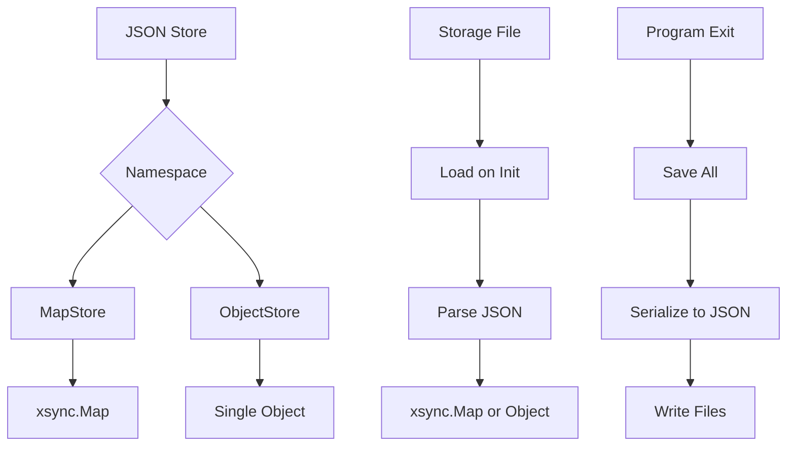
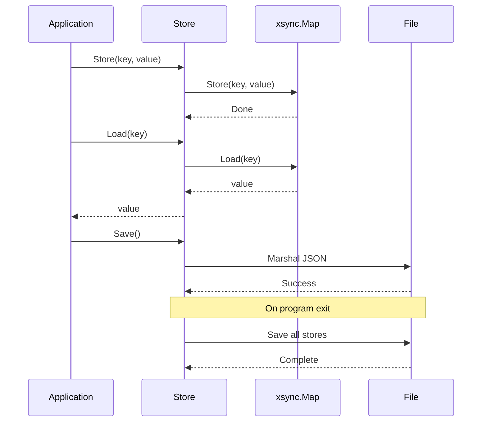

## Overview

The jsonstore package implements a simple yet powerful JSON storage system for GoDoxy, supporting both key-value stores (MapStore) and single object stores (ObjectStore) with automatic persistence to JSON files.

### Key Features

- Namespace-based storage
- Thread-safe concurrent map operations (xsync)
- Automatic JSON loading on initialization
- Automatic JSON saving on program exit
- Generic type support
- Marshal/Unmarshal integration

## Architecture



## Core Components

### MapStore

```go
type MapStore[VT any] struct {
    *xsync.Map[string, VT]
}

// Implements:
// - Initialize() - initializes the internal map
// - MarshalJSON() - serializes to JSON
// - UnmarshalJSON() - deserializes from JSON
```

### ObjectStore

```go
type ObjectStore[Pointer Initializer] struct {
    ptr Pointer
}

// Initializer interface requires:
// - Initialize()
```

### Store Interface

```go
type store interface {
    Initialize()
    json.Marshaler
    json.Unmarshaler
}
```

## Public API

### MapStore Creation

```go
// Store creates a new namespace map store.
func Store[VT any](namespace namespace) MapStore[VT]
```

### ObjectStore Creation

```go
// Object creates a new namespace object store.
func Object[Ptr Initializer](namespace namespace) Ptr
```

## Usage

### MapStore Example

```go
// Define a namespace
type UserID string

// Create a store for user sessions
var sessions = jsonstore.Store[UserID]("sessions")

// Store a value
sessions.Store("user123", "session-token-abc")

// Load a value
token, ok := sessions.Load("user123")
if ok {
    fmt.Println("Session:", token)
}

// Iterate over all entries
for id, token := range sessions.Range {
    fmt.Printf("%s: %s\n", id, token)
}

// Delete a value
sessions.Delete("user123")
```

### ObjectStore Example

```go
// Define a struct that implements Initialize
type AppConfig struct {
    Name    string
    Version int
}

func (c *AppConfig) Initialize() {
    c.Name = "MyApp"
    c.Version = 1
}

// Create an object store
var config = jsonstore.Object[*AppConfig]("app_config")

// Access the object
fmt.Printf("App: %s v%d\n", config.Name, config.Version)

// Modify and save (automatic on exit)
config.Version = 2
```

### Complete Example

```go
package main

import (
    "encoding/json"
    "github.com/yusing/godoxy/internal/jsonstore"
)

type Settings struct {
    Theme string
    Lang  string
}

func (s *Settings) Initialize() {
    s.Theme = "dark"
    s.Lang = "en"
}

func main() {
    // Create namespace type
    type SettingsKey string

    // Create stores
    var settings = jsonstore.Object[*Settings]("settings")
    var cache = jsonstore.Store[string]("cache")

    // Use stores
    settings.Theme = "light"
    cache.Store("key1", "value1")

    // On program exit, all stores are automatically saved
}
```

## Data Flow



## Namespace

Namespaces are string identifiers for different storage areas:

```go
type namespace string

// Create namespaces
var (
    users      = jsonstore.Store[User]("users")
    sessions   = jsonstore.Store[Session]("sessions")
    config     = jsonstore.Object[*Config]("config")
    metadata   = jsonstore.Store[string]("metadata")
)
```

### Reserved Names

None

## File Storage

### File Location

```go
var storesPath = common.DataDir // Typically ./data/.{namespace}.json
```

### File Format

Stores are saved as `{namespace}.json`:

```json
{
  "key1": "value1",
  "key2": "value2"
}
```

### Automatic Loading

On initialization, stores are loaded from disk:

```go
func loadNS[T store](ns namespace) T {
    store := reflect.New(reflect.TypeFor[T]().Elem()).Interface().(T)
    store.Initialize()

    path := filepath.Join(storesPath, string(ns)+".json")
    file, err := os.Open(path)
    if err != nil {
        if !os.IsNotExist(err) {
            log.Err(err).Msg("failed to load store")
        }
        return store
    }
    defer file.Close()

    if err := sonic.ConfigDefault.NewDecoder(file).Decode(&store); err != nil {
        log.Err(err).Msg("failed to decode store")
    }

    stores[ns] = store
    return store
}
```

### Automatic Saving

On program exit, all stores are saved:

```go
func init() {
    task.OnProgramExit("save_stores", func() {
        if err := save(); err != nil {
            log.Error().Err(err).Msg("failed to save stores")
        }
    })
}

func save() error {
    for ns, store := range stores {
        path := filepath.Join(storesPath, string(ns)+".json")
        if err := serialization.SaveJSON(path, &store, 0644); err != nil {
            return err
        }
    }
    return nil
}
```

## Thread Safety

The MapStore uses `xsync.Map` for thread-safe operations:

```go
type MapStore[VT any] struct {
    *xsync.Map[string, VT]
}

// All operations are safe:
// - Load, Store, Delete
// - Range iteration
// - LoadAndDelete
// - LoadOrCompute
```

## JSON Serialization

### MarshalJSON

```go
func (s MapStore[VT]) MarshalJSON() ([]byte, error) {
    return sonic.Marshal(xsync.ToPlainMap(s.Map))
}
```

### UnmarshalJSON

```go
func (s *MapStore[VT]) UnmarshalJSON(data []byte) error {
    tmp := make(map[string]VT)
    if err := sonic.Unmarshal(data, &tmp); err != nil {
        return err
    }
    s.Map = xsync.NewMap[string, VT](xsync.WithPresize(len(tmp)))
    for k, v := range tmp {
        s.Store(k, v)
    }
    return nil
}
```

## Integration Points

The jsonstore package integrates with:

- **Serialization**: JSON marshaling/unmarshaling
- **Task Management**: Program exit callbacks
- **Common**: Data directory configuration

## Error Handling

Errors are logged but don't prevent store usage:

```go
if err := sonic.Unmarshal(data, &tmp); err != nil {
    log.Err(err).
        Str("path", path).
        Msg("failed to load store")
}
```

## Performance Considerations

- Uses `xsync.Map` for lock-free reads
- Presizes maps based on input data
- Sonic library for fast JSON parsing
- Background save on program exit (non-blocking)
