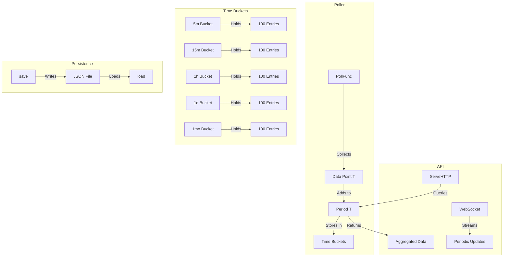
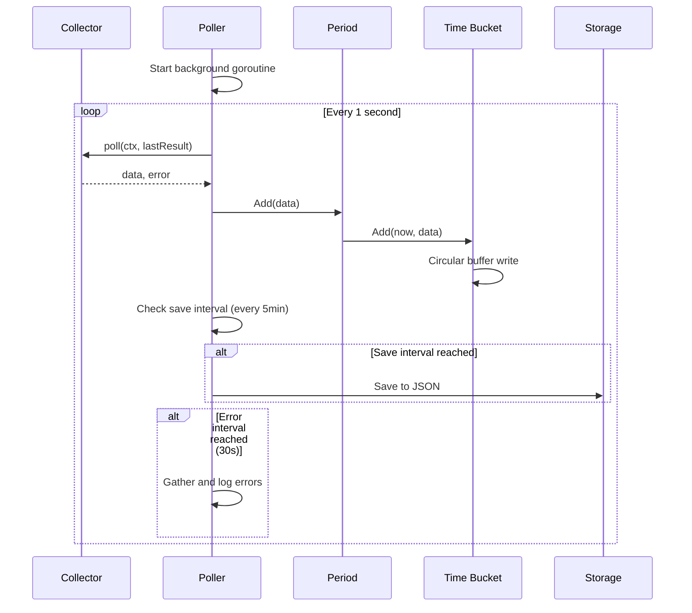
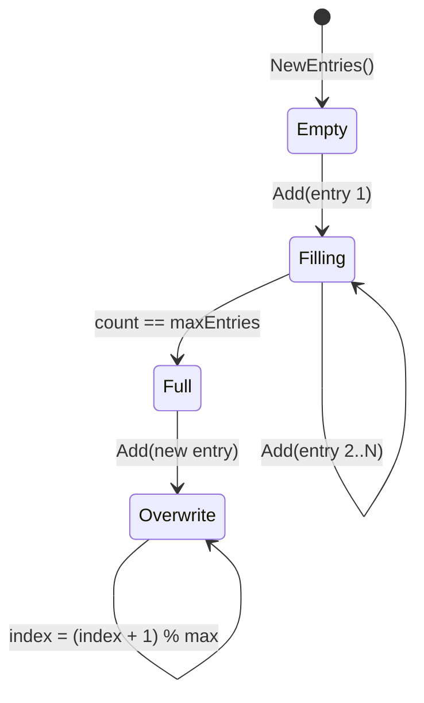

## Overview

The period package implements a generic metrics collection system with time-bucketed storage. It collects data points at regular intervals and stores them in predefined time windows (5m, 15m, 1h, 1d, 1mo) with automatic persistence and HTTP/WebSocket APIs.

### Primary Consumers

- `internal/metrics/uptime` - Route health status storage
- `internal/metrics/systeminfo` - System metrics storage
- `internal/api/v1/metrics` - HTTP API endpoints

### Non-goals

- Does not provide data visualization
- Does not implement alerting or anomaly detection
- Does not support custom time periods (fixed set only)
- Does not provide data aggregation across multiple instances

### Stability

Internal package. Public interfaces are stable.

## Public API

### Exported Types

#### Period[T] Struct

```go
type Period[T any] struct {
    Entries map[Filter]*Entries[T]
    mu      sync.RWMutex
}
```

Container for all time-bucketed entries. Maps each filter to its corresponding `Entries`.

**Methods:**

- `Add(info T)` - Adds a data point to all periods
- `Get(filter Filter) ([]T, bool)` - Gets entries for a specific period
- `Total() int` - Returns total number of entries across all periods
- `ValidateAndFixIntervals()` - Validates and fixes intervals after loading

#### Entries[T] Struct

```go
type Entries[T any] struct {
    entries  [maxEntries]T
    index    int
    count    int
    interval time.Duration
    lastAdd  time.Time
}
```

Circular buffer holding up to 100 entries for a single time period.

**Methods:**

- `Add(now time.Time, info T)` - Adds an entry with interval checking
- `Get() []T` - Returns all entries in chronological order

#### Filter Type

```go
type Filter string
```

Time period filter.

```go
const (
    MetricsPeriod5m  Filter = "5m"
    MetricsPeriod15m Filter = "15m"
    MetricsPeriod1h  Filter = "1h"
    MetricsPeriod1d  Filter = "1d"
    MetricsPeriod1mo Filter = "1mo"
)
```

#### Poller[T, A] Struct

```go
type Poller[T any, A any] struct {
    name         string
    poll         PollFunc[T]
    aggregate    AggregateFunc[T, A]
    resultFilter FilterFunc[T]
    period       *Period[T]
    lastResult   synk.Value[T]
    errs         []pollErr
}
```

Generic poller that collects data at regular intervals.

**Type Aliases:**

```go
type PollFunc[T any] func(ctx context.Context, lastResult T) (T, error)
type AggregateFunc[T any, A any] func(entries []T, query url.Values) (total int, result A)
type FilterFunc[T any] func(entries []T, keyword string) (filtered []T)
```

#### ResponseType[AggregateT]

```go
type ResponseType[AggregateT any] struct {
    Total int        `json:"total"`
    Data  AggregateT `json:"data"`
}
```

Standard response format for API endpoints.

### Exported Functions

#### Period Constructors

```go
func NewPeriod[T any]() *Period[T]
```

Creates a new `Period[T]` with all time buckets initialized.

#### Poller Constructors

```go
func NewPoller[T any, A any](
    name string,
    poll PollFunc[T],
    aggregator AggregateFunc[T, A],
) *Poller[T, A]
```

Creates a new poller with the specified name, poll function, and aggregator.

```go
func (p *Poller[T, A]) WithResultFilter(filter FilterFunc[T]) *Poller[T, A]
```

Adds a result filter to the poller for keyword-based filtering.

#### Poller Methods

```go
func (p *Poller[T, A]) Get(filter Filter) ([]T, bool)
```

Gets entries for a specific time period.

```go
func (p *Poller[T, A]) GetLastResult() T
```

Gets the most recently collected data point.

```go
func (p *Poller[T, A]) Start()
```

Starts the poller. Launches a background goroutine that:

1. Polls for data at 1-second intervals
1. Stores data in all time buckets
1. Saves data to disk every 5 minutes
1. Reports errors every 30 seconds

```go
func (p *Poller[T, A]) ServeHTTP(c *gin.Context)
```

HTTP handler for data retrieval.

## Architecture

### Core Components



### Data Flow



### Time Periods

| Filter | Duration   | Interval     | Max Entries |
| ------ | ---------- | ------------ | ----------- |
| `5m`   | 5 minutes  | 3 seconds    | 100         |
| `15m`  | 15 minutes | 9 seconds    | 100         |
| `1h`   | 1 hour     | 36 seconds   | 100         |
| `1d`   | 1 day      | 14.4 minutes | 100         |
| `1mo`  | 30 days    | 7.2 hours    | 100         |

### Circular Buffer Behavior



When full, new entries overwrite oldest entries (FIFO).

## Configuration Surface

### Poller Configuration

| Parameter            | Type          | Default        | Description                |
| -------------------- | ------------- | -------------- | -------------------------- |
| `PollInterval`       | time.Duration | 1s             | How often to poll for data |
| `saveInterval`       | time.Duration | 5m             | How often to save to disk  |
| `gatherErrsInterval` | time.Duration | 30s            | Error aggregation interval |
| `saveBaseDir`        | string        | `data/metrics` | Persistence directory      |

### HTTP Query Parameters

| Parameter          | Description                         |
| ------------------ | ----------------------------------- |
| `period`           | Time filter (5m, 15m, 1h, 1d, 1mo)  |
| `aggregate`        | Aggregation mode (package-specific) |
| `interval`         | WebSocket update interval           |
| `limit` / `offset` | Pagination parameters               |

## Dependency and Integration Map

### Internal Dependencies

None.

### External Dependencies

| Dependency                                 | Purpose                  |
| ------------------------------------------ | ------------------------ |
| `github.com/gin-gonic/gin`                 | HTTP handling            |
| `github.com/yusing/goutils/http/websocket` | WebSocket streaming      |
| `github.com/bytedance/sonic`               | JSON serialization       |
| `github.com/yusing/goutils/task`           | Lifetime management      |
| `github.com/puzpuzpuz/xsync/v4`            | Concurrent value storage |

### Integration Points

- Poll function collects data from external sources
- Aggregate function transforms data for visualization
- Filter function enables keyword-based filtering
- HTTP handler provides REST/WebSocket endpoints

## Observability

### Logs

| Level | When                                  |
| ----- | ------------------------------------- |
| Debug | Poller start/stop, buffer adjustments |
| Error | Load/save failures                    |
| Info  | Data loaded from disk                 |

### Metrics

None exposed directly. Poll errors are accumulated and logged periodically.

## Security Considerations

- HTTP endpoint should be protected via authentication
- Data files contain potentially sensitive metrics
- No input validation beyond basic query parsing
- WebSocket connections have configurable intervals

## Failure Modes and Recovery

| Failure              | Detection              | Recovery                            |
| -------------------- | ---------------------- | ----------------------------------- |
| Poll function error  | `poll()` returns error | Error accumulated, logged every 30s |
| JSON load failure    | `os.ReadFile` error    | Continue with empty period          |
| JSON save failure    | `Encode` error         | Error accumulated, logged           |
| Context cancellation | `<-ctx.Done()`         | Goroutine exits, final save         |
| Disk full            | Write error            | Error logged, continue              |

### Persistence Behavior

1. On startup, attempts to load existing data from `data/metrics/{name}.json`
1. If file doesn't exist, starts with empty data
1. On load, validates and fixes intervals
1. Saves every 5 minutes during operation
1. Final save on goroutine exit

## Usage Examples

### Defining a Custom Poller

```go
import "github.com/yusing/godoxy/internal/metrics/period"

type CustomMetric struct {
    Timestamp int64   `json:"timestamp"`
    Value     float64 `json:"value"`
    Name      string  `json:"name"`
}

func pollCustomMetric(ctx context.Context, last CustomMetric) (CustomMetric, error) {
    return CustomMetric{
        Timestamp: time.Now().Unix(),
        Value:     readSensorValue(),
        Name:      "sensor_1",
    }, nil
}

func aggregateCustomMetric(entries []CustomMetric, query url.Values) (int, Aggregated) {
    // Aggregate logic here
    return len(aggregated), aggregated
}

var CustomPoller = period.NewPoller("custom", pollCustomMetric, aggregateCustomMetric)
```

### Starting the Poller

```go
// In your main initialization
CustomPoller.Start()
```

### Accessing Data

```go
// Get all entries from the last hour
entries, ok := CustomPoller.Get(period.MetricsPeriod1h)
if ok {
    for _, entry := range entries {
        fmt.Printf("Value: %.2f at %d\n", entry.Value, entry.Timestamp)
    }
}

// Get the most recent value
latest := CustomPoller.GetLastResult()
```

### HTTP Integration

```go
import "github.com/gin-gonic/gin"

func setupMetricsAPI(r *gin.Engine) {
    r.GET("/api/metrics/custom", CustomPoller.ServeHTTP)
}
```

**API Examples:**

```bash
# Get last collected data
GET /api/metrics/custom

# Get 1-hour history
GET /api/metrics/custom?period=1h

# Get 1-day history with aggregation
GET /api/metrics/custom?period=1d&aggregate=cpu_average
```

### WebSocket Integration

```go
// WebSocket connections automatically receive updates
// at the specified interval
ws, _, _ := websocket.DefaultDialer.Dial("ws://localhost/api/metrics/custom?interval=5s", nil)

for {
    _, msg, _ := ws.ReadMessage()
    // Process the update
}
```

### Data Persistence Format

```json
{
  "entries": {
    "5m": {
      "entries": [...],
      "interval": 3000000000
    },
    "15m": {...},
    "1h": {...},
    "1d": {...},
    "1mo": {...}
  }
}
```

## Performance Characteristics

- O(1) add to circular buffer
- O(1) get (returns slice view)
- O(n) serialization where n = total entries
- Memory: O(5 _ 100 _ sizeof(T)) = fixed overhead
- JSON load/save: O(n) where n = total entries

## Testing Notes

- Test circular buffer overflow behavior
- Test interval validation after load
- Test aggregation with various query parameters
- Test concurrent access to period
- Test error accumulation and reporting

## Related Packages

- `internal/metrics/uptime` - Uses period for health status
- `internal/metrics/systeminfo` - Uses period for system metrics
