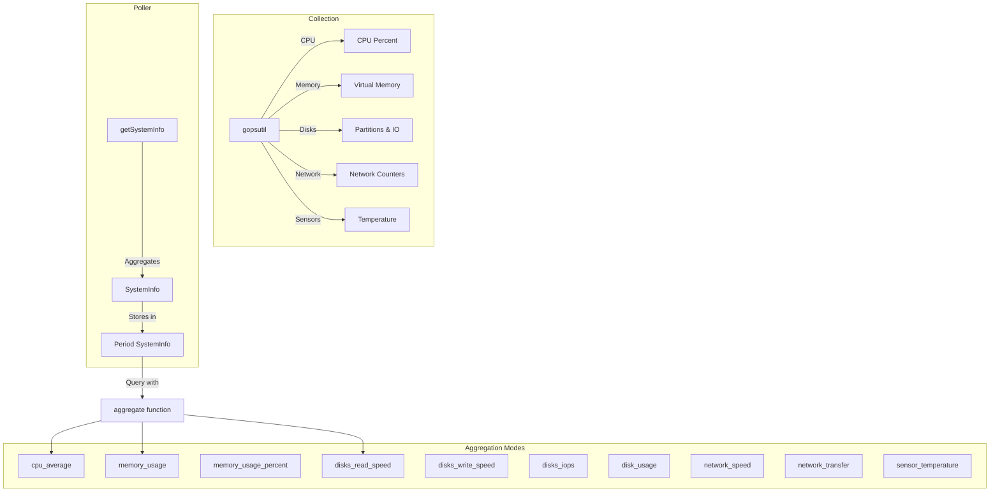
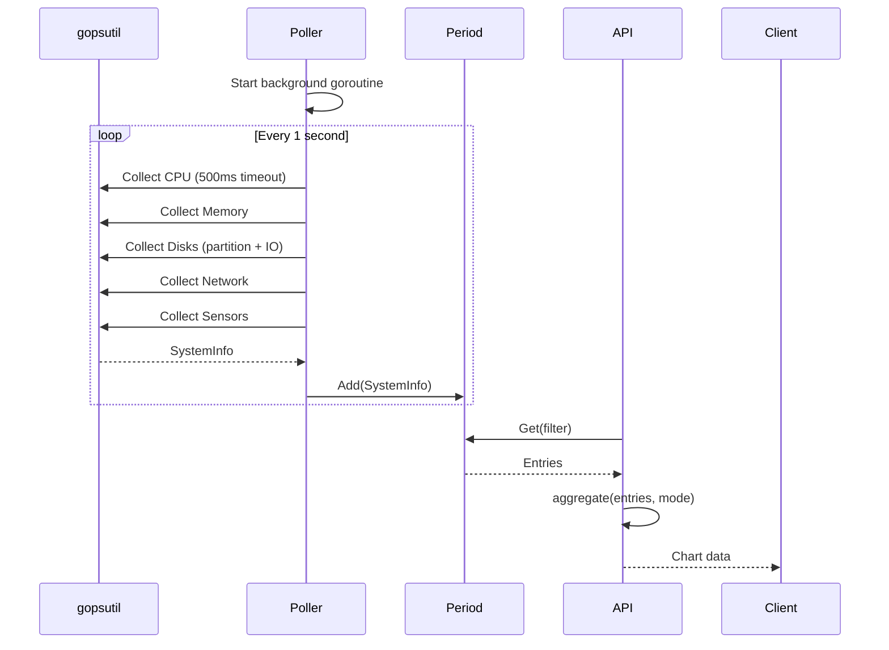

## Overview

The systeminfo package a custom fork of the [gopsutil](https://github.com/shirou/gopsutil) library to collect system metrics and integrates with the `period` package for time-bucketed storage. It supports collecting CPU, memory, disk, network, and sensor data with configurable collection intervals and aggregation modes for visualization.

### Primary Consumers

- `internal/api/v1/metrics` - HTTP endpoint for system metrics
- `internal/homepage` - Dashboard system monitoring widgets
- Monitoring and alerting systems

### Non-goals

- Does not provide alerting on metric thresholds
- Does not persist metrics beyond the period package retention
- Does not provide data aggregation across multiple instances
- Does not support custom metric collectors

### Stability

Internal package. Data format and API are stable.

## Public API

### Exported Types

#### SystemInfo Struct

```go
type SystemInfo struct {
    Timestamp  int64                           `json:"timestamp"`
    CPUAverage *float64                        `json:"cpu_average"`
    Memory     mem.VirtualMemoryStat           `json:"memory"`
    Disks      map[string]disk.UsageStat       `json:"disks"`
    DisksIO    map[string]*disk.IOCountersStat `json:"disks_io"`
    Network    net.IOCountersStat              `json:"network"`
    Sensors    Sensors                         `json:"sensors"`
}
```

Container for all system metrics at a point in time.

**Fields:**

- `Timestamp` - Unix timestamp of collection
- `CPUAverage` - Average CPU usage percentage (0-100)
- `Memory` - Virtual memory statistics (used, total, percent, etc.)
- `Disks` - Disk usage by partition mountpoint
- `DisksIO` - Disk I/O counters by device name
- `Network` - Network I/O counters for primary interface
- `Sensors` - Hardware temperature sensor readings

#### Sensors Type

```go
type Sensors []sensors.TemperatureStat
```

Slice of temperature sensor readings.

#### Aggregated Type

```go
type Aggregated []map[string]any
```

Aggregated data suitable for charting libraries like Recharts. Each entry is a map with timestamp and values.

#### SystemInfoAggregateMode Type

```go
type SystemInfoAggregateMode string
```

Aggregation mode constants:

```go
const (
    SystemInfoAggregateModeCPUAverage         SystemInfoAggregateMode = "cpu_average"
    SystemInfoAggregateModeMemoryUsage        SystemInfoAggregateMode = "memory_usage"
    SystemInfoAggregateModeMemoryUsagePercent SystemInfoAggregateMode = "memory_usage_percent"
    SystemInfoAggregateModeDisksReadSpeed     SystemInfoAggregateMode = "disks_read_speed"
    SystemInfoAggregateModeDisksWriteSpeed    SystemInfoAggregateMode = "disks_write_speed"
    SystemInfoAggregateModeDisksIOPS          SystemInfoAggregateMode = "disks_iops"
    SystemInfoAggregateModeDiskUsage          SystemInfoAggregateMode = "disk_usage"
    SystemInfoAggregateModeNetworkSpeed       SystemInfoAggregateMode = "network_speed"
    SystemInfoAggregateModeNetworkTransfer    SystemInfoAggregateMode = "network_transfer"
    SystemInfoAggregateModeSensorTemperature  SystemInfoAggregateMode = "sensor_temperature"
)
```

### Exported Variables

#### Poller

```go
var Poller = period.NewPoller("system_info", getSystemInfo, aggregate)
```

Pre-configured poller for system info metrics. Start with `Poller.Start()`.

### Exported Functions

#### getSystemInfo

```go
func getSystemInfo(ctx context.Context, lastResult *SystemInfo) (*SystemInfo, error)
```

Collects current system metrics. This is the poll function passed to the period poller.

**Features:**

- Concurrent collection of all metric categories
- Handles partial failures gracefully
- Calculates rates based on previous result (for speed metrics)
- Logs warnings for non-critical errors

**Rate Calculations:**

- Disk read/write speed: `(currentBytes - lastBytes) / interval`
- Disk IOPS: `(currentCount - lastCount) / interval`
- Network speed: `(currentBytes - lastBytes) / interval`

#### aggregate

```go
func aggregate(entries []*SystemInfo, query url.Values) (total int, result Aggregated)
```

Aggregates system info entries for a specific mode. Called by the period poller.

**Query Parameters:**

- `aggregate` - The aggregation mode (see constants above)

**Returns:**

- `total` - Number of aggregated entries
- `result` - Slice of maps suitable for charting

## Architecture

### Core Components



### Data Flow



### Collection Categories

| Category | Data Source                                            | Optional | Rate Metrics          |
| -------- | ------------------------------------------------------ | -------- | --------------------- |
| CPU      | `cpu.PercentWithContext`                               | Yes      | No                    |
| Memory   | `mem.VirtualMemoryWithContext`                         | Yes      | No                    |
| Disks    | `disk.PartitionsWithContext` + `disk.UsageWithContext` | Yes      | Yes (read/write/IOPS) |
| Network  | `net.IOCountersWithContext`                            | Yes      | Yes (upload/download) |
| Sensors  | `sensors.TemperaturesWithContext`                      | Yes      | No                    |

### Aggregation Modes

Each mode produces chart-friendly output:

**CPU Average:**

```json
[
  { "timestamp": 1704892800, "cpu_average": 45.5 },
  { "timestamp": 1704892810, "cpu_average": 52.3 }
]
```

**Memory Usage:**

```json
[
  { "timestamp": 1704892800, "memory_usage": 8388608000 },
  { "timestamp": 1704892810, "memory_usage": 8453440000 }
]
```

**Disk Read/Write Speed:**

```json
[
  { "timestamp": 1704892800, "sda": 10485760, "sdb": 5242880 },
  { "timestamp": 1704892810, "sda": 15728640, "sdb": 4194304 }
]
```

## Configuration Surface

### Disabling Metrics Categories

Metrics categories can be disabled via environment variables:

| Variable                  | Purpose                                     |
| ------------------------- | ------------------------------------------- |
| `METRICS_DISABLE_CPU`     | Set to "true" to disable CPU collection     |
| `METRICS_DISABLE_MEMORY`  | Set to "true" to disable memory collection  |
| `METRICS_DISABLE_DISK`    | Set to "true" to disable disk collection    |
| `METRICS_DISABLE_NETWORK` | Set to "true" to disable network collection |
| `METRICS_DISABLE_SENSORS` | Set to "true" to disable sensor collection  |

## Dependency and Integration Map

### Internal Dependencies

| Package                          | Purpose               |
| -------------------------------- | --------------------- |
| `internal/metrics/period`        | Time-bucketed storage |
| `internal/common`                | Configuration flags   |
| `github.com/yusing/goutils/errs` | Error handling        |

### External Dependencies

| Dependency                      | Purpose                   |
| ------------------------------- | ------------------------- |
| `github.com/shirou/gopsutil/v4` | System metrics collection |
| `github.com/rs/zerolog`         | Logging                   |

### Integration Points

- gopsutil provides raw system metrics
- period package handles storage and persistence
- HTTP API provides query interface

## Observability

### Logs

| Level | When                                       |
| ----- | ------------------------------------------ |
| Warn  | Non-critical errors (e.g., no sensor data) |
| Error | Other errors                               |

### Metrics

No metrics exposed directly. Collection errors are logged.

## Failure Modes and Recovery

| Failure         | Detection                            | Recovery                         |
| --------------- | ------------------------------------ | -------------------------------- |
| No CPU data     | `cpu.Percent` returns error          | Skip and log later with warning  |
| No memory data  | `mem.VirtualMemory` returns error    | Skip and log later with warning  |
| No disk data    | `disk.Usage` returns error for all   | Skip and log later with warning  |
| No network data | `net.IOCounters` returns error       | Skip and log later with warning  |
| No sensor data  | `sensors.Temperatures` returns error | Skip and log later with warning  |
| Context timeout | Context deadline exceeded            | Return partial data with warning |

### Partial Collection

The package uses `gperr.NewGroup` to collect errors from concurrent operations:

```go
errs := gperr.NewGroup("failed to get system info")
errs.Go(func() error { return s.collectCPUInfo(ctx) })
errs.Go(func() error { return s.collectMemoryInfo(ctx) })
// ...
result := errs.Wait()
```

Warnings (like `ENODATA`) are logged but don't fail the collection.
Critical errors cause the function to return an error.

## Usage Examples

### Starting the Poller

```go
import "github.com/yusing/godoxy/internal/metrics/systeminfo"

func init() {
    systeminfo.Poller.Start()
}
```

### HTTP Endpoint

```go
import "github.com/gin-gonic/gin"

func setupMetricsAPI(r *gin.Engine) {
    r.GET("/api/metrics/system", systeminfo.Poller.ServeHTTP)
}
```

**API Examples:**

```bash
# Get latest metrics
curl http://localhost:8080/api/metrics/system

# Get 1-hour history with CPU aggregation
curl "http://localhost:8080/api/metrics/system?period=1h&aggregate=cpu_average"

# Get 24-hour memory usage history
curl "http://localhost:8080/api/metrics/system?period=1d&aggregate=memory_usage_percent"

# Get disk I/O for the last hour
curl "http://localhost:8080/api/metrics/system?period=1h&aggregate=disks_read_speed"
```

### WebSocket Streaming

```javascript
const ws = new WebSocket(
  "ws://localhost:8080/api/metrics/system?period=1m&interval=5s&aggregate=cpu_average",
);

ws.onmessage = (event) => {
  const data = JSON.parse(event.data);
  console.log("CPU:", data.data);
};
```

### Direct Data Access

```go
// Get entries for the last hour
entries, ok := systeminfo.Poller.Get(period.MetricsPeriod1h)
for _, entry := range entries {
    if entry.CPUAverage != nil {
        fmt.Printf("CPU: %.1f%% at %d\n", *entry.CPUAverage, entry.Timestamp)
    }
}

// Get the most recent metrics
latest := systeminfo.Poller.GetLastResult()
```

### Disabling Metrics at Runtime

```go
import (
    "github.com/yusing/godoxy/internal/common"
    "github.com/yusing/godoxy/internal/metrics/systeminfo"
)

func init() {
    // Disable expensive sensor collection
    common.MetricsDisableSensors = true
    systeminfo.Poller.Start()
}
```

## Performance Characteristics

- O(1) per metric collection (gopsutil handles complexity)
- Concurrent collection of all categories
- Rate calculations O(n) where n = number of disks/interfaces
- Memory: O(5 _ 100 _ sizeof(SystemInfo))
- JSON serialization O(n) for API responses

### Collection Latency

| Category | Typical Latency                        |
| -------- | -------------------------------------- |
| CPU      | ~10-50ms                               |
| Memory   | ~5-10ms                                |
| Disks    | ~10-100ms (depends on partition count) |
| Network  | ~5-10ms                                |
| Sensors  | ~10-50ms                               |

## Testing Notes

- Mock gopsutil calls for unit tests
- Test with real metrics to verify rate calculations
- Test aggregation modes with various data sets
- Verify disable flags work correctly
- Test partial failure scenarios

## Related Packages

- `internal/metrics/period` - Time-bucketed storage
- `internal/api/v1/metrics` - HTTP API endpoints
- `github.com/shirou/gopsutil/v4` - System metrics library
