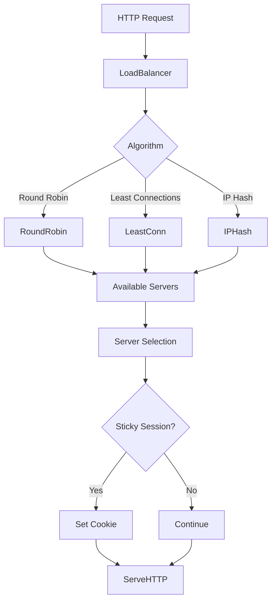
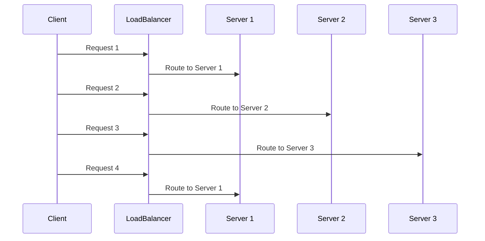
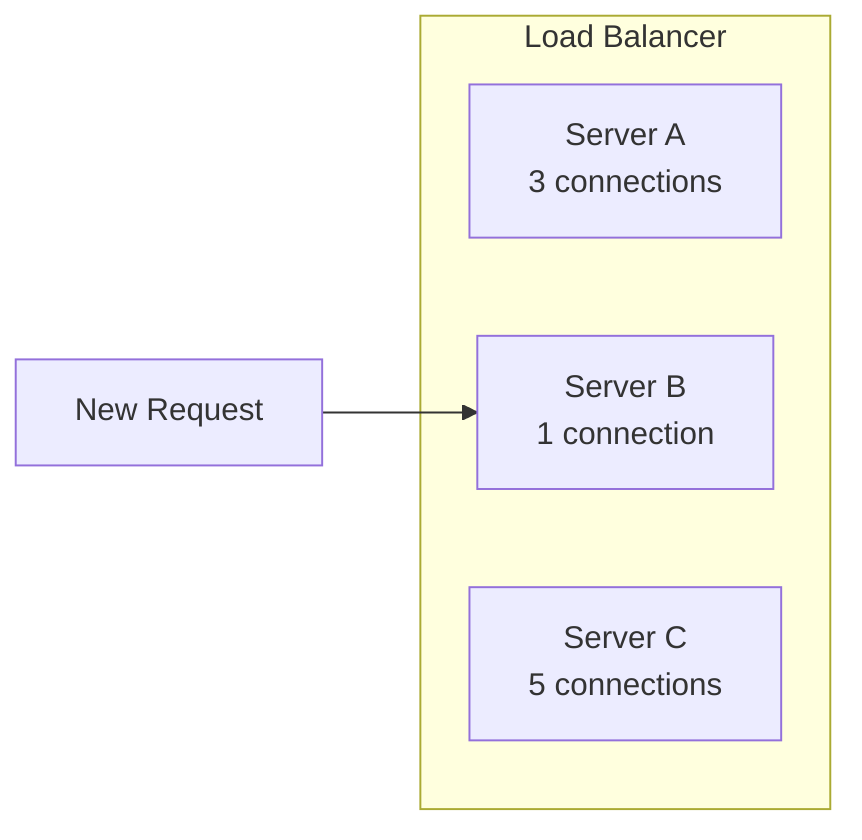
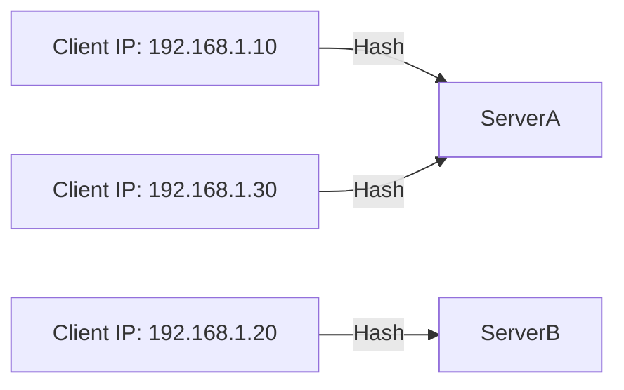
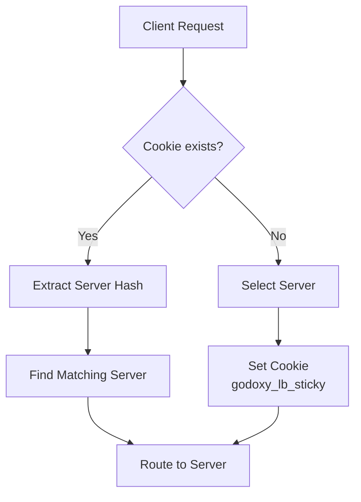

## Overview

This package implements a flexible load balancer for distributing HTTP requests across multiple backend servers. It supports multiple balancing algorithms and integrates with GoDoxy's task management and health monitoring systems.

## Architecture



## Algorithms

### Round Robin

Distributes requests evenly across all available servers in sequence.



### Least Connections

Routes requests to the server with the fewest active connections.



### IP Hash

Consistently routes requests from the same client IP to the same server using hash-based distribution.



## Core Components

### LoadBalancer

```go
type LoadBalancer struct {
    *types.LoadBalancerConfig
    task *task.Task
    pool pool.Pool[types.LoadBalancerServer]
    poolMu sync.Mutex
    sumWeight int
    startTime time.Time
}
```

**Key Methods:**

```go
// Create a new load balancer from configuration
func New(cfg *types.LoadBalancerConfig) *LoadBalancer

// Start the load balancer as a background task
func (lb *LoadBalancer) Start(parent task.Parent) error

// Update configuration dynamically
func (lb *LoadBalancer) UpdateConfigIfNeeded(cfg *types.LoadBalancerConfig)

// Add a backend server
func (lb *LoadBalancer) AddServer(srv types.LoadBalancerServer)

// Remove a backend server
func (lb *LoadBalancer) RemoveServer(srv types.LoadBalancerServer)

// ServeHTTP implements http.Handler
func (lb *LoadBalancer) ServeHTTP(rw http.ResponseWriter, r *http.Request)
```

### Server

```go
type server struct {
    name   string
    url    *nettypes.URL
    weight int
    http.Handler
    types.HealthMonitor
}

// Create a new backend server
func NewServer(name string, url *nettypes.URL, weight int, handler http.Handler, healthMon types.HealthMonitor) types.LoadBalancerServer
```

**Server Interface:**

```go
type LoadBalancerServer interface {
    Name() string
    URL() *nettypes.URL
    Key() string
    Weight() int
    SetWeight(weight int)
    Status() types.HealthStatus
    Latency() time.Duration
    ServeHTTP(rw http.ResponseWriter, r *http.Request)
    TryWake() error
}
```

### Sticky Sessions

The load balancer supports sticky sessions via cookies:



```go
// Cookie settings
Name: "godoxy_lb_sticky"
MaxAge: Configurable (default: 24 hours)
HttpOnly: true
SameSite: Lax
Secure: Based on TLS/Forwarded-Proto
```

## Balancing Modes

```go
const (
    LoadbalanceModeUnset      = ""
    LoadbalanceModeRoundRobin = "round_robin"
    LoadbalanceModeLeastConn  = "least_conn"
    LoadbalanceModeIPHash     = "ip_hash"
)
```

## Configuration

```go
type LoadBalancerConfig struct {
    Link   string              // Link name
    Mode   LoadbalanceMode     // Balancing algorithm
    Sticky bool                // Enable sticky sessions
    StickyMaxAge time.Duration // Cookie max age
    Options map[string]any     // Algorithm-specific options
}
```

## Usage Examples

### Basic Round Robin Load Balancer

```go
config := &types.LoadBalancerConfig{
    Link: "my-service",
    Mode: types.LoadbalanceModeRoundRobin,
}

lb := loadbalancer.New(config)
lb.Start(parentTask)

// Add backend servers
lb.AddServer(loadbalancer.NewServer("backend-1", url1, 10, handler1, health1))
lb.AddServer(loadbalancer.NewServer("backend-2", url2, 10, handler2, health2))

// Use as HTTP handler
http.Handle("/", lb)
```

### Least Connections with Sticky Sessions

```go
config := &types.LoadBalancerConfig{
    Link:         "api-service",
    Mode:         types.LoadbalanceModeLeastConn,
    Sticky:       true,
    StickyMaxAge: 1 * time.Hour,
}

lb := loadbalancer.New(config)
lb.Start(parentTask)

for _, srv := range backends {
    lb.AddServer(srv)
}
```

### IP Hash Load Balancer with Real IP

```go
config := &types.LoadBalancerConfig{
    Link: "user-service",
    Mode: types.LoadbalanceModeIPHash,
    Options: map[string]any{
        "header":     "X-Real-IP",
        "from":       []string{"10.0.0.0/8", "172.16.0.0/12"},
        "recursive":  true,
    },
}

lb := loadbalancer.New(config)
```

### Server Weight Management

```go
// Servers are balanced based on weight (max total: 100)
lb.AddServer(NewServer("server1", url1, 30, handler, health))
lb.AddServer(NewServer("server2", url2, 50, handler, health))
lb.AddServer(NewServer("server3", url3, 20, handler, health))

// Weights are auto-rebalanced if total != 100
```

## Idlewatcher Integration

The load balancer integrates with the idlewatcher system:

- Wake events path (`/api/wake`): Wakes all idle servers
- Favicon and loading page paths: Bypassed for sticky session handling
- Server wake support via `TryWake()` interface

## Health Monitoring

The load balancer implements `types.HealthMonitor`:

```go
func (lb *LoadBalancer) Status() types.HealthStatus
func (lb *LoadBalancer) Detail() string
func (lb *LoadBalancer) Uptime() time.Duration
func (lb *LoadBalancer) Latency() time.Duration
```

Health JSON representation:

```json
{
  "name": "my-service",
  "status": "healthy",
  "detail": "3/3 servers are healthy",
  "started": "2024-01-01T00:00:00Z",
  "uptime": "1h2m3s",
  "latency": "10ms",
  "extra": {
    "config": {...},
    "pool": {...}
  }
}
```

## Thread Safety

- Server pool operations are protected by `poolMu` mutex
- Algorithm-specific state uses atomic operations or dedicated synchronization
- Least connections uses `xsync.Map` for thread-safe connection counting
