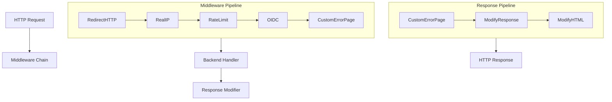
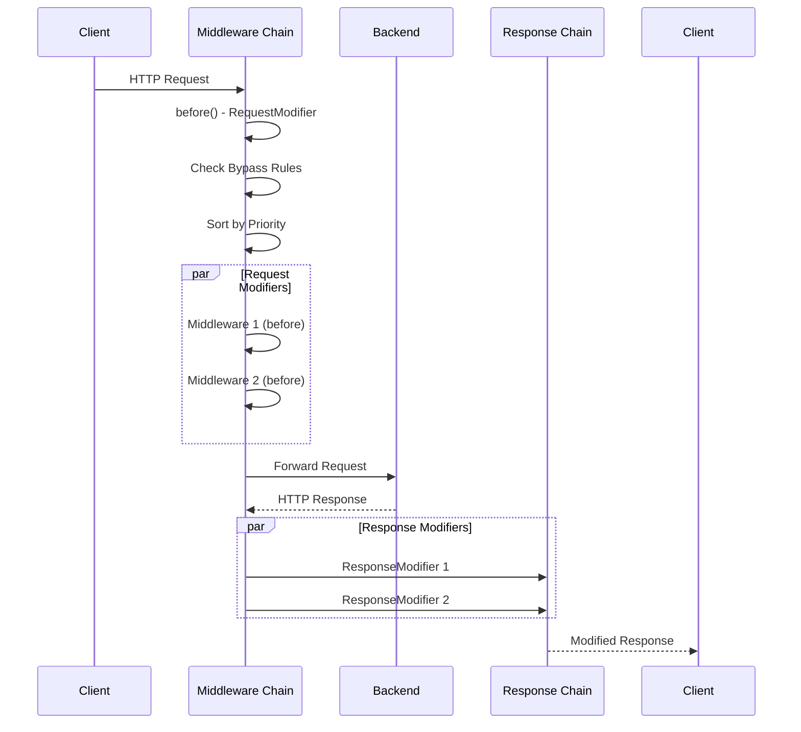
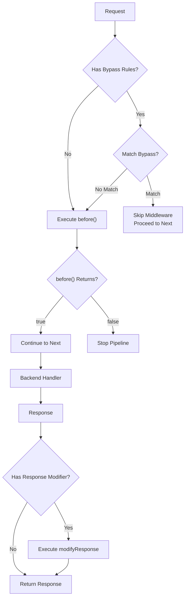

## Overview

This package implements a flexible HTTP middleware system for GoDoxy. Middleware can modify requests before they reach the backend and modify responses before they return to the client. The system supports:

- **Request Modifiers**: Process requests before forwarding
- **Response Modifiers**: Modify responses before returning to client
- **Middleware Chaining**: Compose multiple middleware in priority order
- **YAML Composition**: Define middleware chains in configuration files
- **Bypass Rules**: Skip middleware based on request properties
- **Dynamic Loading**: Load middleware definitions from files at runtime

## Architecture



## Middleware Flow



## Core Components

### Middleware

```go
type Middleware struct {
    name      string
    construct ImplNewFunc
    impl      any
    commonOptions
}

type commonOptions struct {
    Priority int    `json:"priority"` // Default: 10, 0 is highest
    Bypass   Bypass `json:"bypass"`
}
```

**Interfaces:**

```go
// RequestModifier - modify or filter requests
type RequestModifier interface {
    before(w http.ResponseWriter, r *http.Request) (proceed bool)
}

// ResponseModifier - modify responses
type ResponseModifier interface {
    modifyResponse(r *http.Response) error
}

// MiddlewareWithSetup - one-time setup after construction
type MiddlewareWithSetup interface {
    setup()
}

// MiddlewareFinalizer - finalize after options applied
type MiddlewareFinalizer interface {
    finalize()
}

// MiddlewareFinalizerWithError - finalize with error handling
type MiddlewareFinalizerWithError interface {
    finalize() error
}
```

### Middleware Chain

```go
type middlewareChain struct {
    beforess  []RequestModifier
    modResps []ResponseModifier
}

func NewMiddlewareChain(name string, chain []*Middleware) *Middleware
```

### Bypass Rules

```go
type Bypass []rules.RuleOn

// ShouldBypass checks if request should skip middleware
func (b Bypass) ShouldBypass(w http.ResponseWriter, r *http.Request) bool
```

## Available Middleware

| Name                            | Type     | Description                                |
| ------------------------------- | -------- | ------------------------------------------ |
| `redirecthttp`                  | Request  | Redirect HTTP to HTTPS                     |
| `oidc`                          | Request  | OIDC authentication                        |
| `forwardauth`                   | Request  | Forward authentication to external service |
| `modifyrequest` / `request`     | Request  | Modify request headers and path            |
| `modifyresponse` / `response`   | Response | Modify response headers                    |
| `setxforwarded`                 | Request  | Set X-Forwarded headers                    |
| `hidexforwarded`                | Request  | Remove X-Forwarded headers                 |
| `modifyhtml`                    | Response | Inject HTML into responses                 |
| `themed`                        | Response | Apply theming to HTML                      |
| `errorpage` / `customerrorpage` | Response | Serve custom error pages                   |
| `realip`                        | Request  | Extract real client IP from headers        |
| `cloudflarerealip`              | Request  | Cloudflare-specific real IP extraction     |
| `cidrwhitelist`                 | Request  | Allow only specific IP ranges              |
| `ratelimit`                     | Request  | Rate limiting by IP                        |
| `hcaptcha`                      | Request  | hCAPTCHA verification                      |

## Usage Examples

### Creating a Middleware

```go
import "github.com/yusing/godoxy/internal/net/gphttp/middleware"

type myMiddleware struct {
    SomeOption string `json:"some_option"`
}

func (m *myMiddleware) before(w http.ResponseWriter, r *http.Request) bool {
    // Process request
    r.Header.Set("X-Custom", m.SomeOption)
    return true // false would block the request
}

var MyMiddleware = middleware.NewMiddleware[myMiddleware]()
```

### Building Middleware from Map

```go
middlewaresMap := map[string]middleware.OptionsRaw{
    "realip": {
        "priority": 5,
        "header":   "X-Real-IP",
        "from":     []string{"10.0.0.0/8"},
    },
    "ratelimit": {
        "priority": 10,
        "average":  10,
        "burst":    20,
    },
}

mid, err := middleware.BuildMiddlewareFromMap("my-chain", middlewaresMap)
if err != nil {
    log.Fatal(err)
}
```

### YAML Composition

```yaml
# config/middlewares/my-chain.yml
- use: realip
  header: X-Real-IP
  from:
    - 10.0.0.0/8
    - 172.16.0.0/12
  bypass:
    - path glob("/public/*")

- use: ratelimit
  average: 100
  burst: 200

- use: oidc
  allowed_users:
    - user@example.com
```

```go
// Load from file
eb := &gperr.Builder{}
middlewares := middleware.BuildMiddlewaresFromComposeFile(
    "config/middlewares/my-chain.yml",
    eb,
)
```

### Applying Middleware to Reverse Proxy

```go
import "github.com/yusing/goutils/http/reverseproxy"

rp := &reverseproxy.ReverseProxy{
    Target: backendURL,
}

err := middleware.PatchReverseProxy(rp, middlewaresMap)
if err != nil {
    log.Fatal(err)
}
```

### Bypass Rules

```go
bypassRules := middleware.Bypass{
    {
        Type:  rules.RuleOnTypePathPrefix,
        Value: "/public",
    },
    {
        Type:  rules.RuleOnTypePath,
        Value: "/health",
    },
}

mid, _ := middleware.RateLimiter.New(middleware.OptionsRaw{
    "bypass": bypassRules,
    "average": 10,
    "burst":  20,
})
```

## Priority

Middleware are executed in priority order (lower number = higher priority):


## Request Processing



## Integration Points

- **Error Pages**: Uses `errorpage` package for custom error responses
- **Authentication**: Integrates with `internal/auth` for OIDC
- **Rate Limiting**: Uses `golang.org/x/time/rate`
- **IP Processing**: Uses `internal/net/types` for CIDR handling

## Error Handling

Errors during middleware construction are collected and reported:

```go
var errs gperr.Builder
for name, opts := range middlewaresMap {
    m, err := middleware.Get(name)
    if err != nil {
        errs.Add(err)
        continue
    }
    mid, err := m.New(opts)
    if err != nil {
        errs.AddSubjectf(err, "middlewares.%s", name)
        continue
    }
}
if errs.HasError() {
    log.Error().Err(errs.Error()).Msg("middleware compilation failed")
}
```
