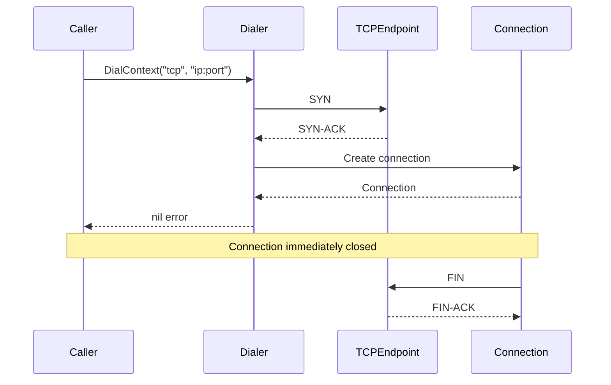

## Overview

The net package implements network utility functions that are used throughout GoDoxy for connectivity testing, TCP operations, and network-related utilities.

### Key Features

- TCP connection testing (ping)
- Connection utilities

## Core Functions

### TCP Ping

```go
// PingTCP pings a TCP endpoint by attempting a connection.
func PingTCP(ctx context.Context, ip net.IP, port int) error
```

## Usage

### Basic Usage

```go
import "github.com/yusing/godoxy/internal/net"

func checkService(ctx context.Context, ip string, port int) error {
    addr := net.ParseIP(ip)
    if addr == nil {
        return fmt.Errorf("invalid IP: %s", ip)
    }

    err := net.PingTCP(ctx, addr, port)
    if err != nil {
        return fmt.Errorf("service %s:%d unreachable: %w", ip, port, err)
    }

    fmt.Printf("Service %s:%d is reachable\n", ip, port)
    return nil
}
```

### Timeout Usage

```go
ctx, cancel := context.WithTimeout(context.Background(), 5*time.Second)
defer cancel()

ip := net.ParseIP("192.168.1.100")
err := net.PingTCP(ctx, ip, 8080)

if err != nil {
    if errors.Is(err, context.DeadlineExceeded) {
        log.Println("Connection timed out")
    } else {
        log.Printf("Connection failed: %v", err)
    }
}
```

## Implementation

```go
func PingTCP(ctx context.Context, ip net.IP, port int) error {
    var dialer net.Dialer
    conn, err := dialer.DialContext(ctx, "tcp", fmt.Sprintf("%s:%d", ip, port))
    if err != nil {
        return err
    }
    conn.Close()
    return nil
}
```

## Data Flow



## Use Cases

### Service Health Check

```go
func checkServices(ctx context.Context, services []Service) error {
    for _, svc := range services {
        ip := net.ParseIP(svc.IP)
        if ip == nil {
            return fmt.Errorf("invalid IP for %s: %s", svc.Name, svc.IP)
        }

        if err := net.PingTCP(ctx, ip, svc.Port); err != nil {
            return fmt.Errorf("service %s (%s:%d) unreachable: %w",
                svc.Name, svc.IP, svc.Port, err)
        }
    }
    return nil
}
```

### Proxmox Container Reachability

```go
// Check if a Proxmox container is reachable on its proxy port
func checkContainerReachability(ctx context.Context, node *proxmox.Node, vmid int, port int) error {
    ips, err := node.LXCGetIPs(ctx, vmid)
    if err != nil {
        return err
    }

    for _, ip := range ips {
        if err := net.PingTCP(ctx, ip, port); err == nil {
            return nil // Found reachable IP
        }
    }

    return fmt.Errorf("no reachable IP found for container %d", vmid)
}
```

## Related Packages

- **Route**: Uses TCP ping for load balancing health checks
- **Proxmox**: Uses TCP ping to verify container reachability
- **Idlewatcher**: Uses TCP ping to check idle status
