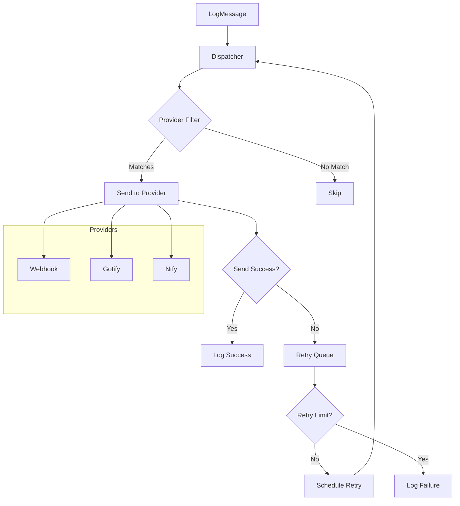
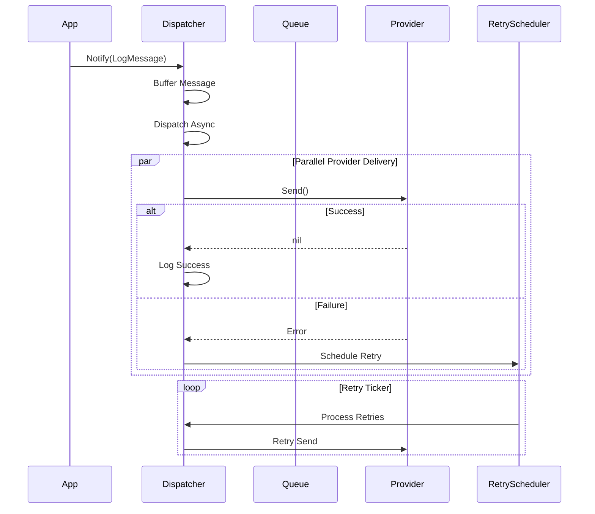

## Overview

The notif package implements a notification dispatcher that delivers messages to multiple providers with automatic retry handling, provider management, and logging support.

### Key Features

- Multiple notification providers (Webhook, Gotify, Ntfy)
- Provider registration and management
- Retry logic with exponential backoff
- Message queuing with configurable buffer
- Selective provider targeting
- Colored message support

## Architecture



## Core Components

### Dispatcher

```go
type Dispatcher struct {
    task        *task.Task
    providers   *xsync.Map[Provider, struct{}]
    logCh       chan *LogMessage
    retryMsg    *xsync.Map[*RetryMessage, struct{}]
    retryTicker *time.Ticker
}
```

### LogMessage

```go
type LogMessage struct {
    Level zerolog.Level
    Title string
    Body  LogBody
    Color Color
    To    []string // Provider names to target
}

type LogBody []string
```

### Provider Interface

```go
type Provider interface {
    GetName() string
    Send(ctx context.Context, msg *LogMessage) error
}
```

## Providers

### Webhook

```go
type Webhook struct {
    URL    string `json:"url"`
    Method string `json:"method"` // default: POST
}
```

### Gotify

```go
type GotifyClient struct {
    URL    string `json:"url"`
    Token  string `json:"token"`
}
```

### Ntfy

```go
type Ntfy struct {
    URL   string `json:"url"`
    Topic string `json:"topic"`
}
```

## Public API

### Dispatcher Management

```go
// StartNotifDispatcher initializes the notification dispatcher.
func StartNotifDispatcher(parent task.Parent) *Dispatcher
```

### Notification

```go
// Notify sends a log message to all providers.
func Notify(msg *LogMessage)
```

### Dispatcher Methods

```go
// RegisterProvider registers a notification provider.
func (disp *Dispatcher) RegisterProvider(cfg *NotificationConfig)
```

## Usage

### Basic Notification

```go
notif.Notify(&notif.LogMessage{
    Level: zerolog.InfoLevel,
    Title: "Container Started",
    Body: notif.ListBody{
        "Container: myapp",
        "Status: Running",
    },
})
```

### Provider-Specific Notification

```go
notif.Notify(&notif.LogMessage{
    Level:    zerolog.WarnLevel,
    Title:    "High Memory Usage",
    Body:     notif.MessageBody("Memory: 85%"),
    Color:    notif.ColorRed,
    To:       []string{"gotify"}, // Only send to provider with name "gotify"
})
```

### Registering Providers

```go
dispatcher := notif.StartNotifDispatcher(parent)

dispatcher.RegisterProvider(&notif.NotificationConfig{
    ProviderName: notif.ProviderWebhook,
    Provider: &notif.Webhook{
        URL: "https://hooks.example.com/webhook",
    },
})

dispatcher.RegisterProvider(&notif.NotificationConfig{
    ProviderName: notif.ProviderGotify,
    Provider: &notif.GotifyClient{
        URL:   "https://gotify.example.com",
        Token: "secret",
    },
})
```

## Retry Logic

### Configuration

```go
const (
    retryInterval     = time.Second
    maxBackoffDelay   = 5 * time.Minute
    backoffMultiplier = 2.0
)
```

### Backoff Calculation

```go
func calculateBackoffDelay(trials int) time.Duration {
    if trials == 0 {
        return retryInterval
    }

    delay := min(float64(retryInterval)*math.Pow(backoffMultiplier, float64(trials)),
                 float64(maxBackoffDelay))

    // Add 20% jitter
    jitter := delay * 0.2 * (rand.Float64() - 0.5)
    return time.Duration(delay + jitter)
}
```

### Retry Schedule

| Trial | Delay  | Jitter    | Total (approx) |
| ----- | ------ | --------- | -------------- |
| 0     | 1s     | +/- 100ms | 0.9-1.1s       |
| 1     | 2s     | +/- 200ms | 1.8-2.2s       |
| 2     | 4s     | +/- 400ms | 3.6-4.4s       |
| 3     | 8s     | +/- 800ms | 7.2-8.8s       |
| 4     | 16s    | +/- 1.6s  | 14.4-17.6s     |
| 5     | 32s    | +/- 3.2s  | 28.8-35.2s     |
| ...   | max 5m | +/- 30s   | 4.5-5.5m       |

## Data Flow



## Message Colors

```go
type Color uint

const (
    ColorDefault Color = iota
    ColorRed
    ColorGreen
    ColorBlue
    ColorYellow
    ColorPurple
)
```

## Configuration

### YAML Configuration

```yaml
providers:
  notification:
    - provider: webhook
      url: https://hooks.example.com/webhook
      method: POST

    - provider: gotify
      url: https://gotify.example.com
      token: your-token

    - provider: ntfy
      url: https://ntfy.example.com
      topic: godoxy
```

## Integration Points

The notif package integrates with:

- **ACL**: Blocked access notifications
- **Route**: Route status changes
- **Idlewatcher**: Container idle/alive notifications
- **Health**: Health check alerts
- **Autocert**: Certificate expiration warnings

## Error Handling

### Provider Errors

```go
var (
    ErrMissingNotifProvider     = errors.New("missing notification provider")
    ErrInvalidNotifProviderType = errors.New("invalid notification provider type")
    ErrUnknownNotifProvider     = errors.New("unknown notification provider")
)
```

### Retry Limits

Retry limits depend on message level:

```go
var maxRetries = map[zerolog.Level]int{
    zerolog.ErrorLevel:   3,
    zerolog.WarnLevel:    2,
    zerolog.InfoLevel:    1,
    zerolog.DebugLevel:   0,
}
```

## Performance Considerations

- Buffered channel with 100 message capacity
- Non-blocking sends to provider
- Batched retry processing
- Provider filtering reduces unnecessary calls
- Exponential backoff prevents thundering herd
