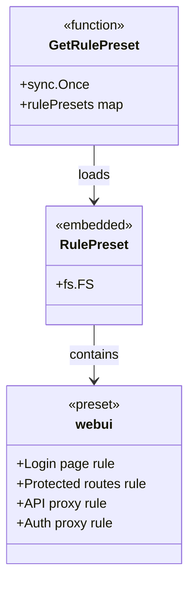
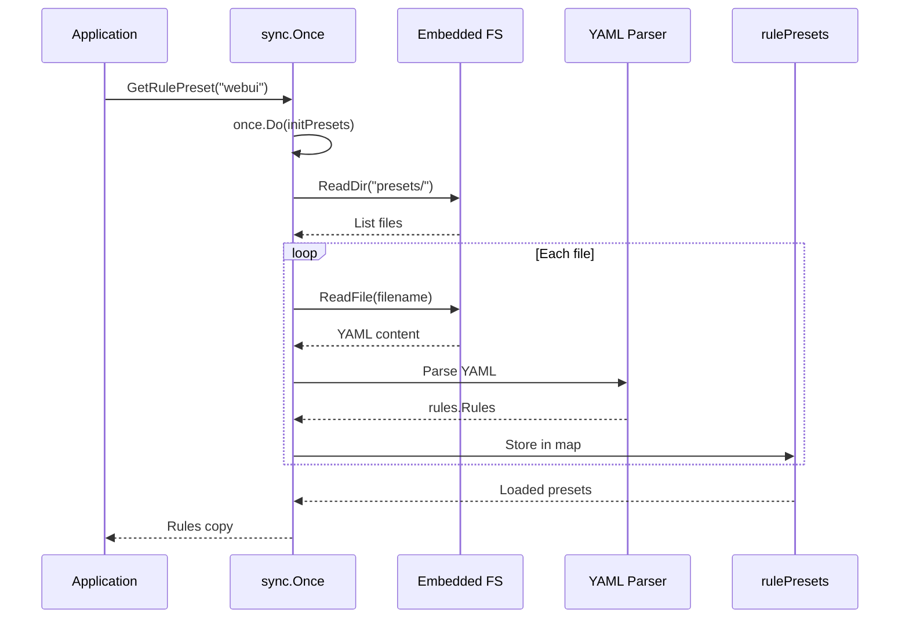

## Overview

The `internal/route/rules/presets` package provides embedded YAML rule configurations that can be reused across routes. Presets are compiled into the binary and loaded at runtime via `sync.Once` initialization.

### Primary Consumers

- **Route configuration**: Applies preset rules to routes
- **WebUI**: Provides default rules for web applications
- **API gateway**: Common patterns for API routes

### Non-goals

- Does not modify presets at runtime
- Does not provide dynamic preset loading
- Does not support preset inheritance/overriding

### Stability

Internal package. Preset content is stable but may change between versions.

## Public API

### Exported Functions

```go
// GetRulePreset retrieves a preset by name
func GetRulePreset(name string) (rules.Rules, bool)
```

**Contract:**

- Uses `sync.Once` for one-time initialization
- Returns a copy of the preset rules
- Second return value indicates if preset exists

## Architecture

### Core Components



### Preset Loading Flow



## Preset Files

### Directory Structure

```
internal/route/rules/presets/
├── embed.go          //go:embed *.yml
├── webui.yml         // WebUI preset
└── README.md
```

### webui Preset

The default preset for GoDoxy WebUI:

**What it does:**

1. Allows unauthenticated access to `/login`
1. Requires auth for most paths, excluding static assets and auth endpoints
1. Proxies `/api/v1/*` to backend
1. Rewrites and proxies `/auth/*` to backend

## Dependency and Integration Map

| Dependency               | Purpose                         |
| ------------------------ | ------------------------------- |
| `internal/route/rules`   | Rules engine for preset content |
| `internal/serialization` | YAML parsing                    |
| `sync`                   | One-time initialization         |

## Observability

### Logs

- DEBUG: Preset loading errors
- WARN: Missing preset files

## Security Considerations

- Presets are compiled into binary (immutable at runtime)
- Environment variable substitution (`${VAR}`) supports secure configuration
- No runtime preset modification possible

## Failure Modes and Recovery

| Failure             | Behavior             | Recovery              |
| ------------------- | -------------------- | --------------------- |
| Preset file missing | Returns (nil, false) | Check preset exists   |
| YAML parse error    | Panic during init    | Fix preset YAML       |
| Unknown preset name | Returns (nil, false) | Use valid preset name |

## Usage Examples

### Loading a Preset

```go
import "github.com/yusing/godoxy/internal/route/rules/presets"

rules, ok := presets.GetRulePreset("webui")
if !ok {
    return fmt.Errorf("preset not found")
}

// Apply rules to a handler
handler := rules.BuildHandler(upstreamHandler)
```

### Creating a Custom Preset

```yaml
# internal/route/rules/presets/api-gateway.yml
- name: cors headers
  on: method OPTIONS
  do: |
    set header Access-Control-Allow-Origin *
    set header Access-Control-Allow-Methods "GET, POST, PUT, DELETE, OPTIONS"
    error 204 "No Content"

- name: auth required
  on: !path /health
  do: require_auth
```

Then load it:

```go
rules, ok := presets.GetRulePreset("api-gateway")
```

### Using Preset in Route Config

```yaml
routes:
  webapp:
    target: http://localhost:3000
    rules: |
      - name: include webui preset
        do: include webui
      - name: additional rule
        on: path /custom/*
        do: proxy http://custom:8080
```

## Limitations

- Presets are read-only after initialization
- No runtime preset modification
- All presets loaded at first access (no lazy loading)
- No preset merging (caller must handle)
