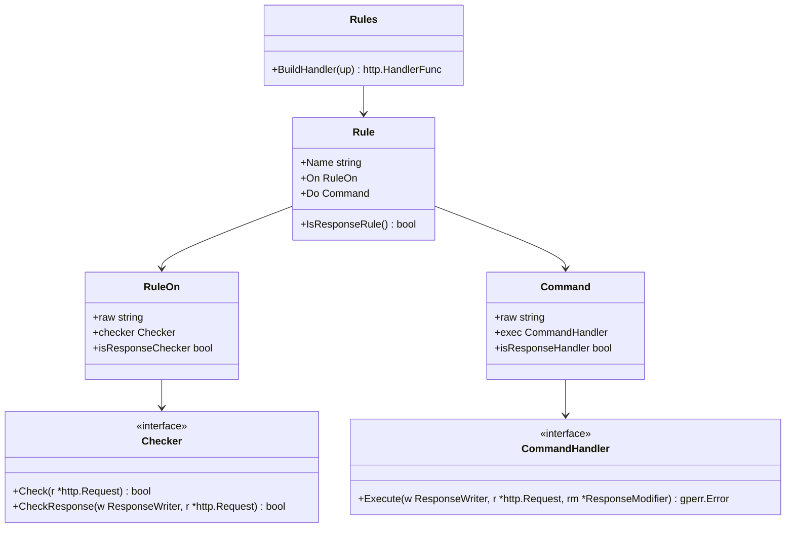
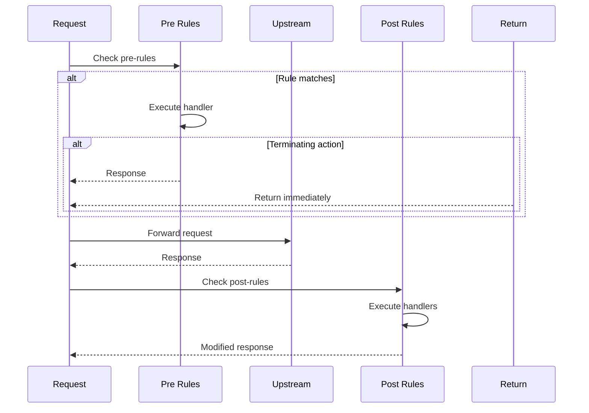

## Overview

The `internal/route/rules` package provides a powerful rule engine for GoDoxy. Rules allow conditional processing of HTTP requests and responses based on various matchers (headers, path, method, IP, etc.). Matching rules can modify requests, route to different backends, or terminate processing.

### Primary Consumers

- **Route layer**: Applies rules during request processing
- **Configuration system**: Parses rule YAML
- **Middleware integration**: Extends rule capabilities

### Non-goals

- Does not implement proxy transport (delegates to reverse proxy)
- Does not handle TLS/SSL (handled at entrypoint)
- Does not perform health checking

### Stability

Internal package with stable YAML schema. Backward-compatible additions to rule types are allowed.

## Public API

### Exported Types

```go
type Rules []Rule

type Rule struct {
    Name string  // Rule identifier for debugging
    On   RuleOn // Condition matcher
    Do   Command // Action to execute
}

type RuleOn struct {
    raw               string
    checker           Checker
    isResponseChecker bool
}

type Command struct {
    raw               string
    exec              CommandHandler
    isResponseHandler bool
}
```

### Exported Functions

```go
// BuildHandler converts rules to an HTTP handler
func (rules Rules) BuildHandler(up http.HandlerFunc) http.HandlerFunc

// ParseRules parses rule configuration
func ParseRules(config string) (Rules, error)

// ValidateRules validates rule syntax
func ValidateRules(config string) error
```

## Architecture

### Core Components



### Request Processing Flow



### Condition Matchers

| Matcher       | Type     | Description                  |
| ------------- | -------- | ---------------------------- |
| `header`      | Request  | Match request header value   |
| `query`       | Request  | Match query parameter        |
| `cookie`      | Request  | Match cookie value           |
| `form`        | Request  | Match form field             |
| `method`      | Request  | Match HTTP method            |
| `host`        | Request  | Match virtual host           |
| `path`        | Request  | Match request path           |
| `proto`       | Request  | Match protocol (http/https)  |
| `remote`      | Request  | Match remote IP/CIDR         |
| `basic_auth`  | Request  | Match basic auth credentials |
| `route`       | Request  | Match route name             |
| `resp_header` | Response | Match response header        |
| `status`      | Response | Match status code range      |

### Matcher Types

```sh
# String: exact match (default)
# Glob: shell-style wildcards (*, ?)
# Regex: regular expressions

path /api/users                // exact match
path glob("/api/*")            // glob pattern
path regex("/api/v[0-9]+/.*")  // regex pattern
```

### Actions

**Terminating Actions** (stop processing):

| Command                  | Description            |
| ------------------------ | ---------------------- |
| `error <code> <message>` | Return HTTP error      |
| `redirect <url>`         | Redirect to URL        |
| `serve <path>`           | Serve local files      |
| `route <name>`           | Route to another route |
| `proxy <url>`            | Proxy to upstream      |

**Non-Terminating Actions** (modify and continue):

| Command                        | Description            |
| ------------------------------ | ---------------------- |
| `pass` / `bypass`              | Pass through unchanged |
| `rewrite <from> <to>`          | Rewrite request path   |
| `require_auth`                 | Require authentication |
| `require_basic_auth <realm>`   | Basic auth challenge   |
| `set <target> <field> <value>` | Set header/variable    |
| `add <target> <field> <value>` | Add header/variable    |
| `remove <target> <field>`      | Remove header/variable |

**Response Actions**:

| Command                                    | Description       |
| ------------------------------------------ | ----------------- |
| `log <level> <path> <template>`            | Log response      |
| `notify <level> <provider> <title> <body>` | Send notification |

## Configuration Surface

### Rule Configuration (YAML)

```yaml
rules:
  - name: rule name
    on: |
      condition1
      & condition2
    do: |
      action1
      action2
```

### Condition Syntax

```yaml
# Simple condition
on: path /api/users

# Multiple conditions (AND)
on: |
  header Authorization Bearer
  & path /api/admin/*

# Negation
on: !path /public/*

# OR within a line
on: method GET | method POST
```

### Variable Substitution

```go
// Static variables
$req_method      // Request method
$req_host        // Request host
$req_path        // Request path
$status_code     // Response status
$remote_host     // Client IP

// Dynamic variables
$header(Name)           // Request header
$header(Name, index)    // Header at index
$arg(Name)              // Query argument
$form(Name)             // Form field

// Environment variables
${ENV_VAR}
```

## Dependency and Integration Map

| Dependency                   | Purpose                  |
| ---------------------------- | ------------------------ |
| `internal/route`             | Route type definitions   |
| `internal/auth`              | Authentication handlers  |
| `internal/acl`               | IP-based access control  |
| `internal/notif`             | Notification integration |
| `internal/logging/accesslog` | Response logging         |
| `pkg/gperr`                  | Error handling           |
| `golang.org/x/net/http2`     | HTTP/2 support           |

## Observability

### Logs

- **DEBUG**: Rule matching details, variable substitution
- **INFO**: Rule execution, terminating actions
- **ERROR**: Rule parse errors, execution failures

Log context includes: `rule`, `alias`, `match_result`

## Security Considerations

- `require_auth` enforces authentication
- `remote` matcher supports IP/CIDR for access control
- Variables are sanitized to prevent injection
- Path rewrites are validated to prevent traversal

## Failure Modes and Recovery

| Failure             | Behavior                  | Recovery                           |
| ------------------- | ------------------------- | ---------------------------------- |
| Invalid rule syntax | Route validation fails    | Fix YAML syntax                    |
| Missing variables   | Variable renders as empty | Check variable sources             |
| Rule timeout        | Request times out         | Increase timeout or simplify rules |
| Auth failure        | Returns 401/403           | Fix credentials                    |

## Usage Examples

### Basic Pass-Through

```yaml
- name: default
  do: pass
```

### Path-Based Routing

```yaml
- name: api proxy
  on: path /api/*
  do: proxy http://api-backend:8080

- name: static files
  on: path /static/*
  do: serve /var/www/static
```

### Authentication

```yaml
- name: admin protection
  on: path /admin/*
  do: require_auth

- name: basic auth for API
  on: path /api/*
  do: require_basic_auth "API Access"
```

### Path Rewriting

```yaml
- name: rewrite API v1
  on: path /v1/*
  do: |
    rewrite /v1 /api/v1
    proxy http://backend:8080
```

### IP-Based Access Control

```yaml
- name: allow internal
  on: remote 10.0.0.0/8
  do: pass

- name: block external
  on: |
    !remote 10.0.0.0/8
    !remote 192.168.0.0/16
  do: error 403 "Access Denied"
```

### WebSocket Support

```yaml
- name: websocket upgrade
  on: |
    header Connection Upgrade
    header Upgrade websocket
  do: bypass
```

## Testing Notes

- Unit tests for all matchers and actions
- Integration tests with real HTTP requests
- Parser tests for YAML syntax
- Variable substitution tests
- Performance benchmarks for hot paths
