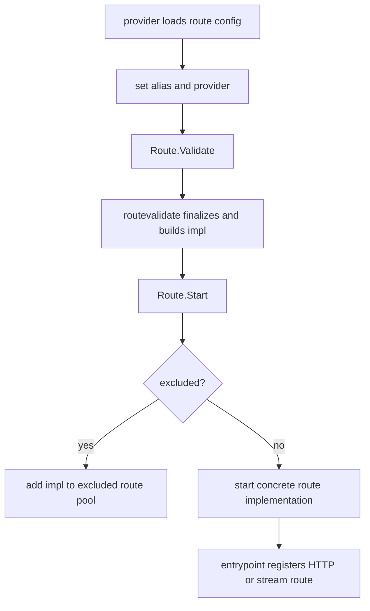

## Overview

`internal/route` owns the `Route` object that providers load from YAML, Docker
labels, agents, or built-in config. It stores user-facing route configuration,
derived URLs, provider metadata, task state, validation/start errors, and the
concrete implementation produced by `internal/routevalidate`.

Concrete request handling is intentionally outside this package:

- `internal/routevalidate` finalizes and validates `Route`, then builds an implementation.
- `internal/routeimpl` contains reverse proxy, file server, and stream route implementations.
- `internal/routing` defines the route/provider/entrypoint interfaces used across packages.
- `internal/entrypoint` owns HTTP and stream listener registration.

## Responsibilities

- Define route config fields and JSON/OpenAPI shape.
- Track provider, Docker/proxmox, homepage, health, and runtime metadata.
- Expose context-aware validation and lifecycle methods (`ValidateContext`,
  `Start`, `Finish`) used by providers.
- Delegate implementation construction through the package builder hook.
- Register excluded routes and route health monitors during start.
- Provide shared route helpers such as `ShouldExclude`, `UseHealthCheck`, `Key`, and `References`.

## Non-Goals

- No concrete HTTP reverse proxy, file-server, TCP, or UDP serving logic.
- No route discovery from files, Docker, or agents.
- No entrypoint listener or request dispatch logic.
- No health-check execution logic.
- No rule parsing or rule command implementation.

## Runtime Wiring

`Route.ValidateContext` calls a package-level builder registered by the
application:

```go
route.InitBuilder(routevalidate.Validate)
```

Production initialization happens in `cmd/main.go`. Tests that validate or start
routes directly must also install a builder in `TestMain` or test setup.

Excluded routes can still start enough runtime state to appear in the excluded
route pool and expose health, but non-excluded routes delegate startup to their
concrete `routing.Route` implementation.

## Key Types

```go
type Route struct {
    Alias  string
    Scheme Scheme
    Host   string
    Port   Port
    Bind   string

    Root  string
    SPA   bool
    Index string

    types.HTTPConfig
    HealthCheck health.HealthCheckConfig
    LoadBalance *loadbalancer.Config
    Idlewatcher *idlewatcher.IdlewatcherConfig
    Rules       rules.Rules
    RuleFile    string

    Metadata
}
```

`Metadata` contains runtime-only fields such as `Container`, derived `LisURL`
and `ProxyURL`, exclusion reason, health monitor, provider reference, task, and
the built `routing.Route` implementation.

`Scheme` is an internal bitset type that marshals to the route config strings:
`http`, `https`, `h2c`, `tcp`, `udp`, and `fileserver`.

`Port` stores the externally listening port and the upstream proxy port:

```go
type Port struct {
    Listening int `json:"listening"`
    Proxy     int `json:"proxy"`
}
```

## Lifecycle



`ValidateContext` is guarded by `sync.Once`; callers should treat route config as
fixed after validation. The context selects candidate-owned defaults, agents,
Proxmox nodes, and other runtime dependencies. The no-argument `Validate` is for
standalone callers and uses the process root context.

`Start` is also guarded by `sync.Once`; errors are retained for later reads. The
outer lifecycle enforces component-local cleanup: if any concrete start path
fails after creating a route task or registering cancellation callbacks, it
finishes and waits for that task exactly once. This removes failed listeners,
health monitors, pool entries, and container registrations while leaving
successful sibling routes owned by the provider active.

## Exclusion

Routes are excluded when validation fails, Docker labels request exclusion,
container port resolution fails, an image is blacklisted, a temporary buildx or
rename container is detected, or a YAML anchor route leaks into validation.

Excluded routes keep enough metadata for API/UI reporting but do not register as
normal HTTP or stream routes.

## Dependency Map

| Dependency | Purpose |
| --- | --- |
| `internal/routing` | Shared route/provider/entrypoint interfaces |
| `internal/routevalidate` | Validation/finalization implementation registered by builder |
| `internal/docker` | Docker container metadata attached to routes |
| `internal/health` | Health config, monitor interfaces, status values |
| `internal/loadbalancer` | Serializable load-balancer route config |
| `internal/idlewatcher/runtime` | Idlewatcher config attached to routes |
| `internal/route/rules` | Route-local request/response rule config |
| `goutils/task` | Route task lifetime and cleanup |

## Testing Notes

- Route validation tests must initialize the builder.
- Tests should assert behavior through `routing.Route` interfaces where possible.
- Test helpers live outside this package in `internal/routetest` when they need
  concrete implementations.
