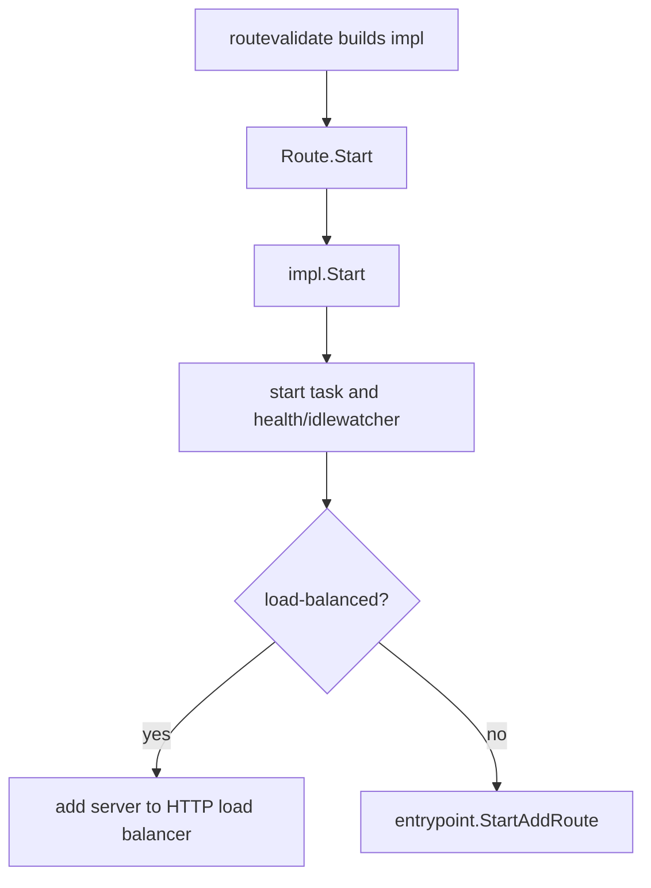

## Overview

`internal/routeimpl` turns validated `route.Route` values into runnable routes.
Each implementation embeds the base route config and satisfies one of the
interfaces in `internal/routing`.

## Implementations

- `ReverseProxyRoute`: HTTP/HTTPS/H2C reverse proxy routes, agent-proxied routes,
  access logging, route rules, idlewatcher integration, and HTTP load-balancer registration.
- `FileServer`: static and SPA file serving from an absolute path or internal `fs.FS`.
- `StreamRoute`: TCP/UDP stream proxy routes, including idlewatcher and health monitor integration.

## Responsibilities

- Create concrete handlers or stream objects from validated route config.
- Start per-route tasks and health monitors.
- Register non-excluded routes with the active entrypoint.
- Wire access logging, route rules, middleware patches, and idlewatcher wrappers.
- Register load-balanced HTTP routes with `internal/net/gphttp/loadbalancer`.

## Non-Goals

- No config finalization or validation. Use `internal/routevalidate`.
- No route discovery from providers.
- No entrypoint HTTP server implementation.
- No low-level health-check implementations.

## Startup Flow

## Notes

- Built-in embedded file routes set `route.Metadata.RootFS`; user-configured file
  routes use absolute filesystem paths.
- Load-balanced HTTP routes create a synthetic HTTP route for the load-balancer link.
- Stream routes initialize the concrete stream before entrypoint registration.
