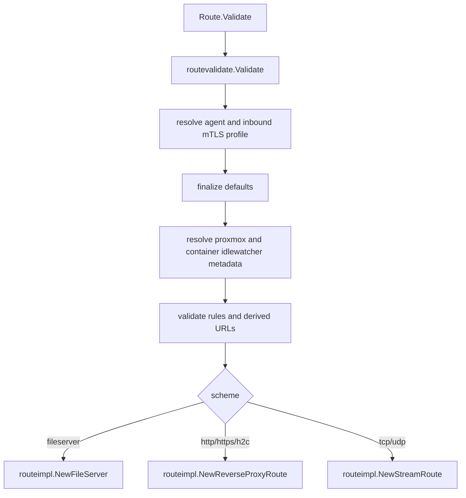

## Overview

`internal/routevalidate` is the builder installed into `internal/route`. It
normalizes route config, fills defaults, validates route-specific invariants,
resolves optional proxmox/agent/idlewatcher metadata, and constructs the concrete
route implementation from `internal/routeimpl`.

## Responsibilities

- Normalize alias/host fields and choose default host, scheme, and ports.
- Resolve Docker image/alias port shortcuts.
- Apply default health-check config from working config state.
- Finalize homepage display config.
- Load route rules from `rule_file`.
- Validate inbound mTLS, reserved Godoxy ports, relay PROXY protocol, TLS termination, health/load-balancer/idlewatcher combinations, and URL construction.
- Resolve proxmox node/resource metadata where configured.
- Build `routeimpl.NewFileServer`, `routeimpl.NewReverseProxyRoute`, or `routeimpl.NewStreamRoute`.

## Non-Goals

- No provider loading.
- No route start/stop task ownership.
- No HTTP request or stream serving.
- No health-check execution.

## Public Entry Point

```go
func Validate(r *route.Route) (impl routing.Route, agent *agentpool.Agent, err error)
```

`cmd/main.go` installs this as the route builder:

```go
route.InitBuilder(routevalidate.Validate)
```

## Validation Flow



## Files

- `finalize.go`: defaults, homepage config, Docker port resolvability.
- `port_selection.go`: image/alias port maps and preferred Docker port selection.
- `rules.go`: `rule_file` loading and rule preset resolution.
- `proxmox.go`: proxmox node/resource route normalization.
- `validate.go`: top-level validation and implementation construction.
