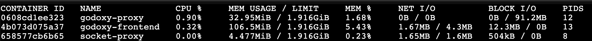
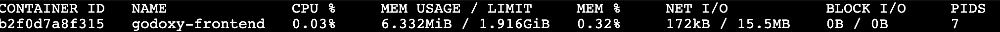

# Benchmark and Resource Usage

## TL;DR

- GoDoxy performs comparably to Traefik, with similar throughput
- Benchmarked on basic route `whoami.domain.com` -> `whoami:80` without access logging and any other middleware
- Real world performance may vary depending on the use case and configuration

## Benchmark

Source code:

- [dev.compose.yml](https://github.com/yusing/godoxy/blob/main/dev.compose.yml)
- [scripts/benchmark.sh](https://github.com/yusing/godoxy/blob/main/scripts/benchmark.sh)

Run the benchmark with:

`make benchmark` or `make TARGET={godoxy|traefik|nginx|caddy} benchmark`

Results (Last updated: `2026-01-03 01:39 +0800`):

| Proxy   | HTTP/1.1 Req/sec | HTTP/2 Req/sec | HTTP/1.1 Latency (avg) | HTTP/2 Latency (avg) | Transfer/sec (HTTP/1.1) |
| ------- | ---------------- | -------------- | ---------------------- | -------------------- | ----------------------- |
| Nginx   | 122,797.73       | 88,854.90      | 1.01ms                 | 1.06ms               | 17.33MB                 |
| Traefik | 87,066.96        | 65,411.50      | 1.35ms                 | 1.48ms               | 8.47MB                  |
| GoDoxy  | 89,100.32        | 68,179.20      | 1.38ms                 | 1.40ms               | 8.67MB                  |
| Caddy   | 14,048.61        | 1,518.10       | 79.92ms                | 65.06ms              | 1.58MB                  |

- **Nginx** leads with the highest throughput on both HTTP/1.1 (~123k req/s) and HTTP/2 (~89k req/s)
- **GoDoxy** performs comparably to Traefik, with similar throughput (~89k req/s HTTP/1.1, ~68k req/s HTTP/2) and good latency
- **Traefik** is slightly behind GoDoxy but still maintains solid performance
- **Caddy** significantly underperforms, likely a bug (also had errors in HTTP/2 test: 262 failed requests)

## Resource Usage

> [!NOTE]
>
> For memory constrained environments, you can use the frontend with `latest-lite` tag.
> See [Lite Image](/Home#lite-image) for more details.

With Lite Image:

