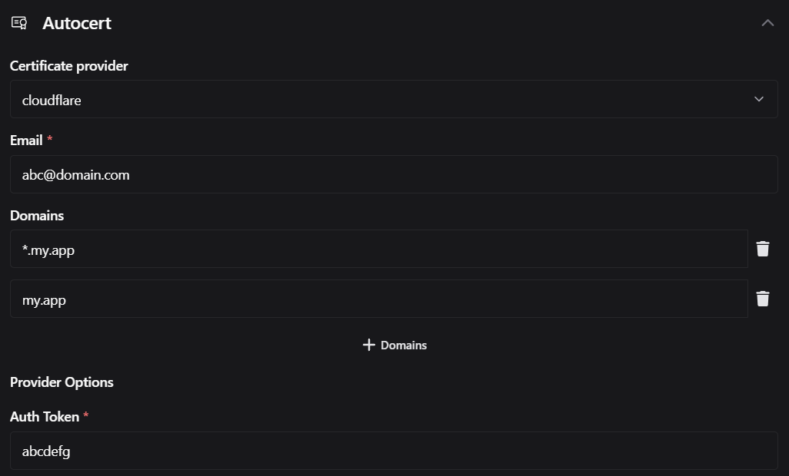

# Certificates and domain matching

## Certificates

- GoDoxy **DOES NOT** register certificate for **each route**. Instead, it registers for all `autocert.domains` in your `config.yml` then combine into one certificate. All HTTP(s) requests to **GoDoxy** will be handled by the same certificate.

- GoDoxy uses <https://github.com/go-acme/lego>, similar to other reverse proxies powered by [Golang](https://golang.org). Powered by [ACME](<https://en.wikipedia.org/wiki/ACME_(protocol)>) and [Let's Encrypt](https://letsencrypt.org) via [DNS-01](https://en.wikipedia.org/wiki/DNS-01) challenge.

- GoDoxy obtain / renew certificates automatically, with 1 hour cooldown for every failed requests. It only renew when these conditions are met:

  - `autocert` is enabled but no certs are found under `certs/`
  - `autocert.domains` does not match current certs
  - Certificates are about to expire in a month

- You can either also use existing (self-signed) certificate.

### Using Existing SSL Certificate

```yaml
autocert:
  provider: local
  # path relative to /app
  cert_path: certs/cert.crt
  key_path: certs/priv.key
```

### Auto SSL with Cloudflare

```yaml
autocert:
  provider: cloudflare
  email: your-email@example.com
  domains:
    - "*.yourdomain.com"
  options:
    auth_token: your-zone-api-token
```



### Auto SSL with Custom Internal CA

You may use internal CA like [step-ca](https://github.com/smallstep/certificates) for issuing certificates.

Use `step-ca` as an example:

```bash
export ACME_URL=https://acme.internal
# get root certs and save to `certs/roots.pem`
# assume that `certs/` is mounted to `/app/certs` (by default)
curl -k https://${ACME_URL}/roots.pem > certs/roots.pem
```

```yaml
autocert:
  provider: custom
  email: your-email@example.com
  domains:
    - "*.yourdomain.com"
  ca_dir_url: https://acme.internal/acme/acme/directory
  ca_certs:
    - certs/roots.pem
```

#### EAB

If you are using EAB (External Account Binding), you can set `eab_kid` and `eab_hmac` in `autocert.options`. It can also be used with custom ACME CA.

```yaml
autocert:
  provider: custom
  email: your-email@example.com
  domains:
    - "*.yourdomain.com"
  eab_kid: your-eab-kid
  eab_hmac: base64-encoded-hmac
```

### Auto SSL with other DNS providers

Check [DNS-01 Providers](DNS-01-Providers.md)

### Troubleshooting

If you encounter issues, try these steps:

- Set `LEGO_DISABLE_CNAME_SUPPORT=1` if your domain has a CNAME record.
- Use a different DNS server.

  ```yaml
  services:
    app:
      container_name: godoxy
      ...
      environment:
        - LEGO_DISABLE_CNAME_SUPPORT=1
      dns:
        - 1.1.1.1
        - 1.1.1.2
  ```

## Domain matching

An alias can either be short alias or FQDN (Fully Qualified Domain Name) alias.

### Docker

Uses container name as short alias by default, unless `proxy.aliases` is specified.

### General

#### Without `match_domains`

When no `match_domains` is set in `config.yml`, a route with short alias `app` can be accessed at:

- `app.anydomain.com`
- `app.*.anydomain.com`
- ...

A route with FQDN alias `app.example.com` can be accessed at:

- `app.example.com`
- `app.*.example.com`

#### Using `match_domains`

This feature is useful when you want to limit routes to certain domains.

With `match_domains` set under `config.yml` like this:

```yaml
match_domains:
  - example.com
  - example.org
```

A route with short alias `app` can only be accessed at:

- `app.example.com`
- `app.example.org`

A route with FQDN alias `app.example.com` can be accessed at:

- `app.example.com`
- `app.*.example.com`
- `app.*.example.org`

#### Use case example for `match_domains`

Given your main domain is `my.app`

- Add `my.app` to `autocert.domains` and `match_domains` in `config.yml`

  ```yaml
  autocert:
    domains:
      - my.app
  match_domains:
    - my.app
  ```

- Use short aliases like `adguard` and `sonarr` when you want them to be accessible at your main domain

  ```yaml
  services:
    adguard: # adguard.my.app
      ...
      labels:
        proxy.aliases: adguard
    sonarr: # sonarr.my.app
      ...
      labels:
        proxy.aliases: sonarr
  ```

- Use FQDN aliases like `adguard.other.app` and `sonarr.other.app` when you want them to be accessible at other domains

  ```yaml
  # docker compose
  services:
    adguard:
      ...
      labels:
        proxy.aliases: adguard.other.app
    sonarr:
      ...
      labels:
        proxy.aliases: sonarr.other.app

  # config.yml
  autocert:
    domains:
      - my.app
  ```
