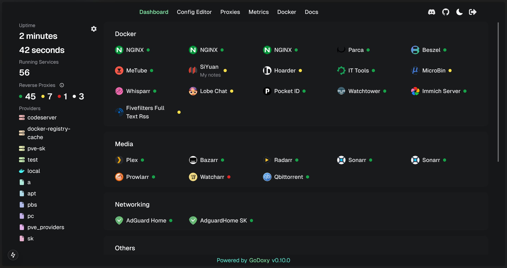
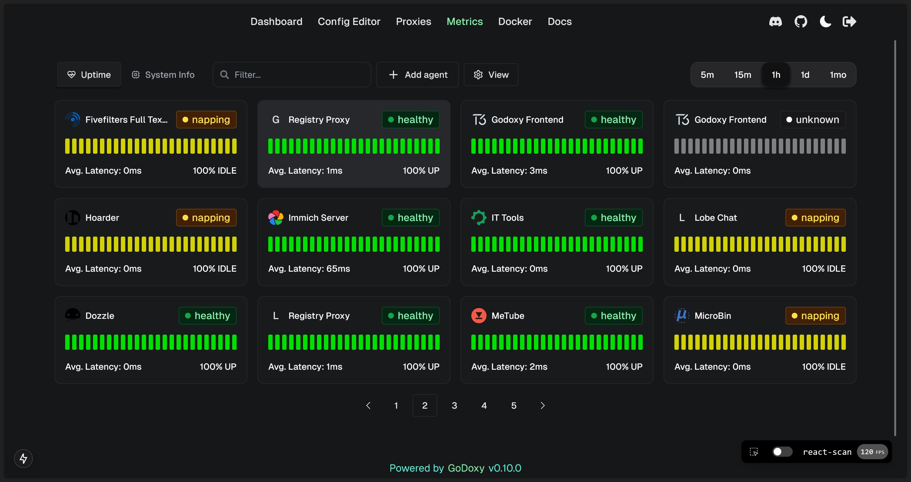
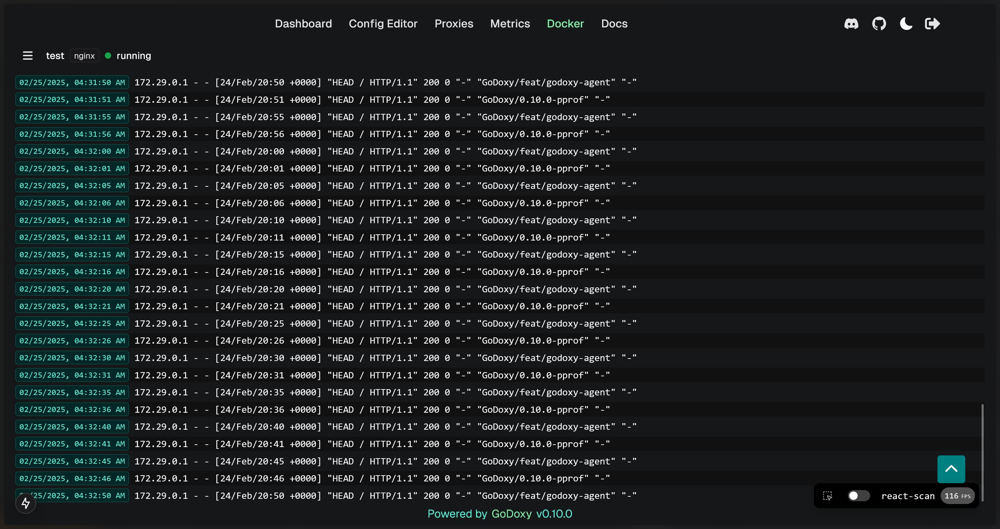
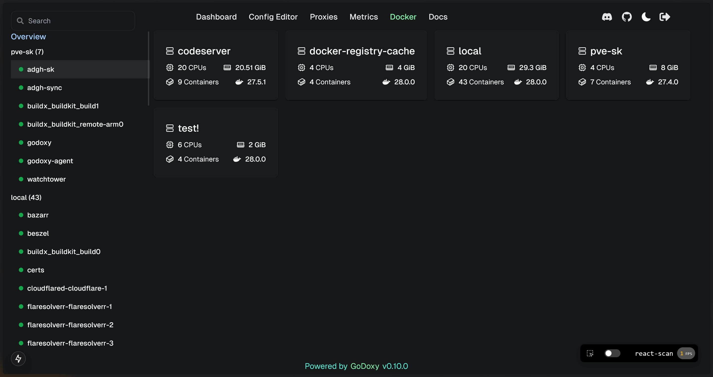
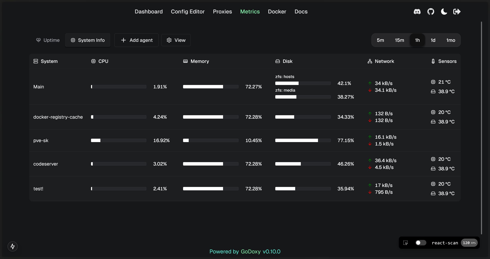
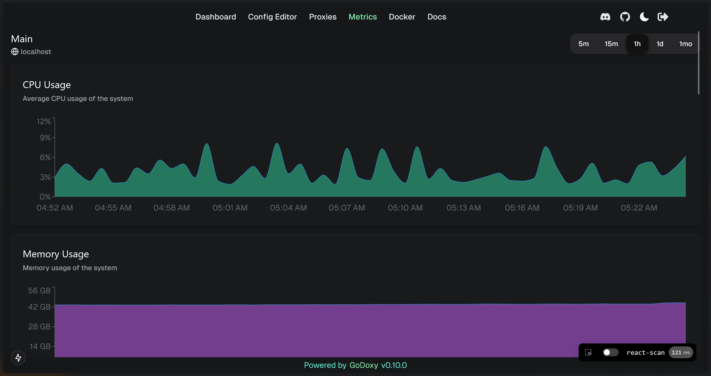

# Gallery

## App Dashboard

## Metrics and System Info

<!-- 

  <table>
    <tr>
      <td align="center"></td>
      <td align="center"></td>
      <td align="center"></td>
    </tr>
    <tr>
      <td align="center"><b>Uptime Monitor</b></td>
      <td align="center"><b>Docker Logs</b></td>
      <td align="center"><b>Server Overview</b></td>
    </tr>
    <tr>
      <td align="center"></td>
      <td align="center"></td>
    </tr>
    <tr>
      <td align="center"><b>System Monitor</b></td>
      <td align="center"><b>Graphs</b></td>
    </tr>
  </table>

 -->

### Uptime Monitor

### Docker Logs

### Server Overview

### System Monitor

### Graphs

