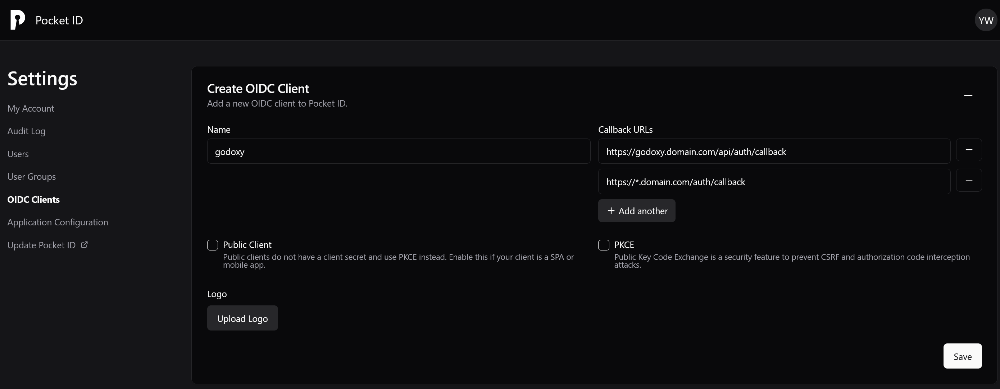
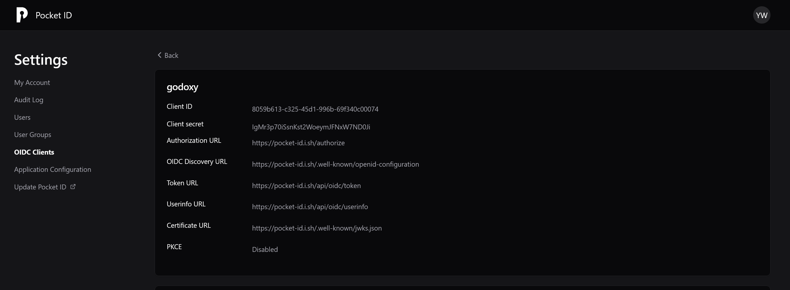

# Basic Setup

> [!NOTE]
>
> The wiki on `https://docs.godoxy.dev` reflects the latest changes in the repository.
>
> Open the wiki on your WebUI instance to read docs of the version you're running.

## Docker Image

| Tag            | Description                             |
| -------------- | --------------------------------------- |
| `latest`       | Stable release                          |
| `latest-lite`  | Stable release (lite, WebUI only)       |
| `nightly`      | Experimental release                    |
| `nightly-lite` | Experimental release (lite, WebUI only) |
| `vx.y.z`       | Stable release                          |

- Proxy `ghcr.io/yusing/godoxy:<tag>`
- Frontend `ghcr.io/yusing/godoxy-frontend:<tag>`

**Current version**


### Lite Image

Lite image is a smaller image that runs a static build of WebUI with nginx.

| Pros                | Cons                              |
| ------------------- | --------------------------------- |
| Smaller image size  | Slower compared to the full image |
| Uses less resources |                                   |

## Secure your containers

> [!NOTE]
> GoDoxy will work without mapping ports to the host.

Remove `ports` section in your `docker-compose.yml` file.

Doing this will make your host has only **one** exposed service, which is GoDoxy.

## Environment variables

### Core

> [!NOTE]
> Also works with old prefix `GOPROXY_` or without prefix like `API_USER`

| Environment Variable   | Description                                 | Default          | Values        |
| ---------------------- | ------------------------------------------- | ---------------- | ------------- |
| `GODOXY_HTTP_ADDR`     | HTTP server listening address               | `:80`            | `[host]:port` |
| `GODOXY_HTTPS_ADDR`    | HTTPS server listening address (if enabled) | `:443`           | `[host]:port` |
| `GODOXY_API_ADDR`      | API server listening address                | `127.0.0.1:8888` | `[host]:port` |
| `GODOXY_HTTP3_ENABLED` | Enable HTTP/3                               | `true`           | boolean       |
| `GODOXY_DEBUG`         | Enable debug behaviors and logging          | `false`          | boolean       |

### Authentication

#### Common

| Environment Variable       | Description                      | Default                                                           | Values                                            |
| -------------------------- | -------------------------------- | ----------------------------------------------------------------- | ------------------------------------------------- |
| `GODOXY_API_JWT_SECURE`    | Secure flag for JWT cookie       | `true`                                                            | boolean                                           |
| `GODOXY_API_JWT_SECRET`    | Base64 JWT secret for api server | random **(you will have to login again after restarting GoDoxy)** | string                                            |
| `GODOXY_API_JWT_TOKEN_TTL` | JWT Time-to-live                 | `24h`                                                             | [duration](https://pkg.go.dev/time#ParseDuration) |

> [!DANGER]
>
> If you desire to use WebUI without HTTPS, set `GODOXY_API_JWT_SECURE` to `false`
>
> **Not recommended**

#### User Password Auth

| Environment Variable  | Description          | Default    | Values |
| --------------------- | -------------------- | ---------- | ------ |
| `GODOXY_API_USER`     | WebUI login username | `admin`    | string |
| `GODOXY_API_PASSWORD` | WebUI login password | `password` | string |

#### OIDC

| Environment Variable            | Description                                                | Default                       |
| ------------------------------- | ---------------------------------------------------------- | ----------------------------- |
| `GODOXY_OIDC_ISSUER_URL`        | OIDC issuer URL                                            | empty                         |
| `GODOXY_OIDC_CLIENT_ID`         | OIDC client ID                                             | empty                         |
| `GODOXY_OIDC_CLIENT_SECRET`     | OIDC client secret                                         | empty                         |
| `GODOXY_OIDC_ALLOWED_USERS`     | OIDC allowed users (optional when `ALLOWED_GROUPS` is set) | empty                         |
| `GODOXY_OIDC_ALLOWED_GROUPS`    | OIDC allowed groups (optional when `ALLOWED_USERS` is set) | empty                         |
| `GODOXY_OIDC_SCOPES`            | OIDC scopes                                                | `openid,profile,email,groups` |
| `GODOXY_OIDC_RATE_LIMIT`        | OIDC rate limit                                            | `10`                          |
| `GODOXY_OIDC_RATE_LIMIT_PERIOD` | OIDC rate limit period                                     | `1s`                          |

##### Scopes

| Scope            | Description                            | Optional? |
| ---------------- | -------------------------------------- | --------- |
| `openid`         | OpenID Connect scope                   | No        |
| `profile`        | User profile scope                     | No        |
| `email`          | User email scope                       | Yes       |
| `groups`         | User groups scope                      | Yes       |
| `offline_access` | Offline access scope for refresh token | Yes       |

> [!NOTE]
>
> You will have to add this "Allowed Callback URL" in your OIDC provider
>
> `https://*.yourdomain.com/auth/callback` (wildcard) or `https:\/\/([^\.]+)\.yourdomain\.com\/auth\/callback` (regex)

###### Authentik specific

- Set Signing Key to "authentik Self-signed Certificate"
- Set Encryption Key to None
- Set Issuer mode to "Each provider has a different issuer, based on the application slug" if not already
- Add scope `authentik default OAuth Mapping: OpenID 'offline_access'`

##### Example





Add these to `.env`:

- `GODOXY_OIDC_ISSUER_URL` IdP's base URL
  - `https://id.domain.com` (Pocket ID)
  - `https://auth.domain.com/application/o/<slug>/` (Authentik)
- `GODOXY_OIDC_CLIENT_ID` Client ID
- `GODOXY_OIDC_CLIENT_SECRET` Client secret
- `GODOXY_OIDC_ALLOWED_USERS` Comma separated list of allowed users
- `GODOXY_OIDC_ALLOWED_GROUPS` Comma separated list of allowed groups

> [!NOTE]
>
> To enable OIDC for specific app, it's just two lines in docker compose:
>
> ```yaml
> services:
>   your_app:
>     ...
>     labels:
>       proxy.#1.middlewares.oidc:
> ```
>
> Checkout [OIDC Middleware](Middlewares#OIDC) for customizing OIDC per app.

### Metrics

| Environment Variable             | Description                        | Default | Values  |
| -------------------------------- | ---------------------------------- | ------- | ------- |
| `GODOXY_METRICS_DISABLE_CPU`     | Disable cpu usage collection       | `false` | boolean |
| `GODOXY_METRICS_DISABLE_MEMORY`  | Disable memory usage collection    | `false` | boolean |
| `GODOXY_METRICS_DISABLE_DISK`    | Disable disk usage, I/O collection | `false` | boolean |
| `GODOXY_METRICS_DISABLE_NETWORK` | Disable network I/O collection     | `false` | boolean |
| `GODOXY_METRICS_DISABLE_SENSORS` | Disable sensors info collection    | `false` | boolean |

## Behaviors

**Default URL: `<container_name>.yourdomain.com`**

> [!NOTE]
>
> All containers are proxied by default, except any of the following is true:
>
> - label `proxy.exclude` is set to **true**
> - GoDoxy **IS NOT** explicit enabled for container, but it is either
>   - from a provider in **explicit only mode** (provider name with exclamation mark **`!`** suffix)
>   - **or** detected as a backend service (e.g. headless browsers, databases, etc.)
> - container doesn't have any exposed port
> - container name has prefix `buildx_`
> - `alias` with prefix `x-` or suffix `-old`

To explicitly enable **GoDoxy** for a container:

- **GoDoxy < v0.9** - set label `proxy.aliases`
- **GoDoxy >= v0.9** - set any label starting with `proxy.`

## Use JSON Schema in IDEs

**If you are unsure about what it is, ignore this**

Using JSON schema allows static checking in IDEs. For VSCode, copy [`.vscode/settings.example.json`](https://github.com/yusing/go-proxy/blob/main/.vscode/settings.example.json) to `.vscode/settings.json` (under root directory of GoDoxy) and modify it to fit your needs
