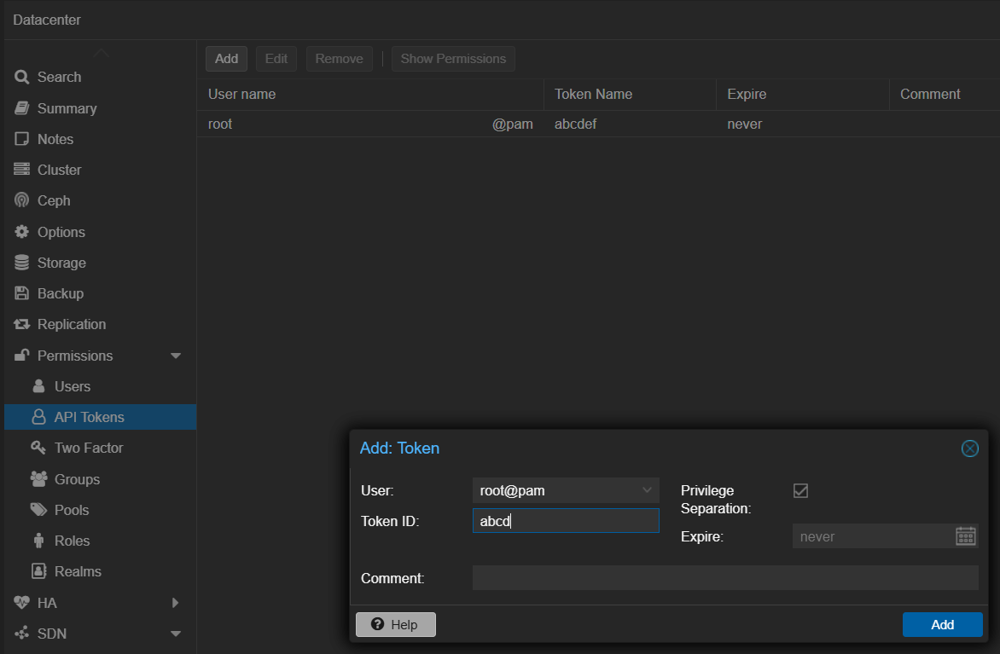

# Idle-sleep

## TL;DR

Services consume resources even when they are idle. This can lead to unexpected costs, performance issues and eating up system memory.

For services you don't use frequently, you can set `idle_timeout` to put them to sleep when they are idle.

## How?

GoDoxy helps save resources by automatically putting your containers to sleep when they haven't been used for a while (no traffic). As soon as new traffic arrives, GoDoxy wakes the container back up.

### Dependencies

If your container relies on other services (defined in your using `depends_on` in docker compose file or `proxy.depends_on` label), GoDoxy is smart about managing them too:

- Going to sleep: When the main container becomes idle, GoDoxy will first stop the main container and then stop its dependent services.
- Waking up: When traffic comes in for the main container, GoDoxy will first start the dependent services and then start the main container.

This ensures that your entire application stack is only running when it needs to be.

> [!WARNING]
>
> Do not set `idle_timeout` on dependencies.

### Condition

You can specify `condition` to control when to wake up the dependent services, it is optional and can be one of:

- `service_started` _(default)_
- `service_healthy`

It also respects to `condition` in `depends_on` field from docker compose file, see [Docker compose docs](https://docs.docker.com/compose/how-tos/startup-order/) for more details, e.g.

```yaml
# without conditions (implies `service_started`)
depends_on:
  - redis
  - postgres

# with conditions
depends_on:
  redis:
    condition: service_healthy
  postgres:
    condition: service_started
```

Specifying with labels is also supported, e.g.

```yaml
labels:
  proxy.depends_on: |
    - redis:service_healthy
    - postgres:service_started
```

### Full idle-sleep example snippet

```yaml
services:
  app:
    image: example/app
    labels:
      proxy.idle_timeout: 1h30s
    depends_on:
      redis:
        condition: service_healthy
      postgres:
        condition: service_started
```

## Configuration

| Label            | Description                                                   | Example  | Default                                     | Accepted values                                                           |
| ---------------- | ------------------------------------------------------------- | -------- | ------------------------------------------- | ------------------------------------------------------------------------- |
| `idle_timeout`   | inactivity timeout before put it into sleep<br/>**❌TCP/UDP** | `1h30s`  | empty **(disabled)**                        | `number[unit]...`                                                         |
| `wake_timeout`   | time to wait for target site to be ready                      |          | `30s`                                       | `number[unit]...`                                                         |
| `stop_method`    | method to stop after `idle_timeout`                           |          | `stop`                                      | `stop`, `pause`, `kill`                                                   |
| `stop_timeout`   | time to wait for stop command                                 |          | `10s`                                       | `number[unit]...`                                                         |
| `stop_signal`    | signal sent to container for `stop` and `kill` methods        |          | docker's default                            | `SIGINT`, `SIGTERM`, `SIGHUP`, `SIGQUIT` and those without **SIG** prefix |
| `start_endpoint` | allow waking only from specific endpoint                      | `/start` | empty **(allow any)**                       | relative URI                                                              |
| `depends_on`     | container to wait and wake/stop together                      |          | `depends_on` field from docker compose file | `alias or docker compose service[:condition]`                             |

### Docker

To enable idlesleep, add the following label(s) to your container:

```yaml
# compose.yml
services:
  app:
    image: abcd
    ...
    labels:
      proxy.idle_timeout: 1h30s     # required
      proxy.wake_timeout: 30s       # optional
      proxy.stop_method: stop       # optional
      proxy.stop_timeout: 10s       # optional
      proxy.stop_signal: SIGINT     # optional
      proxy.start_endpoint: /start  # optional
    depends_on:
      redis:
        condition: service_healthy
      postgres:
        condition: service_healthy
  redis:
    ...
    healthcheck: # with docker healthcheck
      test: ["CMD", "redis-cli", "ping"]
      interval: 10s
      timeout: 5s
      retries: 5
  postgres: # with GoDoxy healthcheck
    ...
```

### Proxmox LXCs

To setup GoDoxy to manage proxmox LXCs. You need to do the following:

1. Add proxmox credentials to `config.yml`

   ```yaml
   # config.yml
   providers:
     proxmox:
       - url: https://pve.domain.com:8006/api2/json
         token_id: root@pam!abcdef
         secret: aaaa-bbbb-cccc-dddd
         no_tls_verify: true
   ```

2. Create API Token on Proxmox

   

3. Allow required permissions

   

4. Add LXCs to route files

   Node Name:

   

   VMID:

   

   ```yaml
   lxc-test:
     port: 3000
     idlewatcher:
       idle_timeout: 15s
       proxmox:
         node: pve
         vmid: 119
       depends_on:
         - lxc-db
   lxc-db: ...
   ```
