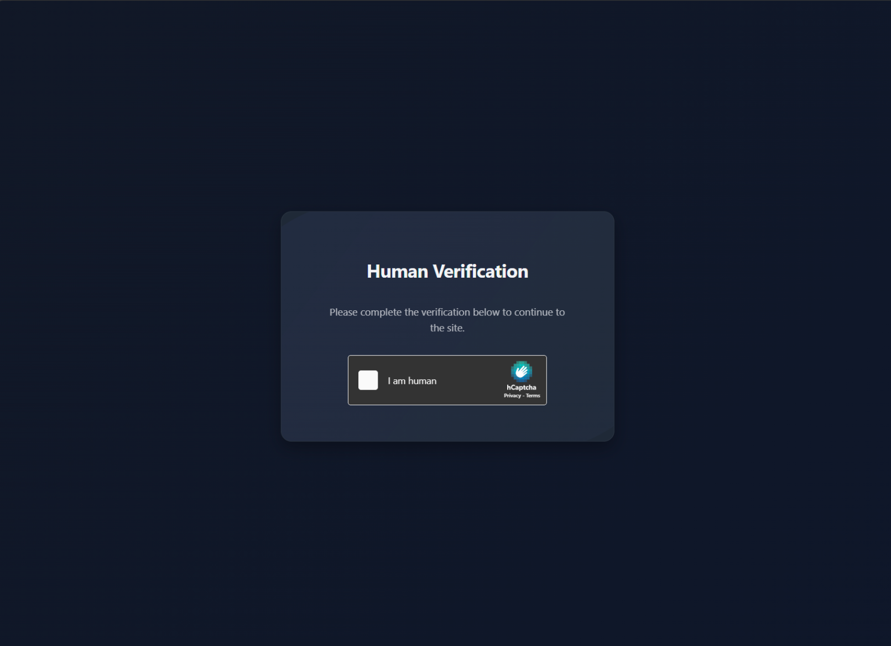
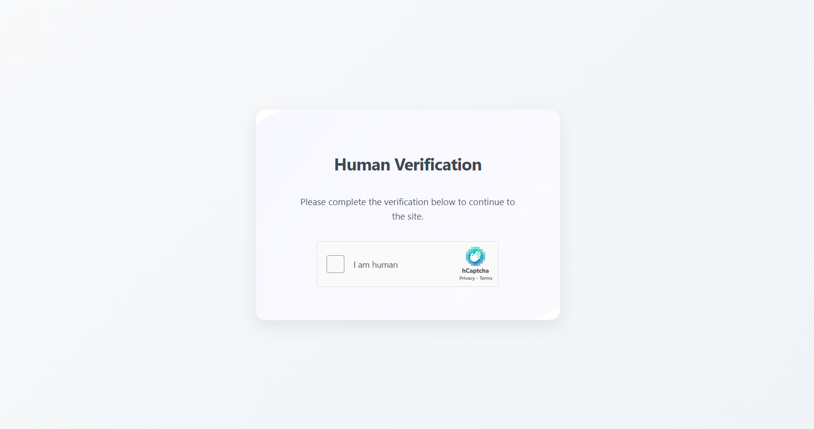

# Middlewares

## Quick Start

| Method                 | Order       | Use Case           | Configuration              |
| ---------------------- | ----------- | ------------------ | -------------------------- |
| **Entrypoint**         | Ordered     | Global middlewares | `config.yml`               |
| **Middleware Compose** | Ordered     | Reusable configs   | `config/middlewares/*.yml` |
| **Docker Labels**      | Unordered\* | Per-route          | Container labels           |
| **Route Files**        | Unordered\* | Per-route          | Route files                |

> Set `priority` for unordered methods when order matters.

### Basic Example

```yaml
# Global middleware (entrypoint)
entrypoint:
  middlewares:
    - use: real_ip
      header: X-Real-IP
      from: [127.0.0.1, 192.168.0.0/16]

# Per-service (Docker labels)
services:
  app:
    labels:
      proxy.myapp.middlewares.redirect_http.priority: 1
      proxy.myapp.middlewares.cidr_whitelist.priority: 2
      proxy.myapp.middlewares.cidr_whitelist.allow: 127.0.0.1, 192.168.0.0/16
```

### Naming Convention

Middleware names and options are **case-insensitive**: `redirectHTTP`, `redirect_http`, `RedirectHttp` are equivalent.

## Applying Middlewares

### Entrypoint & Middleware Compose

```yaml
# Entrypoint (config.yml)
entrypoint:
  middlewares:
    - use: CloudflareRealIP
    - use: CIDRWhitelist
      allow:
        - 127.0.0.1
        - 223.0.0.0/8

# Middleware Compose (config/middlewares/whitelist.yml)
myWhitelist:
  - use: CloudflareRealIP
  - use: CIDRWhitelist
    allow:
      - 127.0.0.1
      - 223.0.0.0/8
```

### Docker Labels

```yaml
# Single line
proxy.#1.middlewares.{name}.{option}: { value }

# YAML block
proxy.#1.middlewares.{name}: |
  {option}: {value}
```

### Route Files

```yaml
myapp:
  middlewares:
    { name }:
      { option }: { value }
```

### Reusing Compositions

```yaml
# Docker labels
proxy.#1.middlewares.myWhitelist@file:

# Route file
myapp:
  middlewares:
    myWhitelist@file:

# Entrypoint
entrypoint:
  middlewares:
    - use: myWhitelist@file
```

### Bypass Rules

```yaml
middleware:
  bypass:
    - route myapp & path glob(/api/*)
    - remote 192.168.0.0/16
    - header User-Agent glob(*bot*)
```

See [Rules syntax](./Rule-Based-Routing.md#syntax) for complete documentation.

## Middleware Reference

### Authentication & Security

| Name           | Purpose                          |
| -------------- | -------------------------------- |
| `oidc`         | OpenID Connect authentication    |
| `hcaptcha`     | Bot protection with hCaptcha     |
| `forward_auth` | External auth service delegation |

#### OIDC

| Option           | Description    | Default                      |
| ---------------- | -------------- | ---------------------------- |
| `allowed_users`  | Allowed users  | `GODOXY_OIDC_ALLOWED_USERS`  |
| `allowed_groups` | Allowed groups | `GODOXY_OIDC_ALLOWED_GROUPS` |
| `client_id`      | Client ID      | `GODOXY_OIDC_CLIENT_ID`      |
| `client_secret`  | Client secret  | `GODOXY_OIDC_CLIENT_SECRET`  |
| `scope`          | OAuth scope    | `GODOXY_OIDC_SCOPE`          |

#### hCaptcha

| Option           | Description    | Default | Required |
| ---------------- | -------------- | ------- | -------- |
| `site_key`       | Site key       | -       | Yes      |
| `secret_key`     | Secret key     | -       | Yes      |
| `session_expiry` | Session expiry | `24h`   | No       |




Users solve captcha once per session.

#### Forward Auth

| Option          | Description        | Default                                                           |
| --------------- | ------------------ | ----------------------------------------------------------------- |
| `route`         | Auth server route  | `tinyauth`                                                        |
| `auth_endpoint` | Auth endpoint path | `/api/auth/traefik`                                               |
| `headers`       | Headers to forward | `["Remote-User", "Remote-Name", "Remote-Email", "Remote-Groups"]` |

**Behavior:**

1. Sends GET request to `route origin + auth_endpoint`
2. Populates X-Forwarded-\* headers
3. **Non-2xx/3xx:** Returns auth response to client
4. **2xx:** Copies headers and forwards upstream

```yaml
# Docker labels
proxy.myapp.middlewares.forward_auth: |
  route: tinyauth
  auth_endpoint: /api/auth/traefik
  headers: Remote-User, Remote-Name, Remote-Email, Remote-Groups
```

### IP Resolution

| Name                 | Purpose                                               |
| -------------------- | ----------------------------------------------------- |
| `real_ip`            | Resolve client IP from proxy headers                  |
| `cloudflare_real_ip` | Cloudflare IP resolution for proxied/tunneled traffic |

#### Real IP

> Recommended for entrypoint - affects `$remote_addr`, `$remote_host`, logs, and CIDRWhitelist.

| Option      | Description       | Default     | Required |
| ----------- | ----------------- | ----------- | -------- |
| `header`    | Real IP header    | `X-Real-IP` | No       |
| `from`      | Trusted CIDRs/IPs | -           | Yes      |
| `recursive` | Recursive mode    | `true`      | No       |

**Recursive Mode:**

- `true`: First IP not in `from` list
- `false`: Last IP not in `from` list

Example: `X-Forwarded-For: 1.2.3.4, 192.168.0.123, 10.0.0.123`, `from: 192.168.0.0/16, 10.0.0.1`

| Recursive | Result       |
| --------- | ------------ |
| `true`    | `1.2.3.4`    |
| `false`   | `10.0.0.123` |

#### Cloudflare Real IP

Preset values:

- `header`: `CF-Connecting-IP`
- `from`: Cloudflare IPs + all local IPs
- `recursive`: `true`

### Access Control

| Name             | Purpose                         |
| ---------------- | ------------------------------- |
| `cidr_whitelist` | Allow/deny requests by IP range |
| `rate_limit`     | Limit request rate per client   |

#### CIDR Whitelist

See [Request-level access control](./Access-Control.md#request-level) for documentation.

#### Rate Limiter

| Option    | Description            | Default | Required |
| --------- | ---------------------- | ------- | -------- |
| `average` | Requests per period    | -       | Yes      |
| `burst`   | Max requests in period | -       | Yes      |
| `periods` | Time period format     | `1s`    | No       |

```yaml
rate_limit:
  average: 10
  burst: 20
  periods: 1m
```

### Traffic Control

| Name                 | Purpose                   |
| -------------------- | ------------------------- |
| `redirect_http`      | Redirect HTTP to HTTPS    |
| `custom_error_pages` | Customize error responses |

#### Redirect HTTP

No configuration options.

#### Custom Error Pages

See [Custom Error Pages](./Custom-Error-Pages) for documentation.

### Request/Response Modification

| Name                           | Purpose                          |
| ------------------------------ | -------------------------------- |
| `modify_request` / `request`   | Modify request headers and paths |
| `modify_response` / `response` | Modify response headers          |
| `hide_x_forwarded`             | Remove X-Forwarded-\* headers    |
| `set_x_forwarded`              | Override X-Forwarded-\* headers  |

#### Modify Request/Response

| Option         | Description     | Default |
| -------------- | --------------- | ------- |
| `set_headers`  | Replace headers | -       |
| `add_headers`  | Add headers     | -       |
| `hide_headers` | Remove headers  | -       |
| `add_prefix`   | Path prefix     | -       |

#### Supported Variables

> Use `$` prefix in YAML files, `$$` in Docker Compose.

See [Variables Reference](#variables-reference) down below.

#### Header Modification

```yaml
# Set headers (replace)
proxy.myapp.middlewares.request.set_headers: |
  X-Custom: value1, value2
  X-Real-IP: $$remote_host

# Add headers (append)
proxy.myapp.middlewares.request.add_headers: |
  X-Custom: value1, value2

# Hide headers (remove)
proxy.myapp.middlewares.request.hide_headers: X-Real-IP, X-Forwarded-For
```

#### X-Forwarded Headers

```yaml
# Hide X-Forwarded headers
proxy.myapp.middlewares.hide_x_forwarded:

# Set X-Forwarded headers (override instead of append)
proxy.myapp.middlewares.set_x_forwarded:
```

### Content Modification

| Name          | Purpose                               |
| ------------- | ------------------------------------- |
| `modify_html` | Inject/replace HTML via CSS selectors |
| `themed`      | Inject theme CSS into HTML            |

#### Modify HTML

| Option    | Description    | Default |
| --------- | -------------- | ------- |
| `target`  | CSS selector   | -       |
| `html`    | HTML to inject | -       |
| `replace` | Replace mode   | `false` |

**Behavior:**

- Only processes `text/html` and `application/xhtml+xml`
- Append mode: modifies **first** matching element
- Replace mode: replaces **all** matching elements
- Gracefully handles errors

**Supported Selectors:** element (`body`), ID (`#main`), class (`.container`), attribute (`[data-test='val']`)

```yaml
# Inject CSS into head
proxy.myapp.middlewares.modify_html: |
  target: head
  html: '<style>body { background: red; }</style>'

# Replace main content
proxy.myapp.middlewares.modify_html: |
  target: main
  html: '<section><h2>New</h2></section>'
  replace: true
```

#### Themed

| Option        | Description  | Conflicts |
| ------------- | ------------ | --------- |
| `theme`       | Preset theme | `css`     |
| `font_url`    | Font URL     | -         |
| `font_family` | Font name    | -         |
| `css`         | Custom CSS   | `theme`   |

Themes: `dark`, `dark-grey`, `solarized-dark`

```yaml
app:
  middlewares:
    themed:
      theme: dark
      font_url: https://fonts.googleapis.com/css2?family=Inter:wght@400;700&display=swap
      font_family: Inter
```

## Variables Reference

| Category     | Variable              | Description           |
| ------------ | --------------------- | --------------------- |
| **Request**  | `req_method`          | HTTP method           |
|              | `req_scheme`          | URL scheme            |
|              | `req_host`            | Host without port     |
|              | `req_port`            | Port number           |
|              | `req_addr`            | Host:port             |
|              | `req_path`            | URL path              |
|              | `req_query`           | Query string          |
|              | `req_url`             | Full URL              |
|              | `req_uri`             | Encoded path?query    |
|              | `req_content_type`    | Content-Type header   |
|              | `req_content_length`  | Request body length   |
| **Client**   | `remote_addr`         | Client IP             |
|              | `remote_host`         | Client IP (parsed)    |
|              | `remote_port`         | Client port           |
| **Response** | `resp_content_type`   | Response Content-Type |
|              | `resp_content_length` | Response body length  |
|              | `status_code`         | HTTP status           |
| **Upstream** | `upstream_name`       | Server alias          |
|              | `upstream_scheme`     | Server scheme         |
|              | `upstream_host`       | Server host           |
|              | `upstream_port`       | Server port           |
|              | `upstream_addr`       | Server address:port   |
|              | `upstream_url`        | Full server URL       |
| **Dynamic**  | `header(name)`        | Get header value      |
|              | `resp_header(name)`   | Get response header   |
|              | `arg(name)`           | Get query param       |

## Examples

```yaml
# Global middleware (config.yml)
entrypoint:
  middlewares:
    - use: cidr_whitelist
      allow:
        - 127.0.0.1
        - 10.0.0.0/16
    - use: modify_request
      set_headers:
        Host: api.openai.com
```

```yaml
# Per-route (Docker labels)
proxy.#1.middlewares.cidr_whitelist.allow: |
  - 127.0.0.1
  - 10.0.0.0/16
proxy.#1.middlewares.oidc.bypass: |
  path glob(/identity/*) | path glob(/api/*) | path glob(/icons/*)
```

```yaml
# OIDC with bypass (entrypoint)
entrypoint:
  middlewares:
    - use: oidc
      bypass:
        - route pocket-id
        - route immich & glob(path /api/*)
        - remote 127.0.0.1
        - remote 192.168.0.0/16
```
