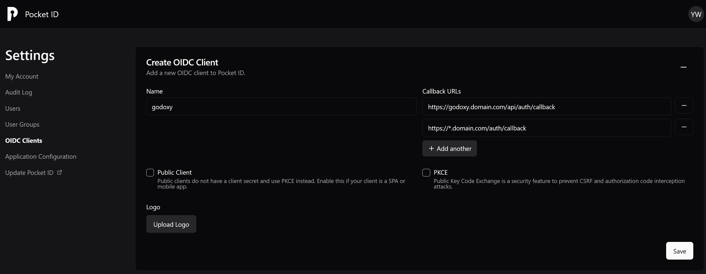
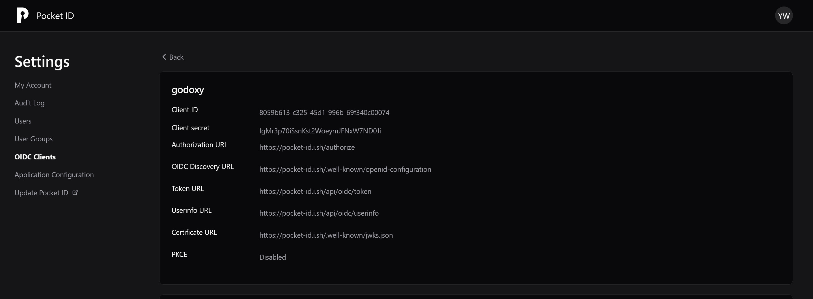

# OpenID Connect (OIDC)

Configure OIDC authentication for the GoDoxy WebUI and per-application middleware.

## Overview

OIDC allows users to authenticate using an external identity provider (IdP) such as Authentik, Pocket ID, or Azure AD. Use it for:

- **WebUI Authentication** - Single sign-on for the dashboard
- **Per-Application Middleware** - Protect individual routes with OIDC

## Environment Variables

| Variable                        | Description         | Default                       |
| ------------------------------- | ------------------- | ----------------------------- |
| `GODOXY_OIDC_ISSUER_URL`        | OIDC issuer URL     | empty                         |
| `GODOXY_OIDC_CLIENT_ID`         | OIDC client ID      | empty                         |
| `GODOXY_OIDC_CLIENT_SECRET`     | OIDC client secret  | empty                         |
| `GODOXY_OIDC_ALLOWED_USERS`     | Allowed users list  | empty                         |
| `GODOXY_OIDC_ALLOWED_GROUPS`    | Allowed groups list | empty                         |
| `GODOXY_OIDC_SCOPES`            | OIDC scopes         | `openid,profile,email,groups` |
| `GODOXY_OIDC_RATE_LIMIT`        | Rate limit          | `10`                          |
| `GODOXY_OIDC_RATE_LIMIT_PERIOD` | Rate limit period   | `1s`                          |

## Scopes

| Scope            | Description    | Required |
| ---------------- | -------------- | -------- |
| `openid`         | OpenID Connect | Yes      |
| `profile`        | User profile   | Yes      |
| `email`          | User email     | No       |
| `groups`         | User groups    | No       |
| `offline_access` | Refresh token  | No       |

## Callback URL

Add this callback URL to your IdP:

```
https://*.yourdomain.com/auth/callback
```

Or for regex-based configuration:

```
https:\/\/([^\.]+)\.yourdomain\.com\/auth\/callback
```

## Provider-Specific Configuration

### Authentik

1. Set **Signing Key** to "authentik Self-signed Certificate"
2. Set **Encryption Key** to None
3. Set **Issuer mode** to "Each provider has a different issuer, based on the application slug"
4. Add scope: `authentik default OAuth Mapping: OpenID 'offline_access'`

### Example Configuration





Add these to `.env`:

| Variable                     | Description    | Example                                                                                            |
| ---------------------------- | -------------- | -------------------------------------------------------------------------------------------------- |
| `GODOXY_OIDC_ISSUER_URL`     | IdP base URL   | `https://id.domain.com` (Pocket ID) or `https://auth.domain.com/application/o/<slug>/` (Authentik) |
| `GODOXY_OIDC_CLIENT_ID`      | Client ID      | your-client-id                                                                                     |
| `GODOXY_OIDC_CLIENT_SECRET`  | Client secret  | your-client-secret                                                                                 |
| `GODOXY_OIDC_ALLOWED_USERS`  | Allowed users  | `user1,user2`                                                                                      |
| `GODOXY_OIDC_ALLOWED_GROUPS` | Allowed groups | `group1,group2`                                                                                    |

## Per-Application OIDC Middleware

Protect individual routes with OIDC authentication using Docker labels:

> [!NOTE]
> The OIDC middleware only processes GET requests. Non-GET requests and WebSocket connections are blocked with a 403 Forbidden response.

```yaml
services:
  app:
    labels:
      # Enable OIDC middleware
      proxy.#1.middlewares.oidc:
```

See [OIDC Middleware](Middlewares.md#oidc) for advanced configuration options.

## Related Documentation

- [Middlewares](Middlewares.md) - OIDC middleware reference
- [Authentication](Home.md#authentication) - Basic setup
