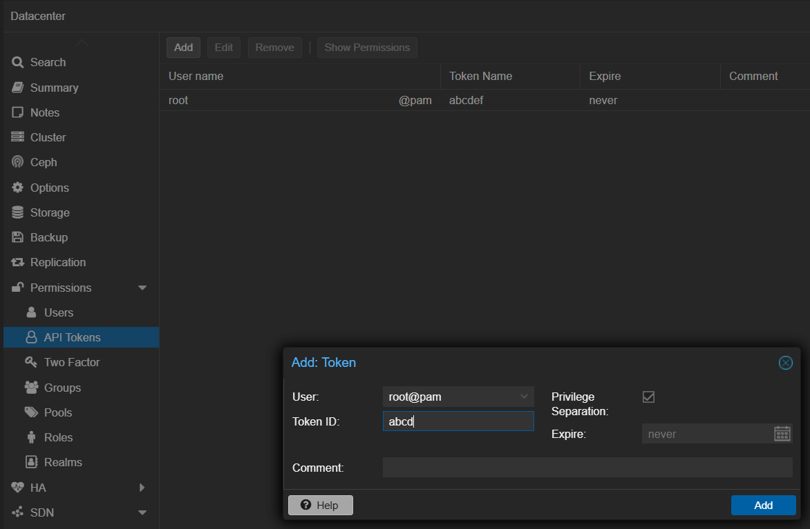
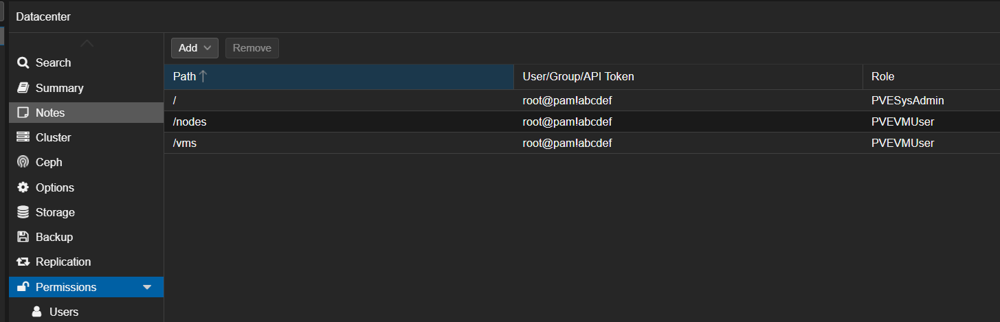
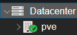
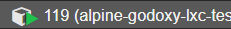

# Proxmox Integration

Manage Proxmox VE PVE nodes and LXC containers with GoDoxy. This integration provides node-level monitoring, container lifecycle management, power operations, and resource monitoring.

## Overview

GoDoxy integrates with Proxmox VE to:

- Auto-discover PVE nodes and LXC containers across clusters
- Monitor node-level statistics (CPU, memory, disk, load average)
- Perform power operations (start, stop, restart, suspend, resume) on containers
- Monitor container statistics (CPU, memory, network, disk I/O)
- Stream journalctl logs from nodes, containers, and services
- Enable idle sleep for energy-efficient container management

### Supported Features

| Feature              | Description                                            |
| -------------------- | ------------------------------------------------------ |
| Node Discovery       | Automatically discover all nodes in Proxmox cluster    |
| Node Monitoring      | Real-time node stats (CPU, memory, disk, load average) |
| Node Journalctl      | Stream system logs from PVE nodes                      |
| Container Journalctl | Access container and service logs via journalctl       |
| Container Lifecycle  | Start, stop, shutdown, suspend, resume, reboot         |
| Resource Monitoring  | Real-time stats streaming (like `docker stats`)        |
| Idle Sleep           | Automatically sleep idle containers                    |

## Quick Start

### Step 1: Create API Token

Create an API token in Proxmox VE:

1. Navigate to **Datacenter > API Tokens**
2. Click **Add**
3. Select a user (e.g., `root@pam`)
4. Enter a token name (e.g., `godoxy`)
5. Copy the **Token ID** and **Secret**



### Step 2: Configure Permissions

Grant the following permissions to your API token:

- `VM.Audit` - View container configuration
- `VM.Console` - Access container console
- `VM.Monitor` - Monitor container status
- `VM.PowerMgmt` - Power operations
- `Sys.Audit` - View node status



### Step 3: Add Provider to config.yml

```yaml
# config.yml
providers:
  proxmox:
    - url: https://pve.domain.com:8006
      token_id: root@pam!godoxy-token
      secret: your-api-token-secret
      no_tls_verify: false
```

### Step 4: Configure Routes

Reference Proxmox containers in your route files:

```yaml
# config/services.yml
my-lxc:
  host: 10.0.9.50
  port: 3000
  proxmox:
    node: pve
    vmid: 119
  homepage:
    name: My LXC App
    category: Development
```

:::info
The `vmname` field is automatically populated by GoDoxy from the Proxmox API and should NOT be set manually in route configuration.
:::

## Configuration Reference

### Provider Configuration

| Property        | Description                   | Required |
| --------------- | ----------------------------- | -------- |
| `url`           | Proxmox API URL               | Yes      |
| `token_id`      | API token ID                  | Yes\*    |
| `secret`        | API token secret              | Yes\*    |
| `username`      | Username (for WebSocket auth) | No\*\*   |
| `password`      | Password (for WebSocket auth) | No\*\*   |
| `realm`         | Authentication realm          | No\*\*   |
| `no_tls_verify` | Disable TLS verification      | No       |

\* Either `token_id`/`secret` or `username`/`password` is required

\*\* Required for WebSocket operations (command execution, journalctl)

### Route Configuration

```yaml
route:
  host: example.com
  port: 443
  proxmox:
    node: pve # Node name from Proxmox cluster
    vmid: 119 # LXC container ID
    service: nginx # Optional: service name for journalctl
```

| Field     | Description                              | Required  |
| --------- | ---------------------------------------- | --------- |
| `node`    | Node name from Proxmox cluster           | Yes       |
| `vmid`    | LXC container ID                         | Yes       |
| `service` | Service name for journalctl logs         | No        |
| `vmname`  | Automatically populated from Proxmox API | No (auto) |

The `vmname` field is populated automatically by GoDoxy from the Proxmox API and should not be set manually.

## How LXC Containers Link to Routes

The `proxmox` configuration creates a link between a GoDoxy route and a Proxmox LXC container. There are two ways to establish this link:

### 1. Automatic Discovery (Reverse Lookup)

When no `proxmox` config is specified, GoDoxy automatically discovers the container by looking up the route's alias/hostname/IP against known Proxmox resources:

```yaml
# No proxmox config needed - discovered automatically!
nginx: # matches lxc/node with name "nginx"
  host: nginx1.lxc.local # route hostname, matches lxc/node with name "nginx1"
  port: 3000
app2:
  host: 10.0.9.50 # route IP address, matches lxc/node with IP 10.0.9.50
  port: 3000
pve: # matches lxc/node with name "pve"
  host: 10.0.0.1 # route IP address, matches lxc/node with IP 10.0.0.1
  port: 8006
  no_tls_verify: true # disable TLS verification
```

GoDoxy will:

1. Query all configured Proxmox providers
2. Look up the route's `host` (or `alias`) against node names, VM names, and IP addresses
3. Automatically populate `proxmox.node`, `proxmox.vmid`, and `proxmox.vmname`

This works for:

- **Node names** (e.g., `pve`, `pve1`)
- **VM names** (e.g., `lxc-app`, `webserver`)
- **IP addresses** (container IPs from Proxmox)

### 2. Explicit Configuration

You can manually specify the Proxmox container / node:

```yaml
# explicitly specify the container
my-lxc:
  host: 10.0.9.50
  port: 3000
  proxmox:
    node: pve # Proxmox node name
    vmid: 119 # LXC container ID
# explicitly specify the node
pve:
  host: 10.0.0.1
  port: 8006
  no_tls_verify: true
  proxmox:
    node: pve # Proxmox node name
```

### What Gets Linked

| Linked Data    | Source                                  | Usage                           |
| -------------- | --------------------------------------- | ------------------------------- |
| Container Name | Proxmox API (`vmname` field)            | Display in WebUI, API responses |
| IP Addresses   | Proxmox API (interfaces + config)       | Health checks, reachability     |
| Status         | Proxmox API (running/stopped/suspended) | Power controls, idle watcher    |
| Service Name   | User config (`service` field)           | Journalctl log filtering        |

Once configured, the route will:

- Show node / container status in the WebUI Servers tab
- Allow starting/stopping the container from the UI
- Stream container logs via `/api/v1/proxmox/journalctl/pve/119/nginx`
- Support idle sleep if configured

### Finding Node Name and VMID

**Node Name:** Locate the node hosting your LXC in the Proxmox UI.



**VMID:** Find the container ID in the Proxmox node summary.



## Authentication Options

### API Token (Recommended)

```yaml
providers:
  proxmox:
    - url: https://pve.domain.com:8006
      token_id: root@pam!godoxy
      secret: aaaa-bbbb-cccc-dddd
```

### Username/Password (Required for WebSocket)

```yaml
providers:
  proxmox:
    - url: https://pve.domain.com:8006
      username: root
      password: your-password
      realm: pam
```

Use username/password authentication when you need:

- Command execution inside containers
- Journalctl log streaming

## API Endpoints

GoDoxy exposes the following REST API endpoints for Proxmox management:

### Statistics

| Endpoint                            | Method | Description                               |
| ----------------------------------- | ------ | ----------------------------------------- |
| `/api/v1/proxmox/stats/:node`       | GET    | Node statistics (supports streaming)      |
| `/api/v1/proxmox/stats/:node/:vmid` | GET    | Container statistics (supports streaming) |

### Logs

| Endpoint                                          | Method | Description                       |
| ------------------------------------------------- | ------ | --------------------------------- |
| `/api/v1/proxmox/journalctl/:node`                | GET    | Node journalctl (WebSocket)       |
| `/api/v1/proxmox/journalctl/:node/:vmid`          | GET    | Container journalctl (WebSocket)  |
| `/api/v1/proxmox/journalctl/:node/:vmid/:service` | GET    | Service-specific logs (WebSocket) |

### Container Operations

| Endpoint                                  | Method | Description       |
| ----------------------------------------- | ------ | ----------------- |
| `/api/v1/proxmox/lxc/:node/:vmid/start`   | POST   | Start container   |
| `/api/v1/proxmox/lxc/:node/:vmid/stop`    | POST   | Stop container    |
| `/api/v1/proxmox/lxc/:node/:vmid/restart` | POST   | Restart container |

For more details, see [API Reference](api.md#proxmox).

## Node-Level Monitoring

GoDoxy supports monitoring PVE nodes directly, independent of container routes. This enables you to monitor the host system even when no LXC containers are configured.

### Node Statistics

Access node-level statistics at `/api/v1/proxmox/stats/:node`:

```bash
# Get current stats
curl "https://godoxy.example.com/api/v1/proxmox/stats/pve"

# Stream stats continuously (like docker stats)
curl -N "https://godoxy.example.com/api/v1/proxmox/stats/pve"
```

**Available Metrics:**

| Metric           | Description                             |
| ---------------- | --------------------------------------- |
| `cpu_usage`      | Current CPU usage percentage            |
| `cpu_model`      | CPU model name                          |
| `mem_usage`      | Used memory (IEC format: KiB, MiB, GiB) |
| `mem_total`      | Total memory                            |
| `mem_pct`        | Memory usage percentage                 |
| `rootfs_usage`   | Used root filesystem space              |
| `rootfs_total`   | Total root filesystem space             |
| `rootfs_pct`     | Root filesystem usage percentage        |
| `uptime`         | Node uptime (human-readable format)     |
| `load_avg_1m`    | 1-minute load average                   |
| `load_avg_5m`    | 5-minute load average                   |
| `load_avg_15m`   | 15-minute load average                  |
| `kernel_version` | Linux kernel version                    |
| `pve_version`    | Proxmox VE version                      |

### Node Journalctl

Stream system logs from PVE nodes:

```bash
# Stream all node journal logs
websocat "wss://godoxy.example.com/api/v1/proxmox/journalctl/pve"

# Stream specific service logs (e.g., pveproxy for the web UI)
websocat "wss://godoxy.example.com/api/v1/proxmox/journalctl/pve/pveproxy"

# Last 100 lines only
websocat "wss://godoxy.example.com/api/v1/proxmox/journalctl/pve?limit=100"
```

**Query Parameters for Journalctl:**

| Parameter | Description                            | Default            |
| --------- | -------------------------------------- | ------------------ |
| `limit`   | Number of historical lines             | 0 (streaming only) |
| `service` | Service unit name (for container logs) | -                  |

**Note:** Journalctl streaming requires username/password authentication in the provider configuration.

## Idle Sleep Integration

GoDoxy can automatically sleep idle Proxmox LXC containers and wake them on traffic. This is ideal for development environments or services with unpredictable usage.

### Basic Configuration

```yaml
my-dev-container:
  host: 10.0.9.50
  port: 3000
  proxmox:
    node: pve
    vmid: 119
  idlewatcher:
    idle_timeout: 1h
    wake_timeout: 60s
```

### With Dependencies

```yaml
lxc-app:
  host: 10.0.9.50
  port: 3000
  proxmox:
    node: pve
    vmid: 119
  idlewatcher:
    idle_timeout: 30m
    depends_on:
      - lxc-db

lxc-db:
  host: 10.0.9.51
  port: 5432
  proxmox:
    node: pve
    vmid: 120
```

See [Idle Sleep](Idle-Sleep.md) for detailed configuration options.

## WebUI Features

The GoDoxy WebUI provides:

- **Server Management**: View and manage Proxmox nodes
- **Node Stats**: Real-time monitoring (CPU, memory, disk, load average)
- **Container Stats**: Real-time monitoring (CPU, memory, network)
- **Power Controls**: Start, stop, restart containers
- **Log Access**: Stream node and container logs via WebSocket

## Troubleshooting

### Connection Issues

```
Error: failed to fetch proxmox cluster info
```

- Verify URL is accessible from GoDoxy server
- Check firewall rules for port 8006
- Ensure TLS certificates are valid or set `no_tls_verify: true`

### Authentication Failures

```
Error: authentication failed
```

- Verify token ID format: `user@realm!token-name`
- Check token permissions in Proxmox
- For WebSocket operations, ensure username/password is configured

### Container Not Found

```
Error: proxmox node 'pve' not found
```

- Verify node name matches Proxmox cluster
- Check that the node is online in Proxmox
- Review API token permissions for that node

### WebSocket Operations Fail

```
Error: no session found, make sure username and password are set
```

- WebSocket operations require username/password authentication
- Add `username` and `password` to provider config
- Ensure the user has appropriate permissions

## Performance Considerations

- Cluster info fetched once on startup
- Resources updated every 3 seconds in background
- Concurrent IP resolution (limited to GOMAXPROCS \* 2)
- 5-second timeout for initial connection
- WebSocket connections properly closed to prevent goroutine leaks

## Security Best Practices

1. **Use API tokens** instead of username/password when possible
2. **Limit token permissions** to minimum required
3. **Enable TLS verification** in production
4. **Restrict network access** to Proxmox API port
5. **Rotate tokens regularly**
