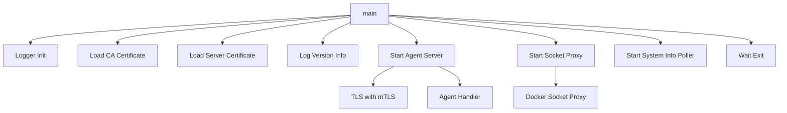

# agent/cmd

The main entry point for the GoDoxy Agent, a secure monitoring and proxy agent that runs alongside Docker containers.

## Overview

This package contains the `main.go` entry point for the GoDoxy Agent. The agent is a TLS-enabled server that provides:

- Secure Docker socket proxying with client certificate authentication
- HTTP proxy capabilities for container traffic
- System metrics collection and monitoring
- Health check endpoints

## Architecture

## Main Function Flow

1. **Logger Setup**: Configures zerolog with console output
1. **Certificate Loading**: Loads CA and server certificates for TLS/mTLS
1. **Version Logging**: Logs agent version and configuration
1. **Agent Server**: Starts the main HTTPS server with agent handlers
1. **Socket Proxy**: Starts Docker socket proxy if configured
1. **System Monitoring**: Starts system info polling
1. **Graceful Shutdown**: Waits for exit signal (3 second timeout)

## Configuration

See `agent/pkg/env/README.md` for configuration options.

## Dependencies

- `agent/pkg/agent` - Core agent types and constants
- `agent/pkg/env` - Environment configuration
- `agent/pkg/server` - Server implementation
- `socketproxy/pkg` - Docker socket proxy
- `internal/metrics/systeminfo` - System metrics
