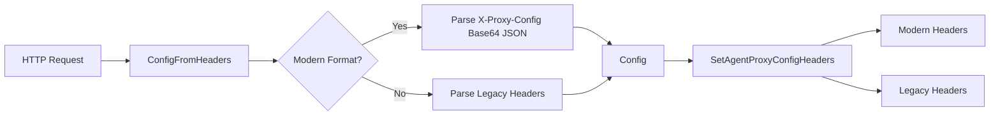

# agent/pkg/agentproxy

Package for configuring HTTP proxy connections through the GoDoxy Agent using HTTP headers.

## Overview

This package provides types and functions for parsing and setting agent proxy configuration via HTTP headers. It supports both a modern base64-encoded JSON format and a legacy header-based format for backward compatibility.

## Architecture



## Public Types

### Config

```go
type Config struct {
    Scheme string       // Proxy scheme (http or https)
    Host   string       // Proxy host (hostname or hostname:port)
    HTTPConfig         // Extended HTTP configuration
}
```

The `HTTPConfig` embedded type (from `internal/route/types`) includes:

- `NoTLSVerify` - Skip TLS certificate verification
- `ResponseHeaderTimeout` - Timeout for response headers
- `DisableCompression` - Disable gzip compression

## Public Functions

### ConfigFromHeaders

```go
func ConfigFromHeaders(h http.Header) (Config, error)
```

Parses proxy configuration from HTTP request headers. Tries modern format first, falls back to legacy format if not present.

### proxyConfigFromHeaders

```go
func proxyConfigFromHeaders(h http.Header) (Config, error)
```

Parses the modern base64-encoded JSON format from `X-Proxy-Config` header.

### proxyConfigFromHeadersLegacy

```go
func proxyConfigFromHeadersLegacy(h http.Header) Config
```

Parses the legacy header format:

- `X-Proxy-Host` - Proxy host
- `X-Proxy-Https` - Whether to use HTTPS
- `X-Proxy-Skip-Tls-Verify` - Skip TLS verification
- `X-Proxy-Response-Header-Timeout` - Response timeout in seconds

### SetAgentProxyConfigHeaders

```go
func (cfg *Config) SetAgentProxyConfigHeaders(h http.Header)
```

Sets headers for modern format with base64-encoded JSON config.

### SetAgentProxyConfigHeadersLegacy

```go
func (cfg *Config) SetAgentProxyConfigHeadersLegacy(h http.Header)
```

Sets headers for legacy format with individual header fields.

## Header Constants

Modern headers:

- `HeaderXProxyScheme` - Proxy scheme
- `HeaderXProxyHost` - Proxy host
- `HeaderXProxyConfig` - Base64-encoded JSON config

Legacy headers (deprecated):

- `HeaderXProxyHTTPS`
- `HeaderXProxySkipTLSVerify`
- `HeaderXProxyResponseHeaderTimeout`

## Usage Example

```go
// Reading configuration from incoming request headers
func handleRequest(w http.ResponseWriter, r *http.Request) {
    cfg, err := agentproxy.ConfigFromHeaders(r.Header)
    if err != nil {
        http.Error(w, "Invalid proxy config", http.StatusBadRequest)
        return
    }

    // Use cfg.Scheme and cfg.Host to proxy the request
    // ...
}
```

## Integration

This package is used by `agent/pkg/handler/proxy_http.go` to configure reverse proxy connections based on request headers.
