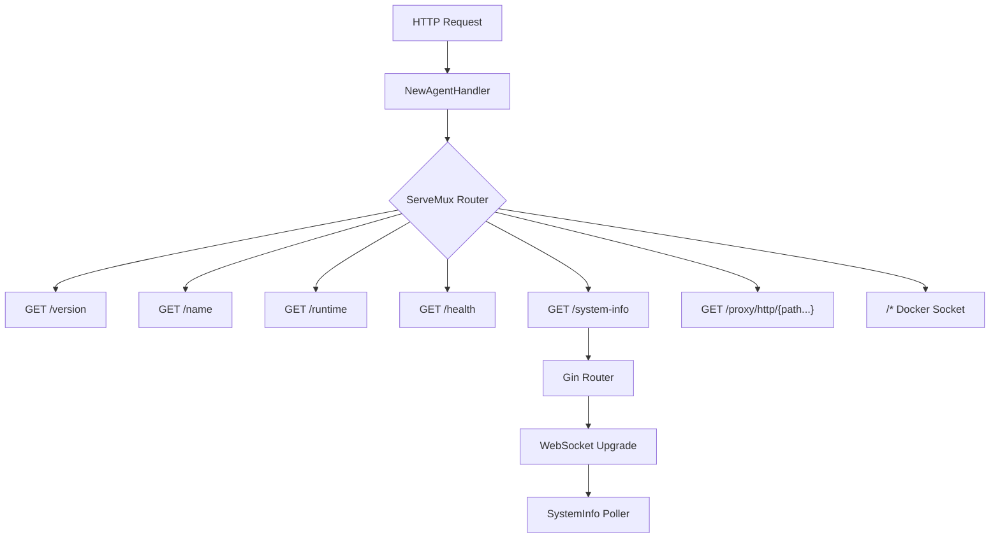

# agent/pkg/handler

HTTP request handler package for the GoDoxy Agent.

## Overview

This package provides the HTTP handler for the GoDoxy Agent server, including endpoints for:

- Version information
- Agent name and runtime
- Health checks
- System metrics (via SSE)
- HTTP proxy routing
- Docker socket proxying

## Architecture



## Public Types

### ServeMux

```go
type ServeMux struct{ *http.ServeMux }
```

Wrapper around `http.ServeMux` with agent-specific endpoint helpers.

**Methods:**

- `HandleEndpoint(method, endpoint string, handler http.HandlerFunc)` - Registers handler with API base path
- `HandleFunc(endpoint string, handler http.HandlerFunc)` - Registers GET handler with API base path

## Public Functions

### NewAgentHandler

```go
func NewAgentHandler() http.Handler
```

Creates and configures the HTTP handler for the agent server. Sets up:

- Gin-based metrics handler with WebSocket support for SSE
- All standard agent endpoints
- HTTP proxy endpoint
- Docker socket proxy fallback

## Endpoints

| Endpoint                | Method   | Description                          |
| ----------------------- | -------- | ------------------------------------ |
| `/version`              | GET      | Returns agent version                |
| `/name`                 | GET      | Returns agent name                   |
| `/runtime`              | GET      | Returns container runtime            |
| `/health`               | GET      | Health check with scheme query param |
| `/system-info`          | GET      | System metrics via SSE or WebSocket  |
| `/proxy/http/{path...}` | GET/POST | HTTP proxy with config from headers  |
| `/*`                    | \*       | Docker socket proxy                  |

## Sub-packages

### proxy_http.go

Handles HTTP proxy requests by reading configuration from request headers and proxying to the configured upstream.

**Key Function:**

- `ProxyHTTP(w, r)` - Proxies HTTP requests based on `X-Proxy-*` headers

### check_health.go

Handles health check requests for various schemes.

**Key Function:**

- `CheckHealth(w, r)` - Performs health checks with configurable scheme

**Supported Schemes:**

- `http`, `https` - HTTP health check
- `h2c` - HTTP/2 cleartext health check
- `tcp`, `udp`, `tcp4`, `udp4`, `tcp6`, `udp6` - TCP/UDP health check
- `fileserver` - File existence check

## Usage Example

```go
package main

import (
    "net/http"
    "github.com/yusing/godoxy/agent/pkg/handler"
)

func main() {
    mux := http.NewServeMux()
    mux.Handle("/", handler.NewAgentHandler())

    http.ListenAndServe(":8890", mux)
}
```

## WebSocket Support

The handler includes a permissive WebSocket upgrader for internal use (no origin check). This enables real-time system metrics streaming via Server-Sent Events (SSE).

## Docker Socket Integration

All unmatched requests fall through to the Docker socket handler, allowing the agent to proxy Docker API calls when configured.
