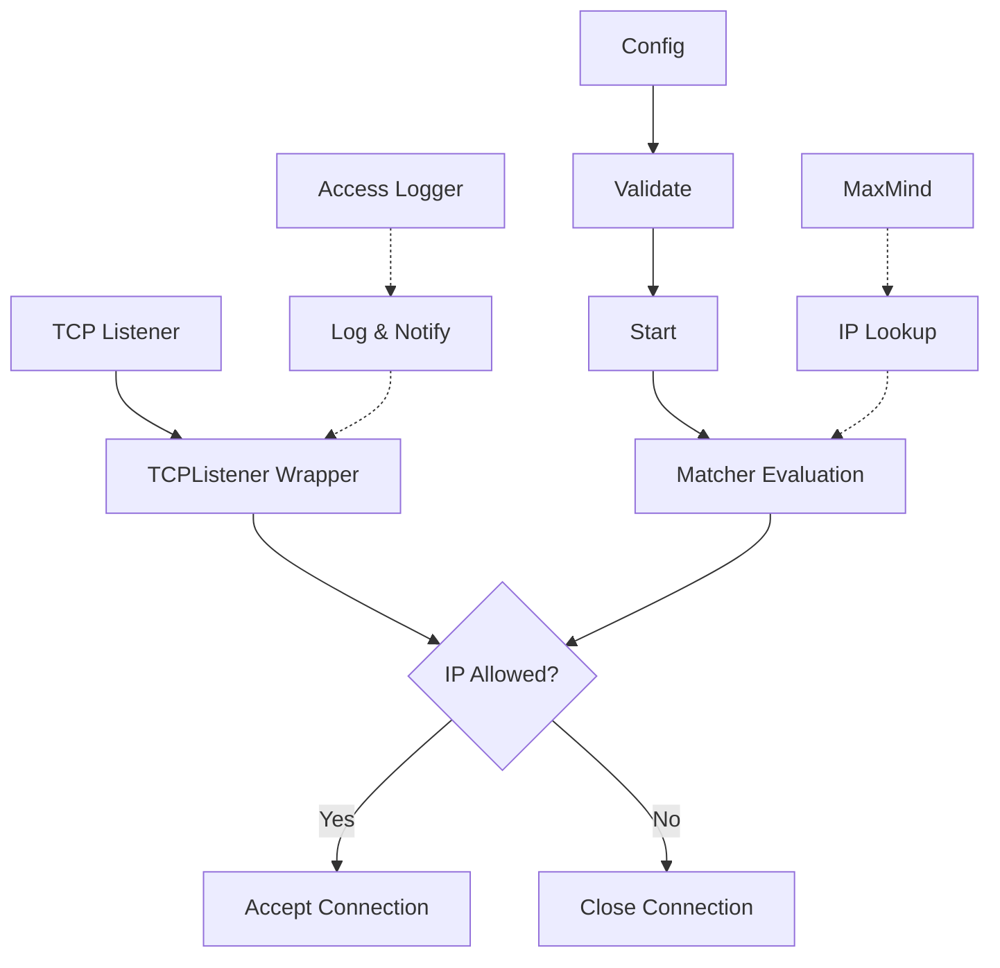
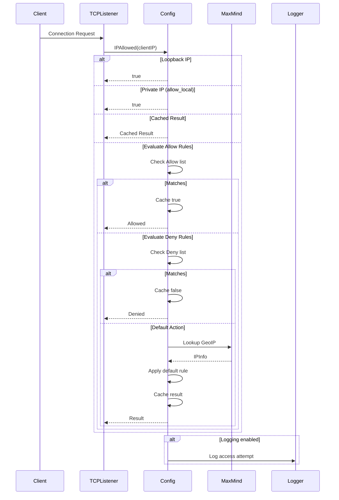

# ACL (Access Control List)

Access control at the TCP connection level with IP/CIDR, timezone, and country-based filtering.

## Overview

The ACL package provides network-level access control by wrapping TCP listeners and validating incoming connections against configurable allow/deny rules. It integrates with MaxMind GeoIP for geographic-based filtering and supports access logging with notification batching.

### Primary consumers

- `internal/entrypoint` - Wraps the main TCP listener for connection filtering
- Operators - Configure rules via YAML configuration

### Non-goals

- HTTP request-level filtering (handled by middleware)
- Authentication or authorization (see `internal/auth`)
- VPN or tunnel integration

### Stability

Stable internal package. The public API is the `Config` struct and its methods.

## Public API

### Exported types

```go
type Config struct {
    Default    string                     // "allow" or "deny" (default: "allow")
    AllowLocal *bool                      // Allow private/loopback IPs (default: true)
    Allow      Matchers                   // Allow rules
    Deny       Matchers                   // Deny rules
    Log        *accesslog.ACLLoggerConfig // Access logging configuration

    Notify struct {
        To             []string      // Notification providers
        Interval       time.Duration // Notification frequency (default: 1m)
        IncludeAllowed *bool         // Include allowed in notifications (default: false)
    }
}
```

```go
type Matcher struct {
    match MatcherFunc
}
```

```go
type Matchers []Matcher
```

### Exported functions and methods

```go
func (c *Config) Validate() error
```

Validates configuration and sets defaults. Must be called before `Start`.

```go
func (c *Config) Start(parent task.Parent) error
```

Initializes the ACL, starts the logger and notification goroutines.

```go
func (c *Config) IPAllowed(ip net.IP) bool
```

Returns true if the IP is allowed based on configured rules. Performs caching and GeoIP lookup if needed.

```go
func (c *Config) WrapTCP(lis net.Listener) net.Listener
```

Wraps a `net.Listener` to filter connections by IP.

```go
func (matcher *Matcher) Parse(s string) error
```

Parses a matcher string in the format `{type}:{value}`. Supported types: `ip`, `cidr`, `tz`, `country`.

## Architecture

### Core components



### Connection filtering flow



### Matcher types

| Type     | Format            | Example               |
| -------- | ----------------- | --------------------- |
| IP       | `ip:address`      | `ip:192.168.1.1`      |
| CIDR     | `cidr:network`    | `cidr:192.168.0.0/16` |
| TimeZone | `tz:timezone`     | `tz:Asia/Shanghai`    |
| Country  | `country:ISOCode` | `country:GB`          |

## Configuration Surface

### Config sources

Configuration is loaded from `config/config.yml` under the `acl` key.

### Schema

```yaml
acl:
  default: "allow" # "allow" or "deny"
  allow_local: true # Allow private/loopback IPs
  log:
    log_allowed: false # Log allowed connections
  notify:
    to: ["gotify"] # Notification providers
    interval: "1m" # Notification interval
    include_allowed: false # Include allowed in notifications
```

### Hot-reloading

Configuration requires restart. The ACL does not support dynamic rule updates.

## Dependency and Integration Map

### Internal dependencies

- `internal/maxmind` - IP geolocation lookup
- `internal/logging/accesslog` - Access logging
- `internal/notif` - Notifications
- `internal/task/task.go` - Lifetime management

### Integration points

```go
// Entrypoint uses ACL to wrap the TCP listener
aclListener := config.ACL.WrapTCP(listener)
http.Server.Serve(aclListener, entrypoint)
```

## Observability

### Logs

- `ACL started` - Configuration summary on start
- `log_notify_loop` - Access attempts (allowed/denied)

Log levels: `Info` for startup, `Debug` for client closure.

### Metrics

No metrics are currently exposed.

## Security Considerations

- Loopback and private IPs are always allowed unless explicitly denied
- Cache TTL is 1 minute to limit memory usage
- Notification channel has a buffer of 100 to prevent blocking
- Failed connections are immediately closed without response

## Failure Modes and Recovery

| Failure                           | Behavior                              | Recovery                                      |
| --------------------------------- | ------------------------------------- | --------------------------------------------- |
| Invalid matcher syntax            | Validation fails on startup           | Fix configuration syntax                      |
| MaxMind database unavailable      | GeoIP lookups return unknown location | Default action applies; cache hit still works |
| Notification provider unavailable | Notification dropped                  | Error logged, continues operation             |
| Cache full                        | No eviction, uses Go map              | No action needed                              |

## Usage Examples

### Basic configuration

```go
aclConfig := &acl.Config{
    Default:    "allow",
    AllowLocal: ptr(true),
    Allow: acl.Matchers{
        {match: matchIP(net.ParseIP("192.168.1.0/24"))},
    },
    Deny: acl.Matchers{
        {match: matchISOCode("CN")},
    },
}
if err := aclConfig.Validate(); err != nil {
    log.Fatal(err)
}
if err := aclConfig.Start(parent); err != nil {
    log.Fatal(err)
}
```

### Wrapping a TCP listener

```go
listener, err := net.Listen("tcp", ":443")
if err != nil {
    log.Fatal(err)
}

// Wrap with ACL
aclListener := aclConfig.WrapTCP(listener)

// Use with HTTP server
server := &http.Server{}
server.Serve(aclListener)
```

### Creating custom matchers

```go
matcher := &acl.Matcher{}
err := matcher.Parse("country:US")
if err != nil {
    log.Fatal(err)
}

// Use the matcher
allowed := matcher.match(ipInfo)
```
