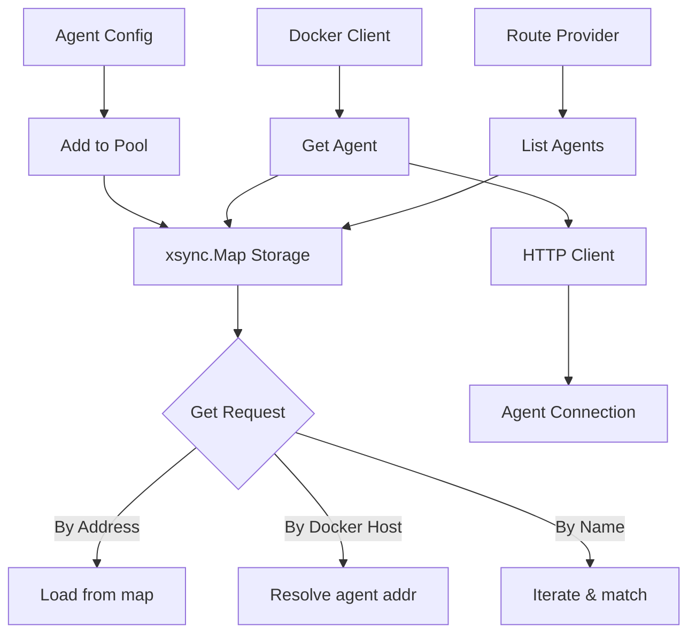

# Agent Pool

Thread-safe pool for managing remote Docker agent connections.

## Overview

The agentpool package provides a centralized pool for storing and retrieving remote agent configurations. It enables GoDoxy to connect to Docker hosts via agent connections instead of direct socket access, enabling secure remote container management.

### Primary consumers

- `internal/route/provider` - Creates agent-based route providers
- `internal/docker` - Manages agent-based Docker client connections
- Configuration loading during startup

### Non-goals

- Agent lifecycle management (handled by `agent/pkg/agent`)
- Agent health monitoring
- Agent authentication/authorization

### Stability

Stable internal package. The pool uses `xsync.Map` for lock-free concurrent access.

## Public API

### Exported types

```go
type Agent struct {
    *agent.AgentConfig
    httpClient       *http.Client
    fasthttpHcClient *fasthttp.Client
}
```

### Exported functions

```go
func Add(cfg *agent.AgentConfig) (added bool)
```

Adds an agent to the pool. Returns `true` if added, `false` if already exists. Uses `LoadOrCompute` to prevent duplicates.

```go
func Has(cfg *agent.AgentConfig) bool
```

Checks if an agent exists in the pool.

```go
func Remove(cfg *agent.AgentConfig)
```

Removes an agent from the pool.

```go
func RemoveAll()
```

Removes all agents from the pool. Called during configuration reload.

```go
func Get(agentAddrOrDockerHost string) (*Agent, bool)
```

Retrieves an agent by address or Docker host URL. Automatically detects if the input is an agent address or Docker host URL and resolves accordingly.

```go
func GetAgent(name string) (*Agent, bool)
```

Retrieves an agent by name. O(n) iteration over pool contents.

```go
func List() []*Agent
```

Returns all agents as a slice. Creates a new copy for thread safety.

```go
func Iter() iter.Seq2[string, *Agent]
```

Returns an iterator over all agents. Uses `xsync.Map.Range`.

```go
func Num() int
```

Returns the number of agents in the pool.

```go
func (agent *Agent) HTTPClient() *http.Client
```

Returns an HTTP client configured for the agent.

## Architecture

### Core components



### Thread safety model

The pool uses `xsync.Map[string, *Agent]` for concurrent-safe operations:

- `Add`: `LoadOrCompute` prevents race conditions and duplicates
- `Get`: Lock-free read operations
- `Iter`: Consistent snapshot iteration via `Range`
- `Remove`: Thread-safe deletion

### Test mode

When running tests (binary ends with `.test`), a test agent is automatically added:

```go
func init() {
    if strings.HasSuffix(os.Args[0], ".test") {
        agentPool.Store("test-agent", &Agent{
            AgentConfig: &agent.AgentConfig{
                Addr: "test-agent",
            },
        })
    }
}
```

## Configuration Surface

No direct configuration. Agents are added via configuration loading from `config/config.yml`:

```yaml
providers:
  agents:
    - addr: agent.example.com:443
      name: remote-agent
      tls:
        ca_file: /path/to/ca.pem
        cert_file: /path/to/cert.pem
        key_file: /path/to/key.pem
```

## Dependency and Integration Map

### Internal dependencies

- `agent/pkg/agent` - Agent configuration and connection settings
- `xsync/v4` - Concurrent map implementation

### External dependencies

- `valyala/fasthttp` - Fast HTTP client for agent communication

### Integration points

```go
// Docker package uses agent pool for remote connections
if agent.IsDockerHostAgent(host) {
    a, ok := agentpool.Get(host)
    if !ok {
        panic(fmt.Errorf("agent %q not found", host))
    }
    opt := []client.Opt{
        client.WithHost(agent.DockerHost),
        client.WithHTTPClient(a.HTTPClient()),
    }
}
```

## Observability

### Logs

No specific logging in the agentpool package. Client creation/destruction is logged in the docker package.

### Metrics

No metrics are currently exposed.

## Security Considerations

- TLS configuration is loaded from agent configuration
- Connection credentials are not stored in the pool after agent creation
- HTTP clients are created per-request to ensure credential freshness

## Failure Modes and Recovery

| Failure              | Behavior             | Recovery                     |
| -------------------- | -------------------- | ---------------------------- |
| Agent not found      | Returns `nil, false` | Add agent to pool before use |
| Duplicate add        | Returns `false`      | Existing agent is preserved  |
| Test mode activation | Test agent added     | Only during test binaries    |

## Performance Characteristics

- O(1) lookup by address
- O(n) iteration for name-based lookup
- Pre-sized to 10 entries via `xsync.WithPresize(10)`
- No locks required for read operations
- HTTP clients are created per-call to ensure fresh connections

## Usage Examples

### Adding an agent

```go
agentConfig := &agent.AgentConfig{
    Addr: "agent.example.com:443",
    Name: "my-agent",
}

added := agentpool.Add(agentConfig)
if !added {
    log.Println("Agent already exists")
}
```

### Retrieving an agent

```go
// By address
agent, ok := agentpool.Get("agent.example.com:443")
if !ok {
    log.Fatal("Agent not found")
}

// By Docker host URL
agent, ok := agentpool.Get("http://docker-host:2375")
if !ok {
    log.Fatal("Agent not found")
}

// By name
agent, ok := agentpool.GetAgent("my-agent")
if !ok {
    log.Fatal("Agent not found")
}
```

### Iterating over all agents

```go
for addr, agent := range agentpool.Iter() {
    log.Printf("Agent: %s at %s", agent.Name, addr)
}
```

### Using with Docker client

```go
// When creating a Docker client with an agent host
if agent.IsDockerHostAgent(host) {
    a, ok := agentpool.Get(host)
    if !ok {
        panic(fmt.Errorf("agent %q not found", host))
    }
    opt := []client.Opt{
        client.WithHost(agent.DockerHost),
        client.WithHTTPClient(a.HTTPClient()),
    }
    dockerClient, err := client.New(opt...)
}
```
