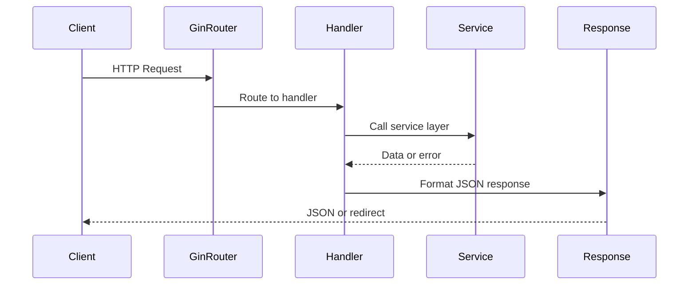

# API v1 Package

Implements the v1 REST API handlers for GoDoxy, exposing endpoints for managing routes, Docker containers, certificates, metrics, and system configuration.

## Overview

The `internal/api/v1` package implements the HTTP handlers that power GoDoxy's REST API. It uses the Gin web framework and provides endpoints for route management, container operations, certificate handling, system metrics, and configuration.

### Primary Consumers

- **WebUI**: The homepage dashboard and admin interface consume these endpoints

### Non-goals

- Authentication and authorization logic (delegated to `internal/auth`)
- Route proxying and request handling (handled by `internal/route`)
- Docker container lifecycle management (delegated to `internal/docker`)
- Certificate issuance and storage (handled by `internal/autocert`)

### Stability

This package is stable. Public API endpoints follow semantic versioning for request/response contracts. Internal implementation may change between minor versions.

## Public API

### Exported Types

Types are defined in `goutils/apitypes`:

| Type                       | Purpose                          |
| -------------------------- | -------------------------------- |
| `apitypes.ErrorResponse`   | Standard error response format   |
| `apitypes.SuccessResponse` | Standard success response format |

### Handler Subpackages

| Package    | Purpose                                        |
| ---------- | ---------------------------------------------- |
| `route`    | Route listing, details, and playground testing |
| `docker`   | Docker container management and monitoring     |
| `cert`     | Certificate information and renewal            |
| `metrics`  | System metrics and uptime information          |
| `homepage` | Homepage items and category management         |
| `file`     | Configuration file read/write operations       |
| `auth`     | Authentication and session management          |
| `agent`    | Remote agent creation and management           |

## Architecture

### Handler Organization

Package structure mirrors the API endpoint paths (e.g., `auth/login.go` handles `/auth/login`).

### Request Flow



## Configuration Surface

API listening address is configured with `GODOXY_API_ADDR` environment variable.

## Dependency and Integration Map

### Internal Dependencies

| Package                 | Purpose                     |
| ----------------------- | --------------------------- |
| `internal/route/routes` | Route storage and iteration |
| `internal/docker`       | Docker client management    |
| `internal/config`       | Configuration access        |
| `internal/metrics`      | System metrics collection   |
| `internal/homepage`     | Homepage item generation    |
| `internal/agentpool`    | Remote agent management     |
| `internal/auth`         | Authentication services     |

### External Dependencies

| Package                        | Purpose                     |
| ------------------------------ | --------------------------- |
| `github.com/gin-gonic/gin`     | HTTP routing and middleware |
| `github.com/gorilla/websocket` | WebSocket support           |
| `github.com/moby/moby/client`  | Docker API client           |

## Observability

### Logs

Handlers log at `INFO` level for requests and `ERROR` level for failures. Logs include:

- Request path and method
- Response status code
- Error details (when applicable)

### Metrics

No dedicated metrics exposed by handlers. Request metrics collected by middleware.

## Security Considerations

- All endpoints (except `/api/v1/version`) require authentication
- Input validation using Gin binding tags
- Path traversal prevention in file operations
- WebSocket connections use same auth middleware as HTTP

## Failure Modes and Recovery

| Failure                             | Behavior                                   |
| ----------------------------------- | ------------------------------------------ |
| Docker host unreachable             | Returns partial results with errors logged |
| Certificate provider not configured | Returns 404                                |
| Invalid request body                | Returns 400 with error details             |
| Authentication failure              | Returns 302 redirect to login              |
| Agent not found                     | Returns 404                                |

## Usage Examples

### Listing All Routes via WebSocket

```go
import (
    "github.com/gorilla/websocket"
)

func watchRoutes(provider string) error {
    url := "ws://localhost:8888/api/v1/route/list"
    if provider != "" {
        url += "?provider=" + provider
    }

    conn, _, err := websocket.DefaultDialer.Dial(url, nil)
    if err != nil {
        return err
    }
    defer conn.Close()

    for {
        _, message, err := conn.ReadMessage()
        if err != nil {
            return err
        }
        // message contains JSON array of routes
        processRoutes(message)
    }
}
```

### Getting Container Status

```go
import (
    "encoding/json"
    "net/http"
)

type Container struct {
    Server string `json:"server"`
    Name   string `json:"name"`
    ID     string `json:"id"`
    Image  string `json:"image"`
}

func listContainers() ([]Container, error) {
    resp, err := http.Get("http://localhost:8888/api/v1/docker/containers")
    if err != nil {
        return nil, err
    }
    defer resp.Body.Close()

    var containers []Container
    if err := json.NewDecoder(resp.Body).Decode(&containers); err != nil {
        return nil, err
    }
    return containers, nil
}
```

### Health Check

```bash
curl http://localhost:8888/health
```

)
