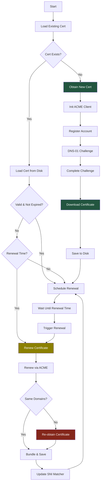
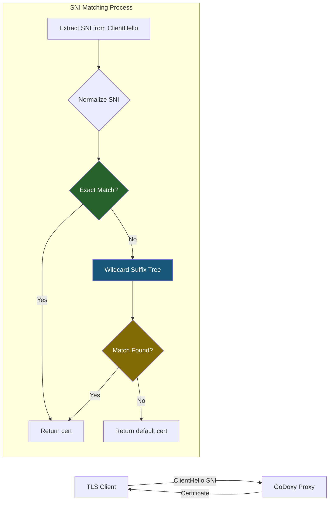

# Autocert Package

Automated SSL certificate management using the ACME protocol (Let's Encrypt and compatible CAs).

## Overview

### Purpose

This package provides complete SSL certificate lifecycle management:

- ACME account registration and management
- Certificate issuance via DNS-01 challenge
- Automatic renewal scheduling (1 month before expiry)
- SNI-based certificate selection for multi-domain setups

### Primary Consumers

- `goutils/server` - TLS handshake certificate provider
- `internal/api/v1/cert/` - REST API for certificate management
- Configuration loading via `internal/config/`

### Non-goals

- HTTP-01 challenge support
- Certificate transparency log monitoring
- OCSP stapling
- Private CA support (except via custom CADirURL)

### Stability

Internal package with stable public APIs. ACME protocol compliance depends on lego library.

## Public API

### Config (`config.go`)

```go
type Config struct {
    Email       string                       // ACME account email
    Domains     []string                     // Domains to certify
    CertPath    string                       // Output cert path
    KeyPath     string                       // Output key path
    Extra       []ConfigExtra                // Additional cert configs
    ACMEKeyPath string                       // ACME account private key
    Provider    string                       // DNS provider name
    Options     map[string]strutils.Redacted // Provider options
    Resolvers   []string                     // DNS resolvers
    CADirURL    string                       // Custom ACME CA directory
    CACerts     []string                     // Custom CA certificates
    EABKid      string                       // External Account Binding Key ID
    EABHmac     string                       // External Account Binding HMAC
}

// Merge extra config with main provider
func MergeExtraConfig(mainCfg *Config, extraCfg *ConfigExtra) ConfigExtra
```

### Provider (`provider.go`)

```go
type Provider struct {
    logger       zerolog.Logger
    cfg          *Config
    user         *User
    legoCfg      *lego.Config
    client       *lego.Client
    lastFailure  time.Time
    legoCert     *certificate.Resource
    tlsCert      *tls.Certificate
    certExpiries CertExpiries
    extraProviders []*Provider
    sniMatcher   sniMatcher
}

// Create new provider (initializes extras atomically)
func NewProvider(cfg *Config, user *User, legoCfg *lego.Config) (*Provider, error)

// TLS certificate getter for SNI
func (p *Provider) GetCert(hello *tls.ClientHelloInfo) (*tls.Certificate, error)

// Certificate info for API
func (p *Provider) GetCertInfos() ([]CertInfo, error)

// Provider name ("main" or "extra[N]")
func (p *Provider) GetName() string

// Obtain certificate if not exists
func (p *Provider) ObtainCertIfNotExistsAll() error

// Force immediate renewal
func (p *Provider) ForceExpiryAll() bool

// Schedule automatic renewal
func (p *Provider) ScheduleRenewalAll(parent task.Parent)

// Print expiry dates
func (p *Provider) PrintCertExpiriesAll()
```

### User (`user.go`)

```go
type User struct {
    Email        string                    // Account email
    Registration *registration.Resource    // ACME registration
    Key          crypto.PrivateKey         // Account key
}
```

## Architecture

### Certificate Lifecycle



### SNI Matching Flow



### Suffix Tree Structure

```
Certificate: *.example.com, example.com, *.api.example.com

exact:
  "example.com" -> Provider_A

root:
  └── "com"
      └── "example"
          ├── "*" -> Provider_A  [wildcard at *.example.com]
          └── "api"
              └── "*" -> Provider_B  [wildcard at *.api.example.com]
```

## Configuration Surface

### Provider Types

| Type           | Description                  | Use Case                  |
| -------------- | ---------------------------- | ------------------------- |
| `local`        | No ACME, use existing cert   | Pre-existing certificates |
| `pseudo`       | Mock provider for testing    | Development               |
| ACME providers | Let's Encrypt, ZeroSSL, etc. | Production                |

### Supported DNS Providers

| Provider     | Name           | Required Options                    |
| ------------ | -------------- | ----------------------------------- |
| Cloudflare   | `cloudflare`   | `CF_API_TOKEN`                      |
| Route 53     | `route53`      | AWS credentials                     |
| DigitalOcean | `digitalocean` | `DO_API_TOKEN`                      |
| GoDaddy      | `godaddy`      | `GD_API_KEY`, `GD_API_SECRET`       |
| OVH          | `ovh`          | `OVH_ENDPOINT`, `OVH_APP_KEY`, etc. |
| CloudDNS     | `clouddns`     | GCP credentials                     |
| AzureDNS     | `azuredns`     | Azure credentials                   |
| DuckDNS      | `duckdns`      | `DUCKDNS_TOKEN`                     |

### Example Configuration

```yaml
autocert:
  provider: cloudflare
  email: admin@example.com
  domains:
    - example.com
    - "*.example.com"
  options:
    auth_token: ${CF_API_TOKEN}
  resolvers:
    - 1.1.1.1:53
```

### Extra Providers

```yaml
autocert:
  provider: cloudflare
  email: admin@example.com
  domains:
    - example.com
    - "*.example.com"
  cert_path: certs/example.com.crt
  key_path: certs/example.com.key
  options:
    auth_token: ${CF_API_TOKEN}
  extra:
    - domains:
        - api.example.com
        - "*.api.example.com"
      cert_path: certs/api.example.com.crt
      key_path: certs/api.example.com.key
```

## Dependency and Integration Map

### External Dependencies

- `github.com/go-acme/lego/v4` - ACME protocol implementation
- `github.com/rs/zerolog` - Structured logging

### Internal Dependencies

- `internal/task/task.go` - Lifetime management
- `internal/notif/` - Renewal notifications
- `internal/config/` - Configuration loading
- `internal/dnsproviders/` - DNS provider implementations

## Observability

### Logs

| Level   | When                          |
| ------- | ----------------------------- |
| `Info`  | Certificate obtained/renewed  |
| `Info`  | Registration reused           |
| `Warn`  | Renewal failure               |
| `Error` | Certificate retrieval failure |

### Notifications

- Certificate renewal success/failure
- Service startup with expiry dates

## Security Considerations

- Account private key stored at `certs/acme.key` (mode 0600)
- Certificate private keys stored at configured paths (mode 0600)
- Certificate files world-readable (mode 0644)
- ACME account email used for Let's Encrypt ToS
- EAB credentials for zero-touch enrollment

## Failure Modes and Recovery

| Failure Mode                   | Impact                     | Recovery                      |
| ------------------------------ | -------------------------- | ----------------------------- |
| DNS-01 challenge timeout       | Certificate issuance fails | Check DNS provider API        |
| Rate limiting (too many certs) | 1-hour cooldown            | Wait or use different account |
| DNS provider API error         | Renewal fails              | 1-hour cooldown, retry        |
| Certificate domains mismatch   | Must re-obtain             | Force renewal via API         |
| Account key corrupted          | Must register new account  | New key, may lose certs       |

### Failure Tracking

Last failure persisted per-certificate to prevent rate limiting:

```
File: <cert_dir>/.last_failure-<hash>
Where hash = SHA256(certPath|keyPath)[:6]
```

## Usage Examples

### Initial Setup

```go
autocertCfg := state.AutoCert
user, legoCfg, err := autocertCfg.GetLegoConfig()
if err != nil {
    return err
}

provider, err := autocert.NewProvider(autocertCfg, user, legoCfg)
if err != nil {
    return fmt.Errorf("autocert error: %w", err)
}

if err := provider.ObtainCertIfNotExistsAll(); err != nil {
    return fmt.Errorf("failed to obtain certificates: %w", err)
}

provider.ScheduleRenewalAll(state.Task())
provider.PrintCertExpiriesAll()
```

### Force Renewal via API

```go
// WebSocket endpoint: GET /api/v1/cert/renew
if provider.ForceExpiryAll() {
    // Wait for renewal to complete
    provider.WaitRenewalDone(ctx)
}
```

## Testing Notes

- `config_test.go` - Configuration validation
- `provider_test/` - Provider functionality tests
- `sni_test.go` - SNI matching tests
- `multi_cert_test.go` - Extra provider tests
- Integration tests require mock DNS provider
