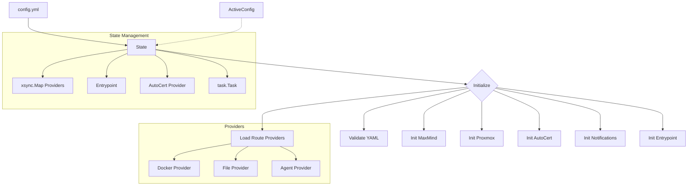
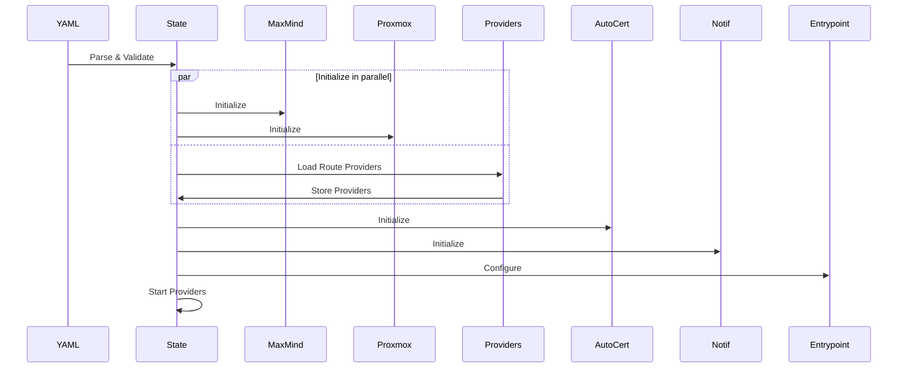

# Configuration Management

Centralized YAML configuration management with thread-safe state access and provider initialization.

## Overview

The config package implements the core configuration management system for GoDoxy, handling YAML configuration loading, provider initialization, route loading, and state transitions. It uses atomic pointers for thread-safe state access and integrates all configuration components.

### Primary consumers

- `cmd/main.go` - Initializes configuration state on startup
- `internal/route/provider` - Accesses configuration for route creation
- `internal/api/v1` - Exposes configuration via REST API
- All packages that need to access active configuration

### Non-goals

- Dynamic provider registration after initialization (require config reload)

### Stability

Stable internal package. Public API consists of `State` interface and state management functions.

## Public API

### Exported types

```go
type Config struct {
    ACL             *acl.Config
    AutoCert        *autocert.Config
    Entrypoint      entrypoint.Config
    Providers       Providers
    MatchDomains    []string
    Homepage        homepage.Config
    Defaults        Defaults
    TimeoutShutdown int
}

type Providers struct {
    Files        []string
    Docker       map[string]types.DockerProviderConfig
    Agents       []*agent.AgentConfig
    Notification []*notif.NotificationConfig
    Proxmox      []proxmox.Config
    MaxMind      *maxmind.Config
}
```

### State interface

```go
type State interface {
    Task() *task.Task
    Context() context.Context
    Value() *Config
    EntrypointHandler() http.Handler
    ShortLinkMatcher() config.ShortLinkMatcher
    AutoCertProvider() server.CertProvider
    LoadOrStoreProvider(key string, value types.RouteProvider) (actual types.RouteProvider, loaded bool)
    DeleteProvider(key string)
    IterProviders() iter.Seq2[string, types.RouteProvider]
    StartProviders() error
    NumProviders() int
}
```

### Exported functions

```go
func NewState() config.State
```

Creates a new configuration state with empty providers map.

```go
func GetState() config.State
```

Returns the active configuration state. Thread-safe via atomic load.

```go
func SetState(state config.State)
```

Sets the active configuration state. Also updates active configs for ACL, entrypoint, homepage, and autocert.

```go
func HasState() bool
```

Returns true if a state is currently active.

```go
func Value() *config.Config
```

Returns the current configuration values.

```go
func (state *state) InitFromFile(filename string) error
```

Initializes state from a YAML file. Uses default config if file doesn't exist.

```go
func (state *state) Init(data []byte) error
```

Initializes state from raw YAML data. Validates, then initializes MaxMind, Proxmox, providers, AutoCert, notifications, access logger, and entrypoint.

```go
func (state *state) StartProviders() error
```

Starts all route providers concurrently.

```go
func (state *state) IterProviders() iter.Seq2[string, types.RouteProvider]
```

Returns an iterator over all providers.

## Architecture

### Core components



### Initialization pipeline



### Thread safety model

```go
var stateMu sync.RWMutex

func GetState() config.State {
    return config.ActiveState.Load()
}

func SetState(state config.State) {
    stateMu.Lock()
    defer stateMu.Unlock()
    config.ActiveState.Store(state)
}
```

Uses `sync.RWMutex` for write synchronization and `sync/atomic` for read operations.

## Configuration Surface

### Config sources

Configuration is loaded from `config/config.yml`.

### Hot-reloading

Configuration supports hot-reloading via editing `config/config.yml`.

## Dependency and Integration Map

### Internal dependencies

- `internal/acl` - Access control configuration
- `internal/autocert` - SSL certificate management
- `internal/entrypoint` - HTTP entrypoint setup
- `internal/route/provider` - Route providers (Docker, file, agent)
- `internal/maxmind` - GeoIP configuration
- `internal/notif` - Notification providers
- `internal/proxmox` - LXC container management
- `internal/homepage/types` - Dashboard configuration
- `github.com/yusing/goutils/task` - Object lifecycle management

### External dependencies

- `github.com/goccy/go-yaml` - YAML parsing
- `github.com/puzpuzpuz/xsync/v4` - Concurrent map

### Integration points

```go
// API uses config/query to access state
providers := statequery.RouteProviderList()

// Route providers access config state
for _, p := range config.GetState().IterProviders() {
    // Process provider
}
```

## Observability

### Logs

- Configuration parsing and validation errors
- Provider initialization results
- Route loading summary
- Full configuration dump (at debug level)

### Metrics

No metrics are currently exposed.

## Security Considerations

- Configuration file permissions should be restricted (contains secrets)
- TLS certificates are loaded from files specified in config
- Agent credentials are passed via configuration
- No secrets are logged (except in debug mode with full config dump)

## Failure Modes and Recovery

| Failure                       | Behavior                            | Recovery                   |
| ----------------------------- | ----------------------------------- | -------------------------- |
| Invalid YAML                  | Init returns error                  | Fix YAML syntax            |
| Missing required fields       | Validation fails                    | Add required fields        |
| Provider initialization fails | Error aggregated and returned       | Fix provider configuration |
| Duplicate provider key        | Error logged, first provider kept   | Rename provider            |
| Route loading fails           | Error aggregated, other routes load | Fix route configuration    |

## Performance Characteristics

- Providers are loaded concurrently
- Routes are loaded concurrently per provider
- State access is lock-free for reads
- Atomic pointer for state swap

## Usage Examples

### Loading configuration

```go
state := config.NewState()
err := state.InitFromFile("config.yml")
if err != nil {
    log.Fatal(err)
}

config.SetState(state)
```

### Accessing configuration

```go
if config.HasState() {
    cfg := config.Value()
    log.Printf("Entrypoint middleware count: %d", len(cfg.Entrypoint.Middlewares))
    log.Printf("Docker providers: %d", len(cfg.Providers.Docker))
}
```

### Iterating providers

```go
for name, provider := range config.GetState().IterProviders() {
    log.Printf("Provider: %s, Routes: %d", name, provider.NumRoutes())
}
```

### Accessing entrypoint handler

```go
state := config.GetState()
http.Handle("/", state.EntrypointHandler())
```
