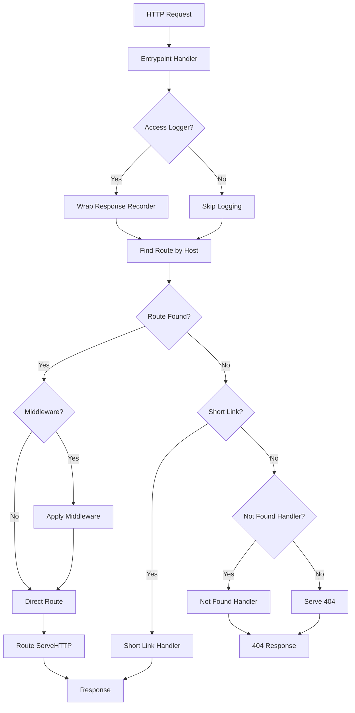
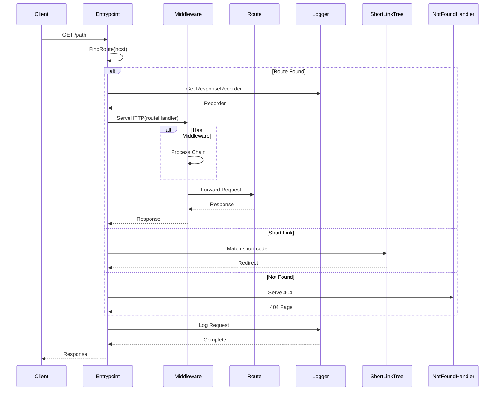

# Entrypoint

The entrypoint package provides the main HTTP entry point for GoDoxy, handling domain-based routing, middleware application, short link matching, and access logging.

## Overview

The entrypoint package implements the primary HTTP handler that receives all incoming requests, determines the target route based on hostname, applies middleware, and forwards requests to the appropriate route handler.

### Key Features

- Domain-based route lookup with subdomain support
- Short link (`go/<alias>` domain) handling
- Middleware chain application
- Access logging for all requests
- Configurable not-found handling
- Per-domain route resolution

## Architecture



## Core Components

### Entrypoint Structure

```go
type Entrypoint struct {
    middleware      *middleware.Middleware
    notFoundHandler http.Handler
    accessLogger    accesslog.AccessLogger
    findRouteFunc   func(host string) types.HTTPRoute
    shortLinkTree   *ShortLinkMatcher
}
```

### Active Config

```go
var ActiveConfig atomic.Pointer[entrypoint.Config]
```

## Public API

### Creation

```go
// NewEntrypoint creates a new entrypoint instance.
func NewEntrypoint() Entrypoint
```

### Configuration

```go
// SetFindRouteDomains configures domain-based route lookup.
func (ep *Entrypoint) SetFindRouteDomains(domains []string)

// SetMiddlewares loads and configures middleware chain.
func (ep *Entrypoint) SetMiddlewares(mws []map[string]any) error

// SetNotFoundRules configures the not-found handler.
func (ep *Entrypoint) SetNotFoundRules(rules rules.Rules)

// SetAccessLogger initializes access logging.
func (ep *Entrypoint) SetAccessLogger(parent task.Parent, cfg *accesslog.RequestLoggerConfig) error

// ShortLinkMatcher returns the short link matcher.
func (ep *Entrypoint) ShortLinkMatcher() *ShortLinkMatcher
```

### Request Handling

```go
// ServeHTTP is the main HTTP handler.
func (ep *Entrypoint) ServeHTTP(w http.ResponseWriter, r *http.Request)

// FindRoute looks up a route by hostname.
func (ep *Entrypoint) FindRoute(s string) types.HTTPRoute
```

## Usage

### Basic Setup

```go
ep := entrypoint.NewEntrypoint()

// Configure domain matching
ep.SetFindRouteDomains([]string{".example.com", "example.com"})

// Configure middleware
err := ep.SetMiddlewares([]map[string]any{
    {"rate_limit": map[string]any{"requests_per_second": 100}},
})
if err != nil {
    log.Fatal(err)
}

// Configure access logging
err = ep.SetAccessLogger(parent, &accesslog.RequestLoggerConfig{
    Path: "/var/log/godoxy/access.log",
})
if err != nil {
    log.Fatal(err)
}

// Start server
http.ListenAndServe(":80", &ep)
```

### Route Lookup Logic

The entrypoint uses multiple strategies to find routes:

1. **Subdomain Matching**: For `sub.domain.com`, looks for `sub`
1. **Exact Match**: Looks for the full hostname
1. **Port Stripping**: Strips port from host if present

```go
func findRouteAnyDomain(host string) types.HTTPRoute {
    // Try subdomain (everything before first dot)
    idx := strings.IndexByte(host, '.')
    if idx != -1 {
        target := host[:idx]
        if r, ok := routes.HTTP.Get(target); ok {
            return r
        }
    }

    // Try exact match
    if r, ok := routes.HTTP.Get(host); ok {
        return r
    }

    // Try stripping port
    if before, _, ok := strings.Cut(host, ":"); ok {
        if r, ok := routes.HTTP.Get(before); ok {
            return r
        }
    }

    return nil
}
```

### Short Links

Short links use a special `.short` domain:

```go
// Request to: https://abc.short.example.com
// Looks for route with alias "abc"
if strings.EqualFold(host, common.ShortLinkPrefix) {
    // Handle short link
    ep.shortLinkTree.ServeHTTP(w, r)
}
```

## Data Flow



## Not-Found Handling

When no route is found, the entrypoint:

1. Attempts to serve a static error page file
1. Logs the 404 request
1. Falls back to the configured error page
1. Returns 404 status code

```go
func (ep *Entrypoint) serveNotFound(w http.ResponseWriter, r *http.Request) {
    if served := middleware.ServeStaticErrorPageFile(w, r); !served {
        log.Error().
            Str("method", r.Method).
            Str("url", r.URL.String()).
            Str("remote", r.RemoteAddr).
            Msgf("not found: %s", r.Host)

        errorPage, ok := errorpage.GetErrorPageByStatus(http.StatusNotFound)
        if ok {
            w.WriteHeader(http.StatusNotFound)
            w.Header().Set("Content-Type", "text/html; charset=utf-8")
            w.Write(errorPage)
        } else {
            http.NotFound(w, r)
        }
    }
}
```

## Configuration Structure

```go
type Config struct {
    Middlewares []map[string]any `json:"middlewares"`
    Rules       rules.Rules      `json:"rules"`
    AccessLog   *accesslog.RequestLoggerConfig `json:"access_log"`
}
```

## Middleware Integration

The entrypoint supports middleware chains configured via YAML:

```yaml
entrypoint:
  middlewares:
    - use: rate_limit
      average: 100
      burst: 200
      bypass:
        - remote 192.168.1.0/24
    - use: redirect_http
```

## Access Logging

Access logging wraps the response recorder to capture:

- Request method and URL
- Response status code
- Response size
- Request duration
- Client IP address

```go
func (ep *Entrypoint) ServeHTTP(w http.ResponseWriter, r *http.Request) {
    if ep.accessLogger != nil {
        rec := accesslog.GetResponseRecorder(w)
        w = rec
        defer func() {
            ep.accessLogger.Log(r, rec.Response())
            accesslog.PutResponseRecorder(rec)
        }()
    }
    // ... handle request
}
```

## Integration Points

The entrypoint integrates with:

- **Route Registry**: HTTP route lookup
- **Middleware**: Request processing chain
- **AccessLog**: Request logging
- **ErrorPage**: 404 error pages
- **ShortLink**: Short link handling
